# Authoring Content with the Universal Editor {#authoring}

Learn how easy and intuitive it is for content authors to create content using the Universal Editor.

## Introduction {#introduction}

The Universal Editor enables editing any aspect of any content in any implementation so you can deliver exceptional experiences and increase content velocity.

To do this, the Universal Editor provides content authors with an intuitive UI that requires minimal training to simply be able to jump in and begin editing content. This document describes the authoring experience of the Universal Editor.

>[!NOTE]
>
>This document assumes you are already familiar with how to access and navigate the Universal Editor. If you are not, see [Accessing and Navigating the Universal Editor.](/help/sites-cloud/authoring/universal-editor/navigation.md)

>[!TIP]
>
>For a more detailed introduction to the Universal Editor, see [Universal Editor Introduction.](/help/implementing/universal-editor/introduction.md)

## Editing Content {#editing-content}

Editing content is simple and intuitive. As you mouse over content in the editor, editable content is highlighted with a thin, light blue outline and a badge.

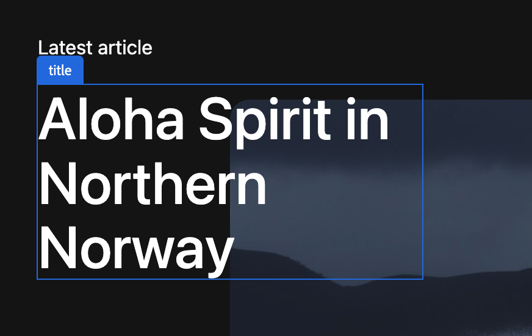

Tapping or clicking the highlighted content is selected and the thin, light blue outline becomes a dark blue outline with a badge.

>[!TIP]
>
>By default, tapping or clicking on content selects it for editing. If you want to navigate your content by following links, switch to [preview mode.](/help/sites-cloud/authoring/universal-editor/navigation.md#preview-mode)

Depending on the content you select, you may have different in-place editing options and additional information and options for the content in the [properties panel.](/help/sites-cloud/authoring/universal-editor/navigation.md#properties-rail)

### Context Menu {#context-menu}

Every piece of editable content is badged with the type of content it is. 

You can click this badge for quick access to a context menu with edit actions. Right-clicking a non-selected editable item automatically selects it and also opens the context menu.

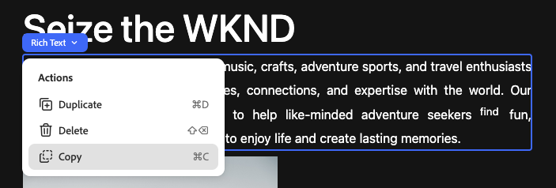

### Editing Plain Text {#edit-plain-text}

You can edit the text in place by double-clicking or double-tapping the component.

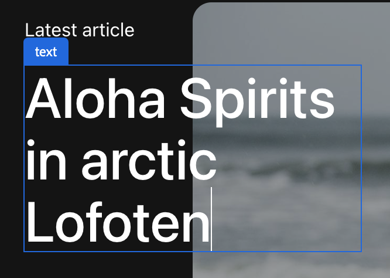

The thin, light blue outline turns to a dark blue outline to indicate selection and a cursor appears. Make your changes and then press enter/return or select outside of the text box to save your changes.

When you select the text component, its details are shown in the [properties panel.](/help/sites-cloud/authoring/universal-editor/navigation.md#properties-rail) You can also edit the text in the panel.

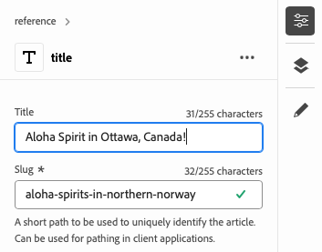

Also, details on your text are available in the properties panel. Changes are automatically saved once focus leaves the edited field in the properties panel.

### Editing Rich Text {#edit-rich-text}

You can edit the text in place by double-clicking or double-tapping the component.

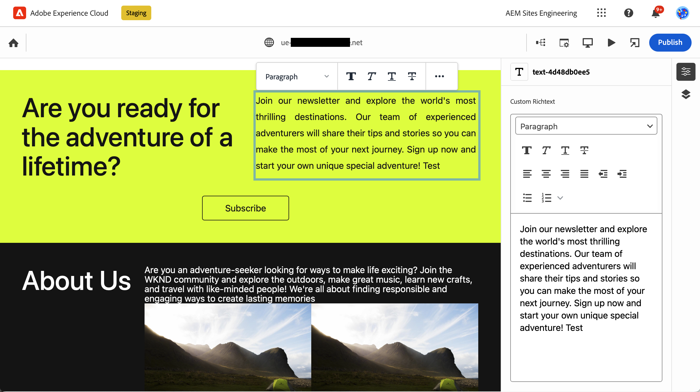

For your convenience, formatting options and details on your text are available in two places.

#### The Rich Text Context Menu {#rich-text-context-menu}

A context menu opens above the rich text block and offers basic formatting options in context. Due to space limitations, some options may be hidden behind the ellipsis button.

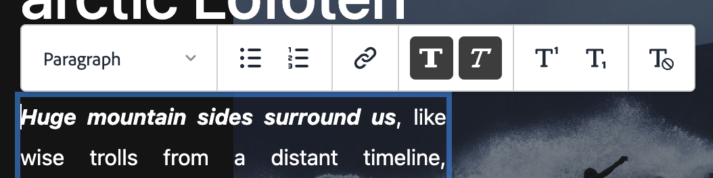

Changes are automatically saved once focus leaves the edited field.

#### The Properties Panel {#properties-rail}

The [properties panel](/help/sites-cloud/authoring/universal-editor/navigation.md#properties-rail) shows an entry for the selected rich text component.

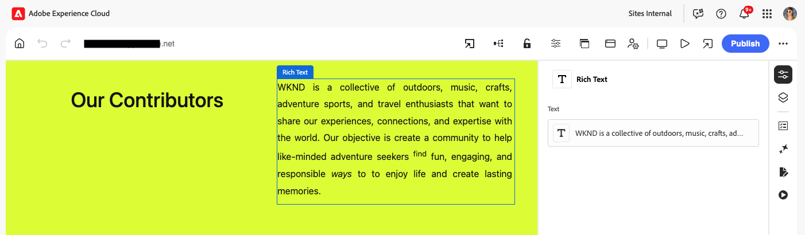

Tap the entry to open a dialog presenting a larger canvas to edit the rich text.

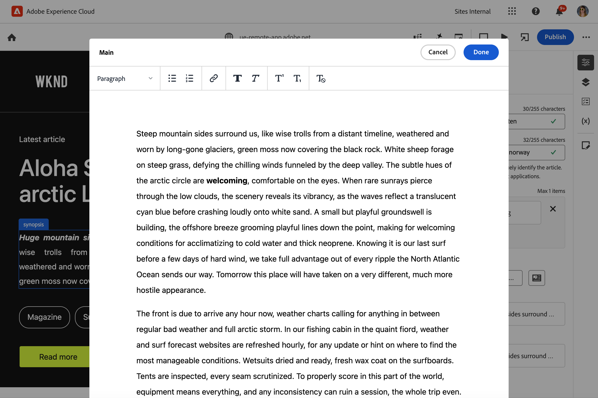

Tap or click **Cancel** or **Done** to discard or save the changes, respectively. You can also press the escape key to save changes and close the dialog.

#### Rich Text Formatting Options {#formatting-options}

The rich text editor (RTE) of the Universal Editor allows the author to apply standard text formatting. The following options are available.

* **Paragraph Style**
  * Paragraph, h1-h6, code
* **Bold**
* **Italic**
* **Underline**
* **Strikethrough**
* **Text Color**
  * Opens a color palette where you can select a color or specify a hex value
  * Only available in the modal editor, not in-context
* **Superscript**
* **Subscript**
* **Bullet list**
  * Use the tab key to indent and shift+tab to outdent.
* **Ordered list**
  * Use the tab key to indent and shift+tab to outdent.
* **Link**
  * Specify a URL or use the Content Browser to select a path within AEM.
* **Unlink**
  * Remove link from selected text.
* **Image**
  * Specify a URL or use the [asset selector](/help/assets/overview-asset-selector.md#using-asset-selector) to select an asset from AEM.
* **Table**
  * Use the drop-down to insert a new table of the selected number of columns and rows or insert and remove new columns/rows.
* **Alignment**
  * **Align Left**
  * **Align Center**
  * **Align Right**
  * **Align Justify**
* **Right to Left**
* **Left to Right**
* **Indent**
* **Outdent**
* **Paste as Text**
  * Remove formatting from text on your clipboard before pasting into the Universal Editor.
* **Remove All Formatting**
  * Remove all formatting options from the selected text.

Depending on your back end, the options available by default may vary. The RTE can be configured to hide options or show additional options depending on authors' needs. Please see the document [Configuring the RTE for the Universal Editor](/help/implementing/universal-editor/configure-rte.md) for more information.

### Editing Media {#edit-media}

You can view its details in the [properties panel.](/help/sites-cloud/authoring/universal-editor/navigation.md#properties-rail)

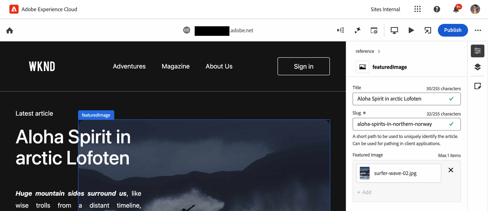

1. Tap or click the preview of the selected image in the properties panel.
1. The [asset selector](/help/assets/overview-asset-selector.md#using-asset-selector) window opens to allow you to select an asset.
1. Select to select a new asset.
1. Select **Select** to return to the properties panel where the asset was replaced.

Changes are saved to your content automatically.

### Editing Content Fragments {#edit-content-fragment}

If you select a [Content Fragment](/help/sites-cloud/administering/content-fragments/overview.md), you can edit its details in the [properties panel.](/help/sites-cloud/authoring/universal-editor/navigation.md#properties-rail)

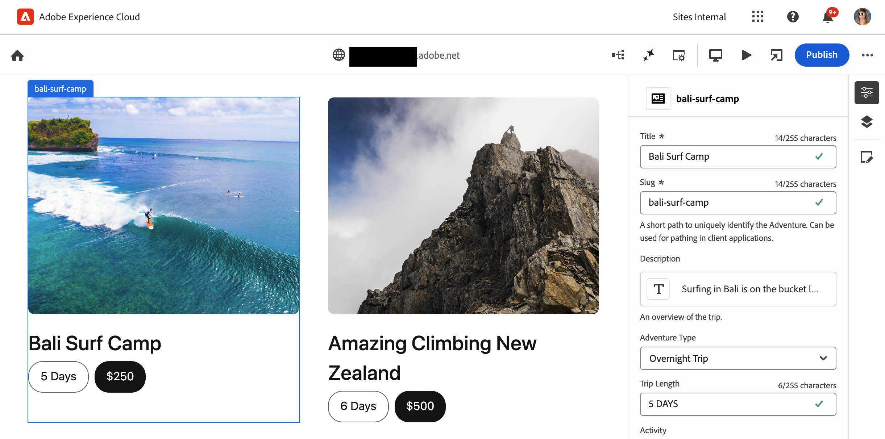

The fields defined in the content model of the selected Content Fragment are displayed and editable in the properties panel.

If you select a field that is related to a Content Fragment, the Content Fragment loads in the components panel and the field is automatically scrolled to.

Changes are automatically saved once focus leaves the edited field in the properties panel.

If you want to edit your Content Fragment in the [Content Fragment editor](/help/sites-cloud/administering/content-fragments/authoring.md) instead, tap or click the [**Open in CF Editor** button](/help/sites-cloud/authoring/universal-editor/navigation.md#edit) in the properties panel.

>[!TIP]
>
>Use the hot key `e` to edit the selected Content Fragment in the Content Fragment editor.

Depending on the needs of your workflow, you may want to edit the Content Fragment in the Universal Editor or directly in the Content Fragment editor.

>[!NOTE]
>
>The Universal Editor [validates Content Fragment fields based on their models](/help/assets/content-fragments/content-fragments-models.md#validation) allowing you to enforce data integrity rules such as regex patterns and uniqueness constraints.
>
>This ensures that your content meets specific business requirements before it's published.

### Adding Components to Containers {#adding-components}

1. Select a container component in the [content tree](/help/sites-cloud/authoring/universal-editor/navigation.md#content-tree-mode) or in the editor.

   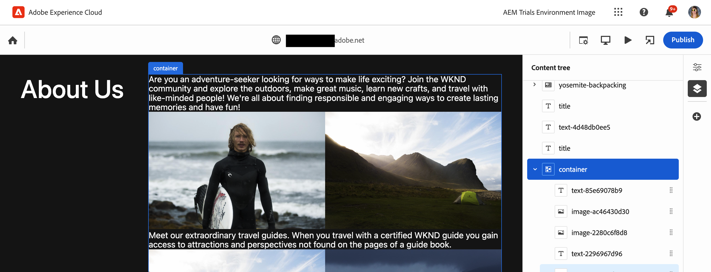

1. Then select the add icon in the properties panel.

   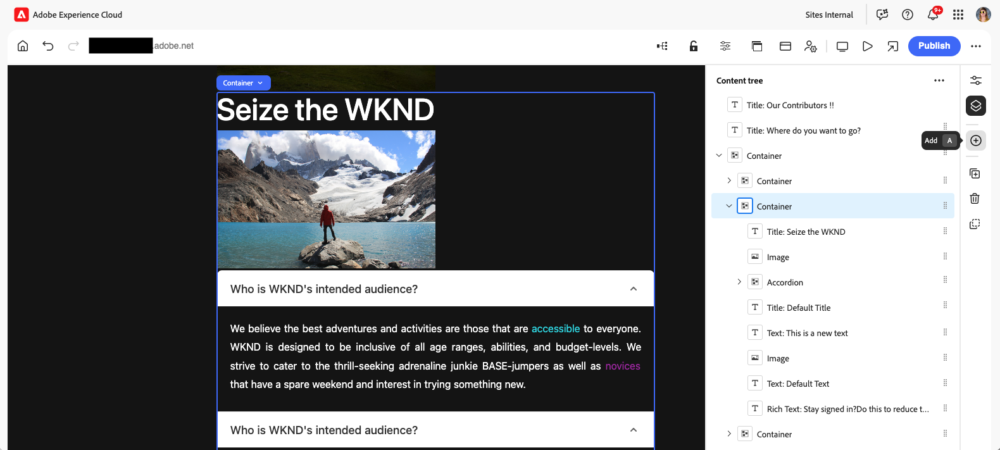

1. The component picker dialog opens. 
   * Use the left column to filter components by category or use the search to filter by name.
   * Click the component name in the right column to insert it into the container.
   * If only one component is allowed in the container, it is inserted automatically.
   * Click outside of the picker to cancel component insertion.

   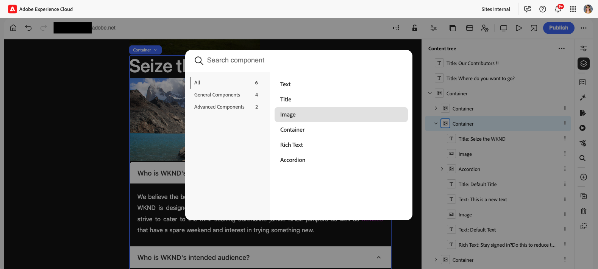

The component is inserted into the container and can be edited in the editor.

>[!TIP]
>
>Use the hot key `a` to add a component to the selected container.

### Duplicating Components in Containers {#duplicating-components}

1. Select a component in a container using the [content tree](/help/sites-cloud/authoring/universal-editor/navigation.md#content-tree-mode) or the editor.
1. Then select the **Duplicate** icon in the properties panel.

   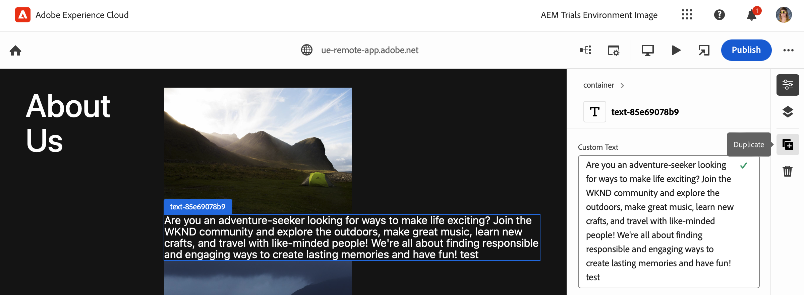
1. The component is duplicated and inserted below the selected component.

The component is inserted into the container and can be edited in the editor.

### Deleting Components from Containers {#deleting-components}

1. Select a container component in the [content tree](/help/sites-cloud/authoring/universal-editor/navigation.md#content-tree-mode) or in the editor.
1. Select the chevron icon of the container to expand its contents in the content tree.
1. Then, in the content tree, select a component within the container.
1. Select the delete icon in the properties panel.

   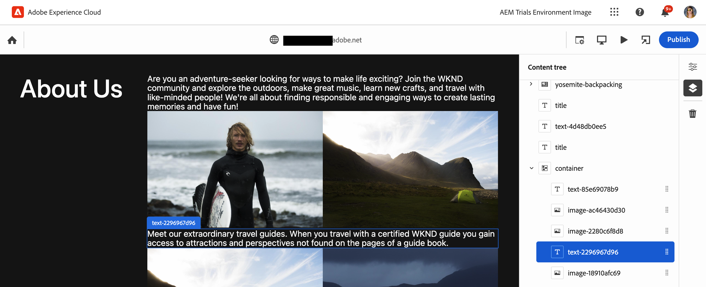

The selected component deleted.

>[!TIP]
>
>Use the hot key `Shift+Backspace` to delete the selected component from its container.

### Reordering and Moving Components {#reordering-components}

You can move and reorder components using the context menu or the content tree.

#### Move Components with the Context Menu {#move-context-menu}

1. Right-click on a component or click on the selected component's badge to open the [context menu.](#context-menu)
1. Select the move option desired.
   * Move to top
   * Move up
   * Move down
   * Move to bottom
   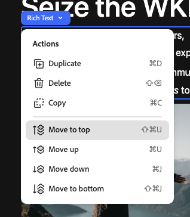

The component is moved in both the editor and the content tree.

>[!TIP]
>
>Use the hot keys `Command-U` or `Shift-Command-U` to move up or to the top, respectively.
>Use the hot keys `Command-J` or `Shift-Command-J` to move down or to the bottom, respectively.

>[!NOTE]
>
>The context menu options can only move components within their containers. If you wish to move components between containers, [use the content tree.](#reorder-content-tree)

#### Reorder Components with the Content Tree {#reorder-content-tree}

1. If not already in [content tree mode](/help/sites-cloud/authoring/universal-editor/navigation.md#content-tree-mode), switch to it.
1. Select a container component in the content tree or in the editor.
1. Select the chevron icon of the container to expand its contents in the content tree.
1. Drag handle icons next to the components within the container show that you can rearrange them. Drag the components to reorder them within the container.

   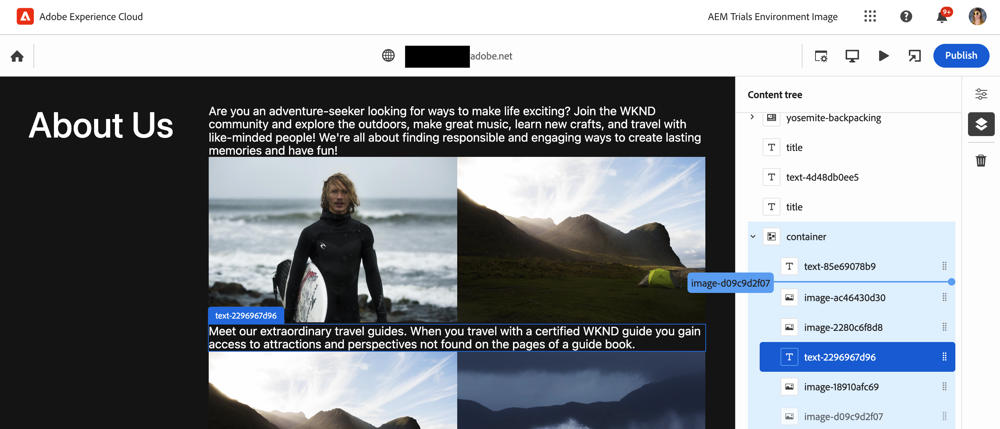
   
1. The dragged component is grayed in the content tree, while your insertion point is represented by a blue line. Release the component to place it in its new location.

The components are reordered in both the content tree and in the editor.

>[!NOTE]
>
>Components can only be moved between containers if the target containers [component filter](/help/implementing/universal-editor/filtering.md) allows the selected component.

### Undo and Redo {#undo-redo}

Select the Undo or Redo buttons to undo or redo the last edit in the editor.

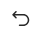
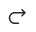

* Undoing and redoing can be performed for edits done in context, edits done via the Properties panel, as well as adding, duplicating, moving, and deleting blocks.
* Undo and redo is limited to the current browser session.

>[!TIP]
>
>Use the hot key `Command-Z` or `Shift-Command-Z` to undo or redo, respectively.

### Copy and Paste {#copy-paste}

You can copy and paste components that are within [containers.](/help/implementing/universal-editor/field-types.md#container) This is possible only if the target container has no [filters configured](/help/implementing/universal-editor/filtering.md) or has filters that allow the component to be pasted.

Copy and paste can be on the same browser tab or between browser tabs, provided the tabs are already open. You can not copy an item and then open a new browser tab to paste it.

1. Select a component either within the editor or in the content tree.
1. The **Copy** icon appears in the [properties panel.](/help/sites-cloud/authoring/universal-editor/navigation.md#properties-panel) Tap or click it.
1. The **Paste** icon appears in the properties panel.
1. Select the component _after_ which you wish to paste the copied component.
1. Tap or click Paste.
1. The copied component is pasted _after_ the selected component.

>[!TIP]
>
>Use the hot key `Command-C` or `Command-V` to copy or paste, respectively.

## Context Options {#context-options}

When editing in place, the editor will offer context-relevant options with a right-click such as duplicating, deleting, or copying components.

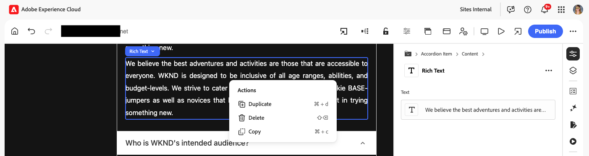

## Previewing Content {#previewing-content}

When you are finished editing content, you often want to navigate it to see how it looks in the content of other pages. In [preview mode](/help/sites-cloud/authoring/universal-editor/navigation.md#preview-mode) you can click links to navigate your content as a reader would. The content is rendered in the editor as it would be published.

In preview mode, tapping or clicking on content reacts as it would to a reader of the content. If you want to select the content for editing, toggle out of [preview mode.](/help/sites-cloud/authoring/universal-editor/navigation.md#preview-mode)

## Editing Component Inheritance {#inheritance}

Inheritance is the mechanism where content can be linked such that changing one automatically changes the other.

Using the Universal Editor, you can cancel inheritance for content by simply updating the content. The editor automatically disables inheritance for all changes made by authors on that page, ensuring that modified content is retained when updates are synchronized from the blueprint.

If the **AEM Multi-Site-Management (MSM) Extension** is enabled for your program, you have [additional toolbar options](#inheritance-extension) to view and change the inheritance status of an individual component within the Universal Editor.

For more details on how inheritance works using the Universal Editor, see [Content Inheritance in the Universal Editor.](/help/sites-cloud/authoring/universal-editor/inheritance.md)

## Optional Toolbar Features {#toolbar-options}

Additional features are available as extensions to the Universal Editor to help you further manage your pages and content. [These extensions must be enabled in your program by an administrator](/help/implementing/universal-editor/extending.md) before they are visible to you as a content author in [the Universal Editor toolbar.](/help/sites-cloud/authoring/universal-editor/navigation.md#universal-editor-toolbar)

### Inheritance {#inheritance-extension}

The **AEM Multi-Site-Management (MSM) Extension** displays the current inheritance status of the selected component and allows you to [break or reinstate inheritance.](/help/sites-cloud/authoring/universal-editor/inheritance.md)

The **Inheritance Installed** icon in the Universal Editor toolbar shows that inheritance is still active for the selected component.

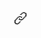

Tap or click the icon to break inheritance for the selected component. Inheritance is automatically broken if you edit the component.

The **Inheritance Broken** icon shows that inheritance has been broken for the selected component.

Tap or click the icon to reinstate inheritance for the selected component. You will need to reload the page to refresh the content in order to show the inherited content.

For information on how to enable this extension, [please see the Extension Manager documentation.](https://developer.adobe.com/uix/docs/extension-manager/feature-highlights/#enablingdisabling-extensions)

>[!NOTE]
>
>The **Inheritance Installed** and **Inheritance Broken** icons only display when a component has been selected and the page is based on a blueprint.

>[!NOTE]
>
>The **AEM Multi-Site-Management (MSM) Extension** only works for pages, not Content Fragments.

### Accessing Page Properties {#page-properties}

The **AEM Page Properties Extension** allows quick access to the [Page Properties window](/help/sites-cloud/authoring/sites-console/page-properties.md) for the page currently being edited.

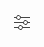

Tap or click the **Page Properties** icon in the Universal Editor toolbar to open the page properties for the page in a new browser tab.

For information on how to enable this extension, [please see the Extension Manager documentation.](https://developer.adobe.com/uix/docs/extension-manager/feature-highlights/#enablingdisabling-extensions)

>[!NOTE]
>
>The **AEM Page Properties Extension** only works for pages, not Content Fragments.

### Access Sites Console {#sites-console}

The **AEM Site Admin Extension** allows quick access to the page being edited within the [Sites Console of AEM,](/help/sites-cloud/authoring/sites-console/introduction.md) allowing you to navigate the site tree or perform page-level actions in the console.

Tap or click the icon to open the Sites Console in a new browser tab, navigated to the page currently in the editor.

For information on how to enable this extension, [please see the Extension Manager documentation.](https://developer.adobe.com/uix/docs/extension-manager/feature-highlights/#enablingdisabling-extensions)

### Locking and Unlocking Pages {#locking-pages}

The **AEM Page Lock Extension** displays the current lock status of the page in the editor and allows you to [lock or unlock the page.](/help/sites-cloud/authoring/sites-console/managing-pages.md#locking-a-page)

The **Unlocked** icon in the Universal Editor toolbar shows that the page currently in the editor is not locked.

Tap or click the icon to lock the page.

The **Locked** icon in the Universal Editor toolbar shows that the page currently in the editor is locked. Hover your mouse over the icon for a tooltip indicating the user who locked the page.

Tap or click the icon to unlock the page if you are the user who locked it.

For information on how to enable this extension, [please see the Extension Manager documentation.](https://developer.adobe.com/uix/docs/extension-manager/feature-highlights/#enablingdisabling-extensions)

>[!NOTE]
>
>The **AEM Page Lock Extension** only works for pages, not Content Fragments.

### Workflows {#workflows}

The **AEM Workflows Extension** allows you to [start a workflow](/help/sites-cloud/authoring/workflows/overview.md) on the page currently in the editor.

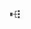

Tap or click the **Workflows** icon in the Universal Editor toolbar to open the **Start a workflow** modal. The window lists the possible content to which you can apply a workflow.

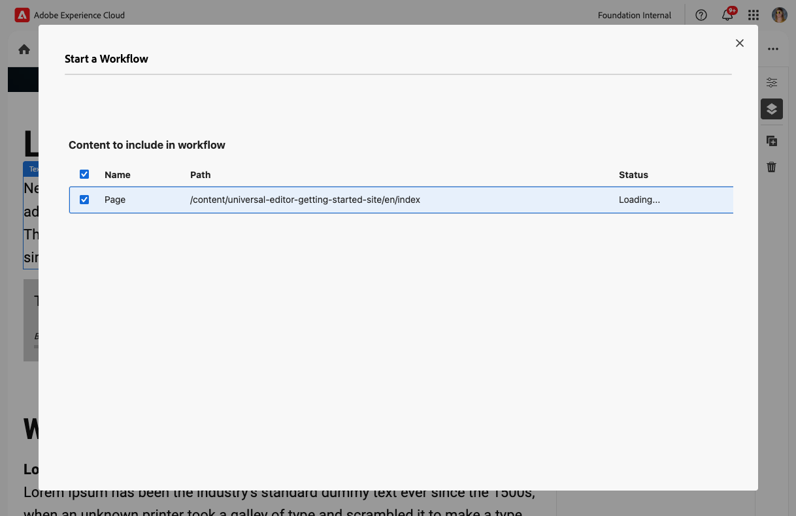

1. In the **Workflow Model** drop down, select the workflow to apply.
1. Provide a description for the workflow in the **Name** field.
1. In the **Content to include in workflow** list, use the checkboxes to define which content to include in the workflow.
1. Tap or click **Start Workflow** to start the workflow or **Close** to abort.

For information on how to enable this extension, [please see the Extension Manager documentation.](https://developer.adobe.com/uix/docs/extension-manager/feature-highlights/#enablingdisabling-extensions)

### Developer Login {#developer-login}

The **AEM Universal Editor Dev Login Extension** is useful for developers who are developing locally, enabling a convenient way to authenticate to a local AEM SDK for testing purposes.

Tap or click the **Developer Logon** icon in the Universal Editor toolbar to provide your local login credentials to sign into your local AEM SDK.

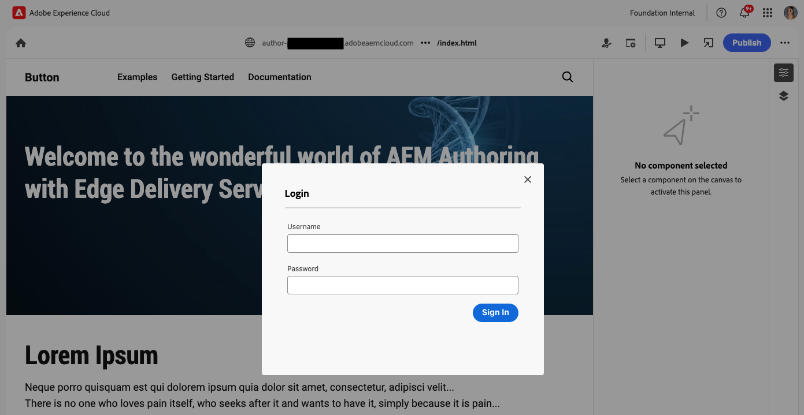

For information on how to enable this extension, [please see the Extension Manager documentation.](https://developer.adobe.com/uix/docs/extension-manager/feature-highlights/#enablingdisabling-extensions)

## Optional Properties Panel Features {#properties-panel-options}

Additional features are available as extensions to the Universal Editor to help you further manage your page content. [These extensions must be enabled in your program by an administrator](/help/implementing/universal-editor/extending.md) before they are visible to you as a content author in [the Universal Editor properties panel.](/help/sites-cloud/authoring/universal-editor/navigation.md#properties-rail)

### Generate Variations {#generate-variations}

The **Generate Variations** extension allows you to use generative artificial intelligence (AI) to create variations for your content directly in the properties panel.

Tap or click the **Generate Variations** icon in the Universal Editor properties panel to receive recommendations and create variations. Please see the document [Generate Variations - Integrated in AEM Editors](/help/generative-ai/generate-variations-integrated-editor.md) for more details on how generating variations works.

For information on how to enable this extension, [please see the Extension Manager documentation.](https://developer.adobe.com/uix/docs/extension-manager/feature-highlights/#enablingdisabling-extensions)

## Additional Resources {#additional-resources}

To learn how to publish content with the universal editor, please see this document.

* [Publishing Content with the Universal Editor](publishing.md) - Learn how the Universal Editor publishes content and how your apps can handle the published content.

To learn more about the technical details of the Universal Editor, please see these developer documents.

* [Universal Editor Introduction](/help/implementing/universal-editor/introduction.md) - Learn how the Universal Editor enables editing any aspect of any content in any implementation so you can deliver exceptional experiences and increase content velocity.
* [Getting Started with the Universal Editor in AEM](/help/implementing/universal-editor/getting-started.md) - Learn how to get access to the Universal Editor and how to start instrumenting your first AEM app to use it.
* [Universal Editor Architecture](/help/implementing/universal-editor/architecture.md) - Learn about the architecture of the Universal Editor and how data flows between its services and layers.
* [Attributes and Types](/help/implementing/universal-editor/attributes-types.md) - Learn about the data attributes and types that the Universal Editor requires.
* [Universal Editor Authentication](/help/implementing/universal-editor/authentication.md) - Learn how the Universal Editor authenticates.
