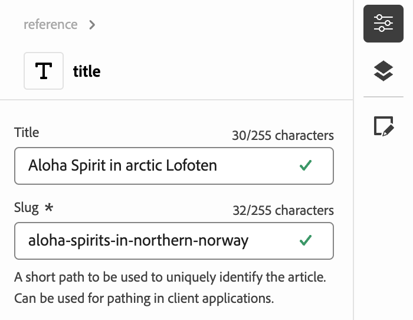

# Authoring Content with the Universal Editor {#authoring}

Learn how easy and intuitive it is for content authors to create content using the Universal Editor.

## Introduction {#introduction}

The Universal Editor enables editing any aspect of any content in any implementation so you can deliver exceptional experiences, increase content velocity, and provide a state-of-the-art developer experience.

To do this, the Universal Editor provides content authors with an intuitive UI that requires minimal training to simply be able to jump in and begin editing content. This document describes the authoring experience of the Universal Editor.

>[!NOTE]
>
>This document assumes you are already familiar with how to access and navigate the Universal Editor. If you are not, see [Accessing and Navigating the Universal Editor](/help/sites-cloud/authoring/universal-editor/navigation.md).

>[!TIP]
>
>For a more detailed introduction to the Universal Editor, see [Universal Editor Introduction](/help/implementing/universal-editor/introduction.md).

## Editing Content {#editing-content}

Editing content is simple and intuitive. As you mouse over content in the editor, editable content is highlighted with a thin blue outline.

>[!TIP]
>
>By default, tapping or clicking on content selects it for editing. If you want to navigate your content by following links, switch to [preview mode](/help/sites-cloud/authoring/universal-editor/navigation.md#preview-mode).

Depending on the content you select, you may have different in-place editing options and you may additional information and options for the content in the [properties panel](/help/sites-cloud/authoring/universal-editor/navigation.md#properties-rail).

### Editing Plain Text {#edit-plain-text}

You can edit the text in place by double-clicking or double-tapping the component.

The thin blue outline turns to a heavy blue outline to indicate select and a cursor appears. Make your changes and then press enter/return or select outside of the text box to save your changes.

When you select to select the text component, its details are shown in the [properties panel](/help/sites-cloud/authoring/universal-editor/navigation.md#properties-rail). You can also edit the text in the panel.

Also, details on your text are available in the properties panel. Changes are automatically saved once focus leaves the edited field in the properties panel.

### Editing Rich Text {#edit-rich-text}

You can edit the text in place by double-clicking or double-tapping the component.

For your convenience, formatting options and details on your text are available in two places.

#### The Context Menu {#context-menu}

The context menu opens above the rich text block and offers basic formatting options in context. Due to space limitations, some options may be hidden behind the ellipsis button.

Changes are automatically saved once focus leaves the edited field.

#### The Properties Panel {#properties-rail}

The [properties panel](/help/sites-cloud/authoring/universal-editor/navigation.md#properties-rail) shows an item for the selected text. Tap the entry to open a dialog presenting a larger canvas to edit the text.

Tap or click **Cancel** or **Done** to discard or save the changes, respectively.

### Editing Media {#edit-media}

You can view its details in the [properties panel](/help/sites-cloud/authoring/universal-editor/navigation.md#properties-rail).

1. Tap or click the preview of the selected image in the properties panel.
1. The [asset selector](/help/assets/overview-asset-selector.md#using-asset-selector) window opens to allow you to select an asset.
1. Select to select a new asset.
1. Select **Select** to return to the properties panel where the asset was replaced.

Changes are saved to your content automatically.

### Editing Content Fragments {#edit-content-fragment}

If you select a [Content Fragment](/help/sites-cloud/administering/content-fragments/overview.md), you can edit its details in the [properties panel](/help/sites-cloud/authoring/universal-editor/navigation.md#properties-rail).

The fields defined in the content model of the selected Content Fragment are displayed and editable in the properties panel.

If you select a field that is related to a Content Fragment, the Content Fragment loads in the components panel and the field is automatically scrolled to.

Changes are automatically saved once focus leaves the edited field in the properties panel.

If you want to edit your Content Fragment in the [Content Fragment editor](/help/sites-cloud/administering/content-fragments/authoring.md) instead, tap or click the [**Open in CF Editor** button](/help/sites-cloud/authoring/universal-editor/navigation.md#edit) in the properties panel.

>[!TIP]
>
>Use the hot key `e` to edit the selected Content Fragment in the Content Fragment editor.

Depending on the needs of your workflow, you may want to edit the Content Fragment in the Universal Editor or directly in the Content Fragment editor.

>[!NOTE]
>
>The Universal Editor [validates Content Fragment fields based on their models](/help/assets/content-fragments/content-fragments-models.md#validation) allowing you to enforce data integrity rules such as regex patterns and uniqueness constraints.
>
>This ensures that your content meets specific business requirements before it's published.

### Adding Components to Containers {#adding-components}

1. Select a container component in the [content tree](/help/sites-cloud/authoring/universal-editor/navigation.md#content-tree-mode) or in the editor.

   

1. Then select the add icon in the properties panel.

   

The component is inserted into the container and can be edited in the editor.

>[!TIP]
>
>Use the hot key `a` to add a component to the selected container.

### Duplicating Components in Containers {#duplicating-components}

1. Select a component in a container using the [content tree](/help/sites-cloud/authoring/universal-editor/navigation.md#content-tree-mode) or the editor.
1. Then select the **Duplicate** icon in the properties panel.

   
1. The component is duplicated and inserted below the selected component.

The component is inserted into the container and can be edited in the editor.

### Deleting Components from Containers {#deleting-components}

1. Select a container component in the [content tree](/help/sites-cloud/authoring/universal-editor/navigation.md#content-tree-mode) or in the editor.
1. Select the chevron icon of the container to expand its contents in the content tree.
1. Then, in the content tree, select a component within the container.
1. Select the delete icon in the properties panel.

   

The selected component deleted.

>[!TIP]
>
>Use the hot key `Shift+Backspace` to delete the selected component from its container.

### Reordering Components in Containers {#reordering-components}

1. If not already in [content tree mode](/help/sites-cloud/authoring/universal-editor/navigation.md#content-tree-mode), switch to it.
1. Select a container component in the content tree or in the editor.
1. Select the chevron icon of the container to expand its contents in the content tree.
1. Drag handle icons next to the components within the container show that you can rearrange them. Drag the components to reorder them within the container.

   
   
1. The dragged component turns gray in the content tree, while your insertion point is represented by a blue line. Release the component to place it in its new location.

The components are reordered in both the content tree and in the editor.

>[!NOTE]
>
>Components can not be moved between containers if a different [component filter](/help/implementing/universal-editor/filtering.md) is set between the source and target containers.

### Create content using GenAI with Generate Variations {#generate-variations-ai}

Use Generative Variations to leverage Generative AI to accelerate content creation.

Open the Universal Editor to find the entry point to Generate Variations.

See [Generate Variations - Integrated in AEM Editors](/help/generative-ai/generate-variations-integrated-editor.md) to learn more.

## Previewing Content {#previewing-content}

When you are finished editing content, you often want to navigate it to see how it looks in the content of other pages. In [preview mode](/help/sites-cloud/authoring/universal-editor/navigation.md#preview-mode) you can click links to navigate your content as a reader would. The content is rendered in the editor as it would be published.

In preview mode, tapping or clicking on content reacts as it would to a reader of the content. If you want to select the content for editing, toggle out of [preview mode](/help/sites-cloud/authoring/universal-editor/navigation.md#preview-mode).

## Additional Resources {#additional-resources}

To learn how to publish content with the universal editor, please see this document.

* [Publishing Content with the Universal Editor](publishing.md) - Learn how the Universal Editor publishes content and how your apps can handle the published content.

To learn more about the technical details of the Universal Editor, please see these developer documents.

* [Universal Editor Introduction](/help/implementing/universal-editor/introduction.md) - Learn how the Universal Editor enables editing any aspect of any content in any implementation so you can deliver exceptional experiences, increase content velocity, and provide a state-of-the-art developer experience.
* [Getting Started with the Universal Editor in AEM](/help/implementing/universal-editor/getting-started.md) - Learn how to get access to the Universal Editor and how to start instrumenting your first AEM app to use it.
* [Universal Editor Architecture](/help/implementing/universal-editor/architecture.md) - Learn about the architecture of the Universal Editor and how data flows between its services and layers.
* [Attributes and Types](/help/implementing/universal-editor/attributes-types.md) - Learn about the data attributes and types that the Universal Editor requires.
* [Universal Editor Authentication](/help/implementing/universal-editor/authentication.md) - Learn how the Universal Editor authenticates.

## Editing Component Inheritance {#inheritance}

Inheritance is the mechanism where content can be linked such that changing one automatically changes the other.

Using the Universal Editor, you can cancel inheritance for content by simply updating the content. The editor automatically disables inheritance for all changes made by authors on that page, ensuring that modified content is retained when updates are synchronized from the blueprint.

For more details on how inheritance works using the Universal Editor, see [Content Inheritance in the Universal Editor](/help/sites-cloud/authoring/universal-editor/inheritance.md).
