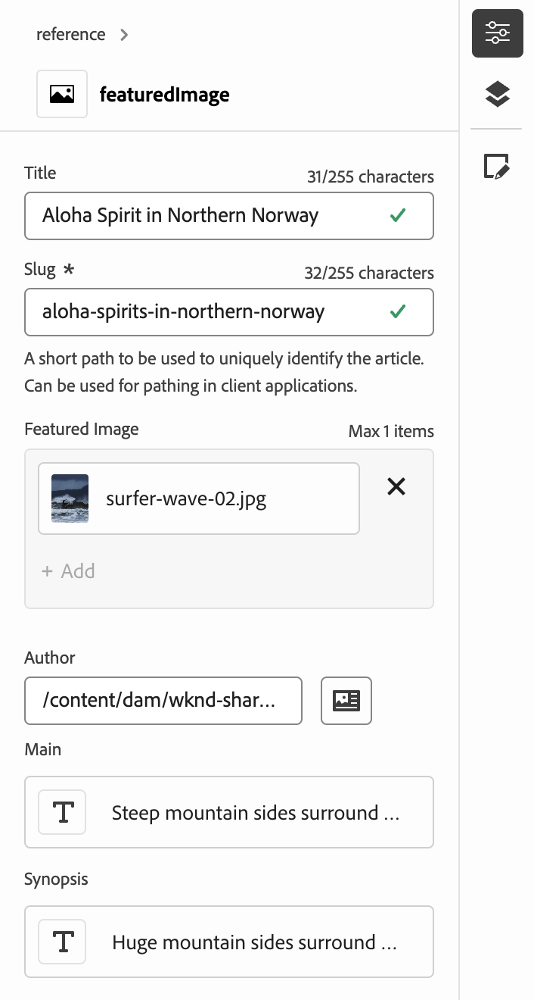
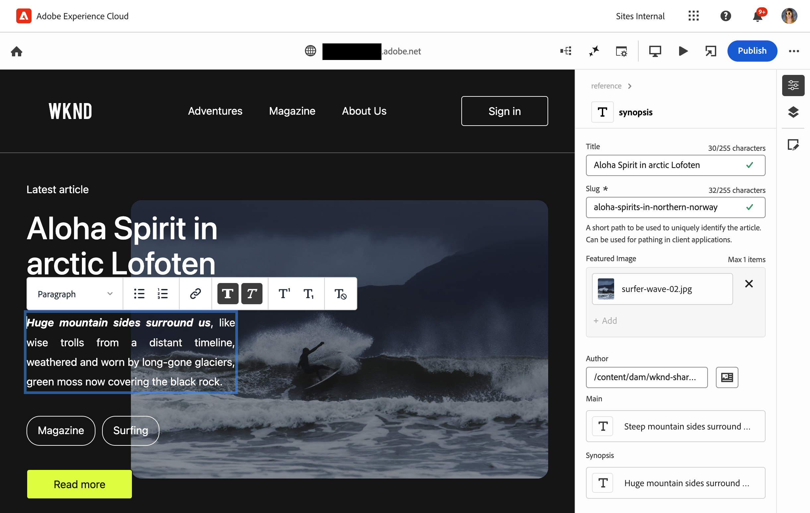

# Authoring Content with the Universal Editor {#authoring}

Learn how easy and intuitive it is for content authors to create content using the Universal Editor.

## Introduction {#introduction}

The Universal Editor enables editing any aspect of any content in any implementation so you can deliver exceptional experiences, increase content velocity, and provide a state-of-the-art developer experience.

To do this, the Universal Editor provides content authors with an intuitive UI that requires minimal training to simply be able to jump in and begin editing content. This document describes the authoring experience of the Universal Editor.

>[!TIP]
>
>For a more detailed introduction to the Universal Editor, see the document [Universal Editor Introduction.](/help/implementing/universal-editor/introduction.md)

## Prepare the App {#prepare-app}

To author content for an app using the Universal Editor, the app must be instrumented by a developer to support the editor.

>[!TIP]
>
>See [Getting Started with the Universal Editor in AEM](/help/implementing/universal-editor/getting-started.md) for an example of how to configure an AEM app to work with the Universal Editor.

## Accessing the Universal Editor {#accessing}

Once the app is instrumented to work with the Universal Editor, the Universal Editor can be access both inside of AEM as a Cloud Service and directly without accessing AEM.

### Accessing within AEM as a Cloud Service {#accessing-aem}

1. Sign into your AEM as a Cloud Service authoring instance.
1. Use the [**Sites** console](/help/sites-cloud/authoring/sites-console/introduction.md) to navigate to the page created for use with the Universal Editor that you wish to edit.
1. Edit the page.
1. The Universal Editor opens to edit the selected page.

>[!NOTE]
>
>When editing a page in the [**Sites** console,](/help/sites-cloud/authoring/sites-console/introduction.md) the console will open the editor appropriate to the page's [template:](/help/sites-cloud/authoring/sites-console/templates.md) either the Universal Editor described in this document, or the [page editor.](/help/sites-cloud/authoring/page-editor/introduction.md)

### Accessing Directly {#accessing-directly}

1. Sign into the Universal Editor. You need an Adobe ID to sign in and [have access to the Universal Editor.](/help/implementing/universal-editor/getting-started.md#request-access)

1. After you are signed in, enter the URL of the page you want to edit in the [location bar.](#location-bar) so you can start editing content such as [text content](#text-mode) or [media content.](#media-mode)

## Understand The UI {#ui}

The UI is divided into these main areas.

* [The Experience Cloud header](#experience-cloud-header)
* [The Universal Editor toolbar](#universal-editor-toolbar)
* [The editor](#editor)
* [The properties rail](#properties-rail)

### The Experience Cloud Header {#experience-cloud-header}

The Experience Cloud header is always present at the top of the screen. It is an anchor that tells you where you are within Experience Cloud and helps you navigate to other Experience Cloud apps.

#### Experience Manager {#experience-manager}

Select the Adobe Experience Cloud link at the left of the header to navigate to the root of your Experience Manager solution to access tools such as [Cloud Manager,](/help/onboarding/cloud-manager-introduction.md) [Cloud Acceleration Manager,](/help/journey-migration/cloud-acceleration-manager/introduction/overview-cam.md) and [Software Distribution.](https://experienceleague.adobe.com/docs/experience-cloud/software-distribution/home.html)

#### Organization {#organization}

This displays the organization you are currently signed into. Select to switch to another organization if your Adobe ID is associated with multiple.

#### Solutions {#solutions}

Tapping or clicking the solutions switcher lets you quickly jump to other Experience Cloud solutions.

#### Help {#help}

The help icon provides quick access to learning and support resources.

#### Notifications {#notifications}

This icon is badged with the number of currently assigned incomplete [notifications.](/help/implementing/cloud-manager/notifications.md)

#### User Properties {#user-properties}

Select the icon representing your user to access your user settings. If you do not have a user picture configured, an icon is randomly assigned.

### The Universal Editor Toolbar {#universal-editor-toolbar}

The Universal Editor toolbar is always present at the top of the screen just below [the Experience Cloud header.](#experience-cloud-header) It gives you quick access to navigate to another page to edit and to publish the current page.

#### The Home Button {#home-button}

The home button returns you to the start page of the Universal Editor

On the start page you can enter the URL of the site you want to edit with the Universal Editor.

>[!NOTE]
>
>Any page that you want to edit with the Universal Editor must be [instrumented to support he Universal Editor.](/help/implementing/universal-editor/getting-started.md)

#### Location Bar {#location-bar}

The location bar shows you the address of the page you are editing. Select to enter the address of another page to edit.

>[!TIP]
>
>Use the hot key `L` to open the address bar.

>[!NOTE]
>
>Any page that you want to edit with the Universal Editor must be [instrumented to support he Universal Editor.](/help/implementing/universal-editor/getting-started.md)

#### Authentication Header Settings {#authentication-settings}

Select the authentication header settings icon if you need to [set a custom authentication header for local development purposes.](/help/implementing/universal-editor/developer-overview.md#auth-header)

#### Emulator Settings {#emulator}

Select the emulation icon to define how the Universal Editor renders the page.

Tapping or clicking the emulation icon reveals the options.

By default the editor opens in desktop layout where the height and width are automatically defined by the browser.

You can also chose to emulate a mobile device and within the Universal Editor:

* Define its orientation
* Define the width and height
* Change the orientation

#### Preview Mode {#preview-mode}

In preview mode, the page rendered in the editor as it would be seen on your published service. This allows the content author to navigate the content by clicking links, and so on.

>[!TIP]
>
>Use the hot key `P` to toggle to and from preview mode.

#### Open App Preview {#open-app-preview}

Select the open app preview icon to open the page you are currently editing in its own browser tab, free of the editor to preview your content.

>[!TIP]
>
>Use the hot key `O` (the letter O) to open the app preview.

#### Publish {#publish}

Select the publish button so you can publish the changes to the content live for consumption by your readers.

>[!TIP]
>
>See the document [Publishing Content with the Universal Editor](publishing.md) for more information on publishing with the Universal Editor.

### The Editor {#editor}

The editor occupies most of the window and is where the page specified in [the location bar](#location-bar) is rendered.

If the editor is in [preview mode,](#preview-mode) the content will be navigable and you can follow links, but you cannot edit the content.

### Properties Rail {#properties-rail}

The properties rail is always present along the right side of the editor. Depending on its mode, it can show details for a component selected in the content or the hierarchy of the page contents.

#### Properties Mode {#properties-mode}

In properties mode, the rail shows the properties of the component currently selected in the editor. This is the default mode of the properties rail when a page is loaded.

Depending on the type of component you select, details can be displayed and modified in the properties rail.

Not all components have details that can be shown and/or edited.

>[!TIP]
>
>Use the hot key `D` to switch to properties mode.

#### Content Tree Mode {#content-tree-mode}

In content tree mode, the rail shows the hierarchy of the page content.

When selecting an item in the content tree, the editor scrolls to that content and selects it.

>[!TIP]
>
>Use the hot key `F` to switch to content tree mode.

##### Edit {#edit}

When editing, the options for the selected component appear in the properties rail, where you can edit the selected component. If the selected component is a Content Fragment, you can also select the edit button.

Tapping or clicking the edit button opens the [Content Fragment editor](/help/assets/content-fragments/content-fragments-managing.md#opening-the-fragment-editor) in a new tab. This allows you access to the full power of the Content Fragment Editor to edit the associated Content Fragment.

Depending on the needs of your workflow, you may want to edit the Content Fragment in the Universal Editor or directly in the Content Fragment editor.

>[!TIP]
>
>Use the hot key `E` to edit a selected component.

##### Add {#add}

If you select a container component either in the content tree or in the editor, the add option appears on the properties rail.

Tapping or clicking the add button opens a drop-down menu of components that are available to [add to the selected container.](#adding-components)

>[!TIP]
>
>Use the hot key `A` to add a component to a selected container component.

##### Delete {#delete}

If you select a component within a container component either in the content tree or in the editor, the delete option appears on the properties rail.

Tapping or clicking the delete button [deletes the component.](#deleting-components)

>[!TIP]
>
>Use the hot key `Shift+Backspace` to delete a selected component from a container.

## Editing Content {#editing-content}

Editing content is simple and intuitive. As you mouse over content in the editor, editable content is highlighted with a blue box.

>[!TIP]
>
>By default, tapping or clicking on content selects it for editing. If you want to navigate your content by following links, switch to [preview mode.](#preview-mode)

Depending on the content you select, you may have different in-place editing options and you may additional information and options for the content in the [properties rail.](#properties-rail)

### Editing Plain Text {#edit-plain-text}

You can edit the text in place by double-clicking or double-tapping the component.

Press enter/return or select outside of the text box to save your changes.

When you select to select the text component, its details are shown in the properties rail. You can also edit the text in the rail.

Also, details on your text are available in the properties rail. Changes are automatically saved once focus leaves the edited field in the properties rail.

### Editing Rich Text {#edit-rich-text}

You can edit the text in place by double-clicking or double-tapping the component.

For your convenience, formatting options and details on your text are available in two places.

* The **context menu** opens above the rich text block and offers basic formatting options in context. Due to space limitations, some options may be hidden behind the ellipsis button.
* The **properties rail** shows all formatting options available along with the text.

Changes are automatically saved once focus leaves the edited field.

### Editing Media {#edit-media}

You can view its details in the properties rail.

1. Tap or click the preview of the selected image in the properties rail.
1. The [asset selector](/help/assets/asset-selector.md#using-asset-selector) window opens to allow you to select an asset.
1. Select to select a new asset.
1. Select **Select** to return to the properties rail where the asset was replaced.

Changes are saved to your content automatically.

### Editing Content Fragments {#edit-content-fragment}

If you select a [Content Fragment,](/help/sites-cloud/administering/content-fragments/overview.md) you can edit its details in the properties rail.

The fields defined in the content model of the selected Content Fragment are displayed and editable in the properties rail.

If you select a field that is related to a Content Fragment, the Content Fragment loads in the components rail and the field is automatically scrolled to.

Changes are automatically saved once focus leaves the edited field in the properties rail.

If you want to edit your Content Fragment in the [Content Fragment editor](/help/sites-cloud/administering/content-fragments/authoring.md) instead, click the [edit button](#edit) in the mode rail.

Depending on the needs of your workflow, you may want to edit the Content Fragment in the Universal Editor or directly in the Content Fragment editor.

### Adding Components to Containers {#adding-components}

1. Select a container component in the content tree or in the editor.
1. Then select the add icon in the properties rail.

   

The component is inserted into the container and can be edited in the editor.

>[!TIP]
>
>Use the hot key `A` to add a component to the selected container.

### Deleting Components from Containers {#deleting-components}

1. Select a container component in the content tree or in the editor.
1. Select the chevron icon of the container to expand its contents in the content tree.
1. Then, in the content tree, select a component within the container.
1. Select the delete icon in the properties rail.

   

The selected component deleted.

>[!TIP]
>
>Use the hot key `Shift+Backspace` to delete the selected component from its container.

### Reordering Components in Containers {#reordering-components}

1. Select a container component in the content tree or in the editor.
1. If not already in [content tree mode,](#content-tree-mode) switch to it.
1. Select the chevron icon of the container to expand its contents in the content tree.
1. Drag handle icons next to the components within the container show that you can rearrange them. Drag the components to reorder them within the container.

   
   
1. The dragged component turns gray in the component tree, while your insertion point is represented by a blue line. Release the component to place it in its new location.

The components are reordered in both the content tree and in the editor

## Previewing Content {#previewing-content}

When you are finished editing content, you often want to navigate it to see how it looks in the content of other pages. In [preview mode](#preview-mode) you can click links to navigate your content as a reader would. The content is rendered in the editor as it would be published.

In preview mode, tapping or clicking on content reacts as it would to a reader of the content. If you want to select the content for editing, toggle out of [preview mode.](#preview-mode)

## Additional Resources {#additional-resources}

To learn how to publish content with the universal editor, please see this document.

* [Publishing Content with the Universal Editor](publishing.md) - Learn how the Universal Editor publishes content and how your apps can handle the published content.

To learn more about the technical details of the Universal Editor, please see these developer documents.

* [Universal Editor Introduction](/help/implementing/universal-editor/introduction.md) - Learn how the Universal Editor enables editing any aspect of any content in any implementation so you can deliver exceptional experiences, increase content velocity, and provide a state-of-the-art developer experience.
* [Getting Started with the Universal Editor in AEM](/help/implementing/universal-editor/getting-started.md) - Learn how to get access to the Universal Editor and how to start instrumenting your first AEM app to use it.
* [Universal Editor Architecture](/help/implementing/universal-editor/architecture.md) - Learn about the architecture of the Universal Editor and how data flows between its services and layers.
* [Attributes and Types](/help/implementing/universal-editor/attributes-types.md) - Learn about the data attributes and types that the Universal Editor requires.
* [Universal Editor Authentication](/help/implementing/universal-editor/authentication.md) - Learn how the Universal Editor authenticates.

