# Accessing and Navigating the Universal Editor {#navigating}

Learn the basics of accessing and navigating the Universal Editor.

## Introduction {#introduction}

The Universal Editor enables editing any aspect of any content in any implementation so you can deliver exceptional experiences, increase content velocity, and provide a state-of-the-art developer experience.

To do this, the Universal Editor provides content authors with an intuitive UI that requires minimal training to simply be able to jump in and begin editing content. This document describes how to navigate the Universal Editor.

>[!TIP]
>
>* For details on authoring using the Universal Editor, see the document [Authoring Content with the Universal Editor](/help/sites-cloud/authoring/universal-editor/authoring.md).
>* For a more detailed introduction to the Universal Editor, see [Universal Editor Introduction](/help/implementing/universal-editor/introduction.md).

## Prepare the App {#prepare-app}

To author content for an app using the Universal Editor, the app must be instrumented by a developer to support the editor.

>[!TIP]
>
>See [Getting Started with the Universal Editor in AEM](/help/implementing/universal-editor/getting-started.md) for an example of how to configure an AEM app to work with the Universal Editor.

## Accessing the Universal Editor {#accessing}

Once the app is instrumented to work with the Universal Editor, the Universal Editor can be access both inside of AEM as a Cloud Service and directly without accessing AEM.

### Accessing within AEM as a Cloud Service {#accessing-aem}

1. Sign into your AEM as a Cloud Service authoring instance.
1. Use the [**Sites** console](/help/sites-cloud/authoring/sites-console/introduction.md) to navigate to the page created for use with the Universal Editor that you wish to edit.
1. Edit the page.
1. The Universal Editor opens to edit the selected page.

>[!NOTE]
>
>When editing a page in the [**Sites** console](/help/sites-cloud/authoring/sites-console/introduction.md), the console will open the editor appropriate to the page's [template](/help/sites-cloud/authoring/page-editor/templates.md) either the Universal Editor described in this document, or the [page editor](/help/sites-cloud/authoring/page-editor/introduction.md).

### Accessing Directly {#accessing-directly}

1. Sign into the Universal Editor. You need an Adobe ID to sign in and [have access to the Universal Editor](/help/implementing/universal-editor/getting-started.md#request-access).

1. After you are signed in, enter the URL of the page you want to edit in the [location bar](#location-bar), so you can start editing content such as text content or media content.

## Understand The UI {#ui}

The UI is divided into these main areas.

* [The Experience Cloud header](#experience-cloud-header)
* [The Universal Editor toolbar](#universal-editor-toolbar)
* [The editor](#editor)
* [The properties panel](#properties-rail)

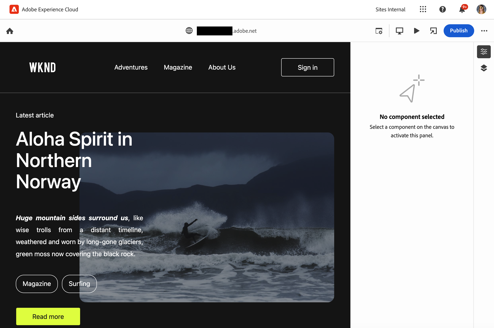

>[!TIP]
>
>The Universal Editor offers a number of [customization options](/help/implementing/universal-editor/customizing.md) and [extension points](/help/implementing/universal-editor/extending.md) that can modify and add to the functionality of the editor. For this reason, you may see different options than the standard ones documented here.

### Experience Platform Top Navigation Bar {#experience-cloud-header}

The Experience Platform top navigation bar is always present at the top of the screen. It is an anchor that tells you where you are within Experience Cloud and helps you navigate to other Experience Cloud apps.

For details on the Experience Platform top navigation bar, please see the [Adobe Experience Platform UI guide](https://experienceleague.adobe.com/en/docs/experience-platform/landing/platform-ui/ui-guide#top-navigation-bar)

#### Account {#user-properties}

Tapping or clicking the account icon opens a menu with your user settings.

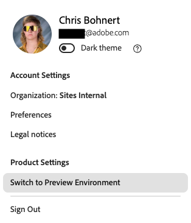

For the Universal Editor, under the heading **Product Settings**, there is an option to switch between the current production version of the Universal Editor and the upcoming preview version.

### The Universal Editor Toolbar {#universal-editor-toolbar}

The Universal Editor toolbar is always present at the top of the screen just below [the Experience Cloud header](#experience-cloud-header). It gives you quick access to navigate to another page to edit and to publish the current page.

Depending on the configuration of your program, it can also present [additional features that have been enabled as extensions by your administrator.](#additional-toolbar-buttons)

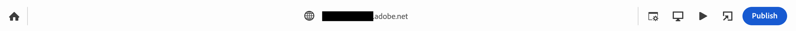

#### The Home Button {#home-button}

The home button returns you to the start page of the Universal Editor

On the start page you can enter the URL of the site you want to edit with the Universal Editor.

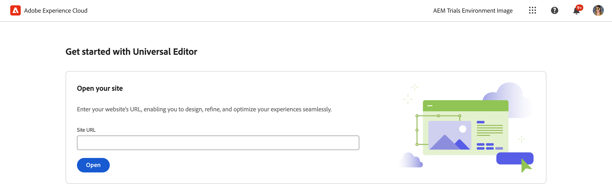

>[!NOTE]
>
>Any page that you want to edit with the Universal Editor must be [instrumented to support he Universal Editor](/help/implementing/universal-editor/getting-started.md).

A **Quick Links** section provides you with help resources and a **Recents** section provides links to pages you recently opened with the Universal Editor.

#### Location Bar {#location-bar}

The location bar shows you the address of the page you are editing. Select to enter the address of another page to edit.

>[!TIP]
>
>Use the hot key `l` (the letter l) to open the address bar.

>[!NOTE]
>
>Any page that you want to edit with the Universal Editor must be [instrumented to support he Universal Editor](/help/implementing/universal-editor/getting-started.md).

#### Undo and Redo {#undo-redo}

Select the Undo or Redo buttons to undo or redo the last edit in the editor. Please see the document [Authoring Content with the Universal Editor](/help/sites-cloud/authoring/universal-editor/authoring.md#undo-redo) for more information.

>[!TIP]
>
>Use the hot key `Command-Z` or `Shift-Command-Z` to undo or redo, respectively.

#### Authentication Headers {#authentication-settings}

Select the authentication headers icon if you need to [set a custom authentication header for local development purposes](/help/implementing/universal-editor/developer-overview.md#auth-header).

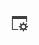

#### Responsive Mode {#emulator}

Select the responsive mode icon to define how the Universal Editor renders the page.

Tapping or clicking the responsive mode icon reveals the options.

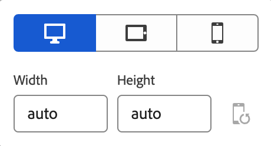

By default the editor opens in desktop layout where the height and width are automatically defined by the browser.

You can also chose to emulate a mobile device and within the Universal Editor:

* Define its orientation
* Define the width and height
* Change the orientation

#### Preview {#preview-mode}

In preview mode, the page rendered in the editor as it would be seen on your published service. This allows the content author to navigate the content by clicking links, and so on.

>[!TIP]
>
>Use the hot key `p` to toggle to and from preview mode.

#### Open Page {#open-page}

Select the open page icon to open the page you are currently editing in its own browser tab, free of the editor to preview your content.

>[!TIP]
>
>Use the hot key `o` (the letter o) to open the app preview.

>[!TIP]
>
>The preview URL for your app [can be customized](/help/implementing/universal-editor/customizing.md#custom-preview-urls).

>[!NOTE]
>
>The open page button [can be disabled](/help/implementing/universal-editor/customizing.md#open-page) and thus might not appear in your editor.

#### Publish {#publish}

Select the publish button so you can publish the changes to the content live for consumption by your readers or to a preview environment for review.

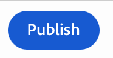

>[!TIP]
>
>See the document [Publishing Content with the Universal Editor](publishing.md) for more information on publishing with the Universal Editor.

>[!NOTE]
>
>The publish button [can be disabled](/help/implementing/universal-editor/customizing.md#disable-publish) and thus might not appear in your editor.

#### Ellipsis {#ellipsis}

Additional, standard options are accessible using the ellipsis button.

For example, the ability to unpublish a page (i.e. reverse the action of the [**Publish** button](#publish)) is accessible via the ellipsis button.

#### Additional Buttons {#additional-toolbar-buttons}

The Universal Editor offers a customizable and extensible authoring experience. If you see additional buttons in the toolbar, your Universal Editor has been extended.

* For details on how an individual extension works, [please see the Universal Editor authoring documentation.](/help/sites-cloud/authoring/universal-editor/authoring.md#toolbar-options)
* For details on extension possibilities, please see the [Extending the Universal Editor.](/help/implementing/universal-editor/extending.md)
* For details on how to install an individual extension, please see the [Extension Manager documentation.](https://developer.adobe.com/uix/docs/extension-manager/extension-developed-by-adobe/)

### The Editor {#editor}

The editor occupies most of the window and is where the page specified in [the location bar](#location-bar) is rendered.

If the editor is in [preview mode](#preview-mode), the content will be navigable and you can follow links, but you cannot edit the content.

### Properties Panel {#properties-rail}

The properties panel is always present along the right side of the editor. Depending on its mode, it can show details for a component selected in the content or the hierarchy of the page contents.

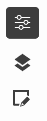

Depending on the configuration of your program, it can also present [additional features that have been enabled as extensions by your administrator.](#additional-properties-panel-buttons)

#### Properties Mode {#properties-mode}

In properties mode, the panel shows the properties of the component currently selected in the editor. This is the default mode of the properties panel when a page is loaded.

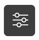

Depending on the type of component you select, details can be displayed and modified in the properties panel.

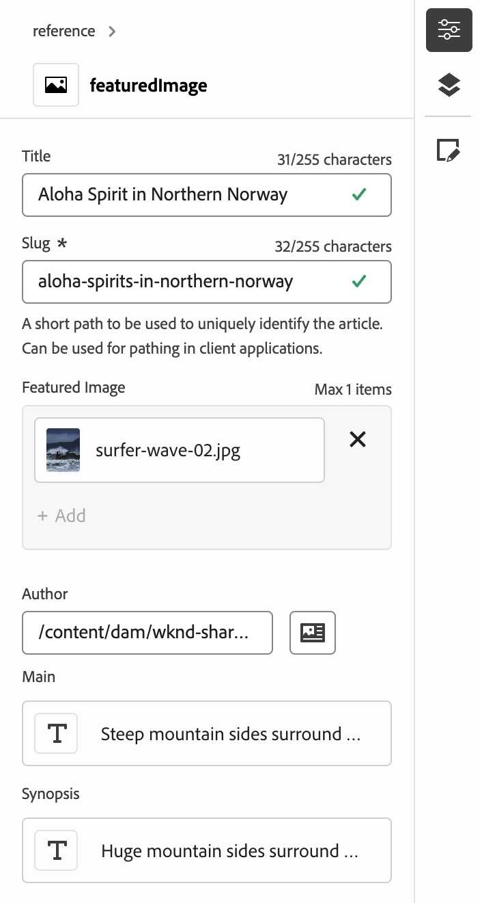

Not all components have details that can be shown and/or edited.

>[!TIP]
>
>Use the hot key `d` to switch to properties mode.

#### Content Tree Mode {#content-tree-mode}

In content tree mode, the panel shows the hierarchy of the page content.

* When selecting an item in the content tree, the editor scrolls to that content and selects it.
* When double-clicking an item in the content tree, the editor scrolls to that content and selects it and also opens the associated properties in [properties mode.](#properties-mode)

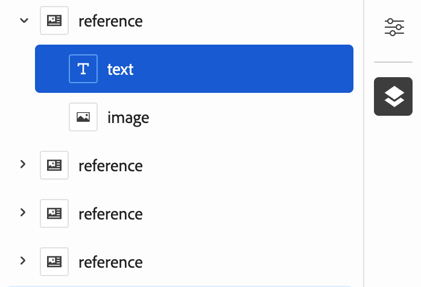

>[!TIP]
>
>Use the hot key `f` to switch to content tree mode.

##### Open in CF Editor {#edit}

When editing, the options for the selected component appear in the properties panel, where you can edit the selected component. If the selected component is a Content Fragment, you can also select the **Open in CF Editor** button.

Tapping or clicking the **Open in CF Editor** button opens the [Content Fragment editor](/help/assets/content-fragments/content-fragments-managing.md#opening-the-fragment-editor) in a new tab. This allows you access to the full power of the Content Fragment editor to edit the associated Content Fragment.

Depending on the needs of your workflow, you may want to edit the Content Fragment in the Universal Editor or directly in the Content Fragment editor.

>[!TIP]
>
>Use the hot key `e` to open a selected Content Fragment in the Content Fragment editor.

##### Add {#add}

If you select a container component either in the content tree or in the editor, the add option appears on the properties panel.

Tapping or clicking the add button opens a drop-down menu of components that are available to [add to the selected container](/help/sites-cloud/authoring/universal-editor/authoring.md#adding-components).

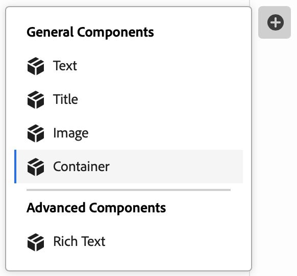

>[!TIP]
>
>Use the hot key `a` to add a component to a selected container component.

##### Duplicate {#duplicate}

If you select a component within a container component either in the content tree or in the editor, the duplicate option appears on the properties panel.

Tapping or clicking the duplicate button [duplicates the selected component](/help/sites-cloud/authoring/universal-editor/authoring.md#duplicating-components).

##### Delete {#delete}

If you select a component within a container component either in the content tree or in the editor, the delete option appears on the properties panel.

Tapping or clicking the delete button [deletes the component](/help/sites-cloud/authoring/universal-editor/authoring.md#deleting-components).

>[!TIP]
>
>Use the hot key `Shift+Backspace` to delete a selected component from a container.

##### Copy and Paste {#copy-paste}

You can copy and paste components that are within [containers.](/help/implementing/universal-editor/field-types.md#container)

>[!TIP]
>
>Use the hot key `Command-C` or `Command-V` to copy or paste, respectively.

Please see the document [Authoring Content with the Universal Editor](/help/sites-cloud/authoring/universal-editor/authoring.md#copy-paste) for more information.

#### Additional Buttons {#additional-properties-panel-buttons}

The Universal Editor offers a customizable and extensible authoring experience. If you see additional buttons in the properties panel, your Universal Editor has been extended.

* For details on how an individual extension works, [please see the Universal Editor authoring documentation.](/help/sites-cloud/authoring/universal-editor/authoring.md#properties-panel-options)
* For details on extension possibilities, please see the [Extending the Universal Editor.](/help/implementing/universal-editor/extending.md)
* For details on how to install an individual extension, please see the [Extension Manager documentation.](https://developer.adobe.com/uix/docs/extension-manager/extension-developed-by-adobe/)

## Next Steps {#next-steps}

Now that you know how to access and navigate the Universal Editor, you are ready to [author content using it](/help/sites-cloud/authoring/universal-editor/authoring.md).
