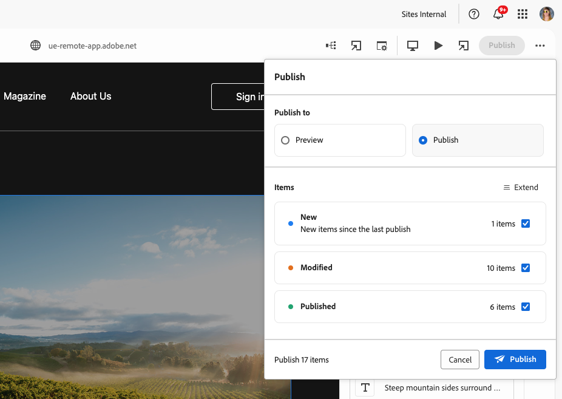
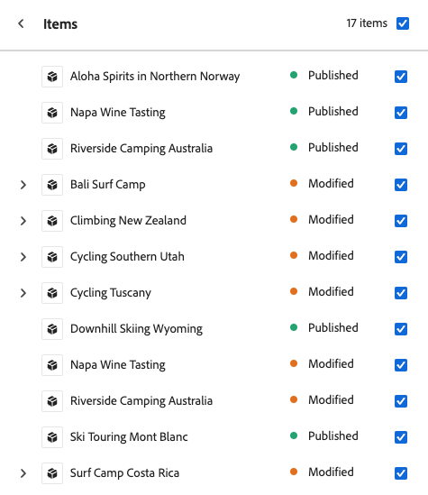

# Publishing Content with the Universal Editor {#publishing}

Learn how the Universal Editor publishes content and how your apps can handle the published content.

>[!TIP]
>
>The publication process described here is the standard out-of-the-box feature of the Universal Editor.
>
>The Universal Editor also supports [extensions and UI extensibility](/help/implementing/universal-editor/extending.md) to allow workflows to support your publication process, so your publication flow may vary.

## Publishing Content from the Universal Editor {#publishing-content}

When you as a content author are ready to publish your content, you simply need to tap or click the **Publish** icon in the Universal Editor's tool bar.

1. In the Universal Editor, tap or click [the **Publish** icon in the Universal Editor's tool bar.](/help/sites-cloud/authoring/universal-editor/navigation.md#publish)
1. If you have a [preview service](/help/sites-cloud/authoring/sites-console/previewing-content.md) available, you can choose where you publish your content, either to **Preview** or **Publish**.
1. The **Items** section lists the content that is included in the publication including:
   * **New** items that have not yet been published.
   * **Mofified** content that has been published, but modified since the last publication.
   * **Published** content that has been published and not modified since that publication.

   Tap or click the checkboxes next to those items to include/exclude them from publication as required. Tap or click **Extend** to see individual items included in the totals for the three categories and to be able to in/exclude them individually.

   

   Tap or click the back arrow next to the **Items** heading to return to the overview.

1. Tap or click **Publish** to publish or **Cancel** to abort.

## Unpublishing Content from the Universal Editor {#unpublishing-content}

Unpublishing content works in a similar fashion to publishing content. When you as a content author are ready to remove content from publication, tap or click the ellipsis icon in the Universal Editor's tool bar and then **Unpublish**.

You then have the same options to unpublish content as you did when [publishing content.](#publishing-content) including unpublishing from a preview instance if available and which items to include in unpublication.

## Publishing and Unpublishing from the Sites Console {#publishing-sites-console}

You can also publish [from the Sites console,](/help/sites-cloud/authoring/sites-console/publishing-pages.md) which can be useful when you wish to publish multiple pages of content or schedule publication or unpublication.

## Similarities with the Page Editor {#similarities}

For users of the [AEM Page Editor,](/help/sites-cloud/authoring/page-editor/introduction.md) the process to publish content with the Universal Editor works as you are accustomed: on publication in AEM, the content is replicated from the author tier to the publish tier.

## Differences {#differences}

What makes publishing with the Universal Editor a bit different is not so much the editor itself, but rather the external hosting of the app that the Universal Editor makes possible.

When externally hosted, it is the concern of the web app to ensure that content is loaded from the author tier when the app is opened by authors within the editor, and is loaded from the publish tier when the app is accessed by visitors.

## Detecting the Tier in the App {#detecting}

Determining whether the author or publishing tier should be access can be accomplished by a simple conditional statement in the app to choose the appropriate author or publish endpoint when detecting that its being opened within the editor.

Another option is to deploy the app to two different environments that are configured differently, so that one retrieves its content from the author tier, and one that retrieves it from the publish tier. To allow authors to open the published URL in the Universal Editor, a small script can  be created to "convert" the publish-side URL to its equivalent on the author environment (for example, by prepending an `author` sub-domain), so that the authors are automatically redirected.

## Summary {#summary}

The objective of the Universal Editor is to not impose any particular pattern, so that the implementation can best achieve its goals in a fully-decoupled manner while still keeping everything simple and straight-forward for the implementation.

Likewise the Universal Editor does not make any requirements on how any particular project should go about determining from which tier to delivery the content. Rather it enables several possibilities and allows the project to determine which solution is best for its own requirements.

## Additional Resources {#additional-resources}

To learn how to author content with the universal editor, please see this document.

* [Authoring Content with the Universal Editor](authoring.md) - Learn how easy and intuitive it is for content authors to create content using the Universal Editor.

To learn more about the technical details of the Universal Editor, please see these developer documents.

* [Universal Editor Introduction](/help/implementing/universal-editor/introduction.md) - Learn how the Universal Editor enables editing any aspect of any content in any implementation so you can deliver exceptional experiences, increase content velocity, and provide a state-of-the-art developer experience.
* [Getting Started with the Universal Editor in AEM](/help/implementing/universal-editor/getting-started.md) - Learn how to get access to the Universal Editor and how to start instrumenting your first AEM app to use it.
* [Universal Editor Architecture](/help/implementing/universal-editor/architecture.md) - Learn about the architecture of the Universal Editor and how data flows between its services and layers.
* [Attributes and Types](/help/implementing/universal-editor/attributes-types.md) - Learn about the data attributes and types that the Universal Editor requires.
* [Universal Editor Authentication](/help/implementing/universal-editor/authentication.md) - Learn how the Universal Editor authenticates.
