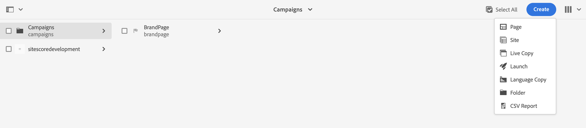
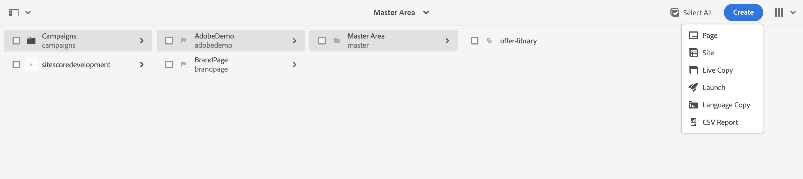
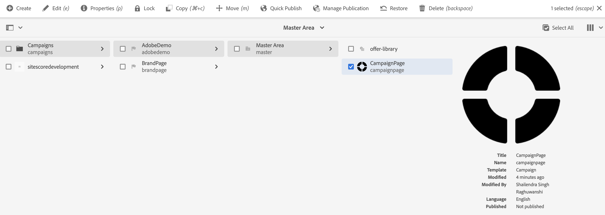
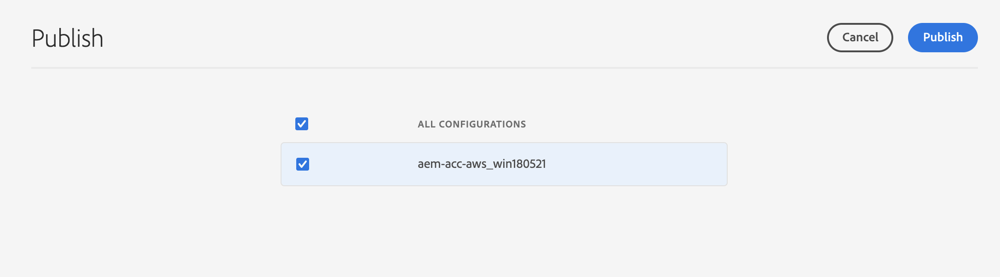
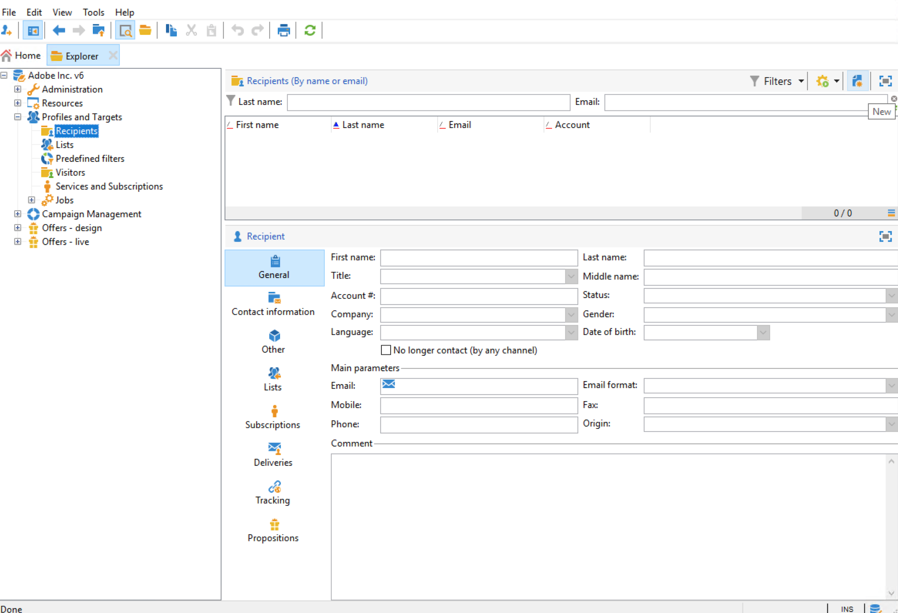

# Creating an Adobe Experience Manager Newsletter {#creating-newsletter}

Before you can perform the steps presented below you need to first [integrate](/help/sites-cloud/integrating/integrating-campaign-classic.md) Adobe Campaign Classic and AEM as a Cloud Service. Having configured both Adobe Campaign Classic and AEM as a Cloud Service, you will now learn how to create an Adobe Experience Manager Newsletter.

1. From the AEM author instance, click the Adobe Experience Manager logo in the upper left side of the page and select **Sites**.
1. Select Campaign, click **Create→Page**.

1. Select Brand and click **Next**.
1. Enter a title and click **Create** and **Done**.
1. To create a Campaign page, go to **Campaigns→AdobeDemo→Master** and click **Create→Page**.

1. Select the Campaign template then click **Next** and **Done**.
1. Enter a title , click **Create** and **Done**.
1. Go to **Campaign→AdobeDemo→Master** and select the CampaignPage checkbox. Click **Properties** on the top left.

1. Go to the **Cloud Service** tab:
    * Select Adobe Campaign from the Cloud Service Configurations drop-down list.
    * Select the desired name for the Adobe Campaign configuration.
    * **Save** and **Close**.
1. To create an Adobe Campaign Classic Email page, go to **Campaign→AdobeDemo→Master→CampaignPage** and click **Create→Page**.
1. Select the Adobe Campaign Email (for example, AC 6.1) template and click **Next**.
1. On the Create page, enter the title for the newsletter, click **Create** and **Done**.
1. Go to **Campaign→AdobeDemo→Master→CampaignPage**, select the Campaign Classic checkbox and click on **Edit** on top left to open the email page.
1. Edit the Adobe Campaign Classic email newsletter page as per your requirements.
1. Click on the **Page Information** button on top left and click on **Publish Page**.
1. Select the configuration on which the page has to be published. Click **Publish**.

1. The newsletter page has been published on the publish instance and also on the AEM Adobe Campaign Classic configuration.
    * Now the newsletter page will be visible in Adobe Campaign Classic
1. Click on the Page Information button and click **Start Workflow**.
1. Select **Approve for Adobe Campaign** as the workflow model and click the **Start Workflow** button.
1. A disclaimer appears on the top of the page. Click **Complete** to confirm the review and again click **OK**.
1. Click **Complete** and select **Newsletter approval** in the Next Step drop-down list and click the **OK** button.

## Creating a Recipient {#creating-recipient}

1. Open the Adobe Campaign Classic server by using the Adobe Campaign Classic client console.
1. Go to the Explorer view.
1. In the tree view on the left, go to Profiles and Targets and select **Recipients**.

1. Fill the Details of the recipient.
   * Enter the First name.
   * Enter the Last Name.
   * Enter the Email.
   * Click **Save**.

## Creating an Email Delivery in Adobe Campaign Classic {#create-delivery}

1. Open the Adobe Campaign Classic server by using the Adobe Campaign Classic client console.
1. Go to the Explorer view.
1. In the tree view on the left, select **Campaign Management** and select **Deliveries**.
1. On top right corner, click **New**.
1. Select **Email Delivery with AEM Content** from the Delivery template drop-down list and click **Continue**.
1. Click on From link under Email parameters.
    * Enter the Sender address.
    * Enter the From field.
    * Click **OK**.
1. Click **To** link then click **Add** on the select target screen.
1. Select **A recipient** and click **Next**.

1. Select the recipient created [previously](#creating-recipient) and click **Finish**.
1. The recipient has been selected. Click **OK**.
1. Click **Synchonize**.
1. Select the email page from the list, click **OK**.
1. The email template is synchronized. Click **Refresh Content** if it is not loaded.
1. Click **Send** to send the email.
1. On next screen, select **Delivery as soon as possible** and then click **Analyze**.

1. Now as the delivery has been created, click **Confirm Delivery** to start sending the email. Click **Yes** to confirm.

1. The delivery has started. Click **Close**.
1. Click **Save** to save the delivery.
