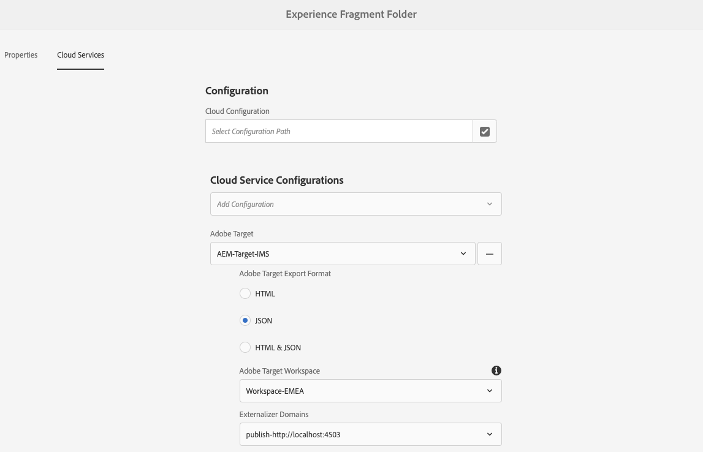
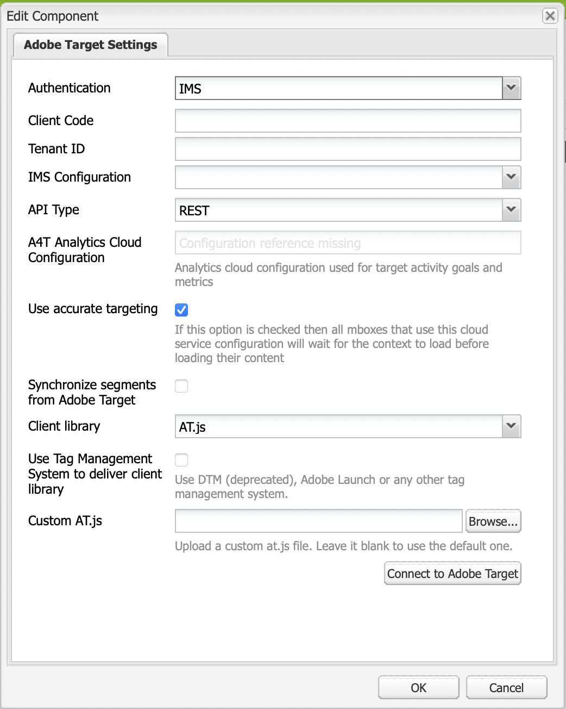

# Exporting Experience Fragments to Adobe Target{#exporting-experience-fragments-to-adobe-target}

>[!CAUTION]
>
>* The AEM Experience Fragments are exported into the default workspace of Adobe Target.
>* AEM must be integrated with Adobe Target according to the instructions under [Integrating with Adobe Target](/help/sites-cloud/integrating/integrating-adobe-target.md).

You can export [Experience Fragments](/help/sites-cloud/authoring/fundamentals/experience-fragments.md), created in Adobe Experience Manager as a Cloud Service (AEM), to Adobe Target (Target). They can then be used as offers in Target activities, to test and personalize experiences at scale.

There are three options available for exporting an Experience Fragment to Adobe Target:

* HTML (default): Support for web and hybrid content delivery
* JSON: Support for headless content delivery
* HTML & JSON

To prepare your instance for exporting AEM Experience Fragments to Adobe Target you need to: 

* [Integrate with Adobe Target](/help/sites-cloud/integrating/integrating-adobe-target.md)
* [Add the Cloud Configuration](#add-the-cloud-configuration)
* [Add the Legacy Configuration](#add-the-legacy-configuration)

After that you can:

* [Export an Experience Fragment to Adobe Target](#exporting-an-experience-fragment-to-adobe-target)
* [Use your Experience Fragments in Adobe Target](#using-your-experience-fragments-in-adobe-target)
* And also [Delete an Experience Fragment already exported to Adobe Target](#deleting-an-experience-fragment-already-exported-to-adobe-target)

Experience Fragments can be exported to the default workspace in Adobe Target, or to user-defined workspaces for Adobe Target.

>[!NOTE]
>
>The Adobe Target workspaces do not exist in Adobe Target itself. They are defined and managed in Adobe IMS (Identity Management System), then selected for usage across solutions using Adobe Developer Console.

>[!NOTE]
>
>Adobe Target workspaces can be used to allow members of an organization (group) to create and manage offers and activities for this organization only; without giving access to other users. For example, country-specific organizations within a global concern.

>[!NOTE]
>
>For further information see also:
>
>* [Adobe Target development](http://developers.adobetarget.com/)
>* [Core Components - Experience Fragments](https://experienceleague.adobe.com/docs/experience-manager-core-components/using/introduction.html)
>* [Adobe Target - How Do I Use Adobe Experience Manager (AEM) Experience Fragments?](https://experienceleague.adobe.com/docs/target/using/experiences/offers/aem-experience-fragments.html?lang=en)
>* [AEM 6.5 - Manually Configuring the Integration with Adobe Target - Creating a Target Cloud Configuration](https://experienceleague.adobe.com/docs/experience-manager-65/administering/integration/target-configuring.html#creating-a-target-cloud-configuration)

## Prerequisites {#prerequisites}

Various actions are required:

1. You have to [integrate AEM with Adobe Target](/help/sites-cloud/integrating/integrating-adobe-target.md).

1. Experience Fragments are exported from the AEM author instance, so you need to [Configure the AEM Link Externalizer](/help/implementing/developing/extending/experience-fragments.md#configuring-the-aem-link-externalizer) on the author instance to ensure that any references within the Experience Fragment are externalized for web delivery.

   >[!NOTE]
   >
   >For link rewriting not covered by the default, the [Experience Fragment Link Rewriter Provider](/help/implementing/developing/extending/experience-fragments.md#the-experience-fragment-link-rewriter-provider-html) is available. With this, customized rules can be developed for your instance.

## Add the Cloud Configuration {#add-the-cloud-configuration}

Before exporting a fragment you need to add the **Cloud Configuration** for **Adobe Target** to the fragment, or folder. This also enables you to:

* specify the format option(s) to be used for the export
* select a Target workspace as destination
* select an externalizer domain for rewriting references in the Experience Fragment (optional)

The required options can be selected in **Page Properties** of the required folder and/or fragment; the specification will be inherited as necessary.

1. Navigate to the **Experience Fragments** console.

1. Open **Page Properties** for the appropriate folder or fragment.

   >[!NOTE]
   >
   >If you add the cloud configuration to the Experience Fragment parent folder, the configuration is inherited by all the children.
   >
   >If you add the cloud configuration to the Experience Fragment itself, the configuration is inherited by all varations.

1. Select the **Cloud Services** tab.

1. Under **Cloud Service Configuration**, select **Adobe Target** from the drop-down list.

   >[!NOTE]
   >
   >The JSON format of an Experience Fragment offer can be customized. To do this define a customer Experience Fragment component and then annotate how to export its properties in the component Sling Model.
   >
   >See the core component: [Core Components - Experience Fragments](https://experienceleague.adobe.com/docs/experience-manager-core-components/using/components/experience-fragment.html)

1. Under **Adobe Target** select:

   * the appropriate configuration
   * the required format option
   * an Adobe Target workspace
   * if required - the externalizer domain

   >[!CAUTION]
   >
   >The externalizer domain is optional. 
   >
   > An AEM externalizer is configured when you want the exported content to point to a specific *publish* domain. For more details see [Configuring the AEM Link Externalizer](/help/implementing/developing/extending/experience-fragments.md#configuring-the-aem-link-externalizer).
   >
   > Also note that Externalizer Domains are only relevant to the content of the Experience Fragment that is sent to Target, and not metadata such as View Offer Content.

   For example, for a folder:

   

1. **Save & Close**.

## Add the Legacy Configuration {#add-the-legacy-configuration}

<!-- This is effectively the Manually Integrating with Adobe Target {#manually-integrating-with-adobe-target} section from 6.5 -->

>[!IMPORTANT]
>
>Adding a new Legacy configuration is a special case scenario that is only supported for the export of Experience Fragments. 

After [adding the Cloud Configuration](#add-the-cloud-configuration) to use Launch by Adobe, to initially integrate AEM with Adobe Target, you also need to manually integrate with Adobe Target using a legacy configuration.

### Creating a Target Cloud Configuration {#creating-a-target-cloud-configuration}

To enable AEM to interact with Adobe Target, create a Target cloud configuration. To create the configuration, you provide the Adobe Target client code and user credentials.

You create the Target cloud configuration only once because you can associate the configuration with multiple AEM campaigns. If you have several Adobe Target client codes, create one configuration for each client code.

You can configure the cloud configuration to synchronize segments from Adobe Target. If you enable synchronization, segments are imported from Target in the background as soon as the cloud configuration is saved.

Use the following procedure to create a Target cloud configuration in AEM:

1. Navigate to **Legacy Cloud Services** via the **AEM logo** &gt; **Tools** &gt; **Cloud Services** &gt; **Legacy Cloud Services**. 
   For example: ([http://localhost:4502/libs/cq/core/content/tools/cloudservices.html](http://localhost:4502/libs/cq/core/content/tools/cloudservices.html))

   The **Adobe Experience Cloud** overview page opens.

1. In the **Adobe Target** section, click **Configure Now**.
1. In the **Create Configuration** dialog:

   1. Give the configuration a **Title**.
   1. Select the **Adobe Target Configuration** template.
   1. Click **Create**.

You can now select the new configuration for editing.

1. The edit dialog opens.

   

   <!-- Can this still occur?

   >[!NOTE]
   >
   >When configuring A4T with AEM, you may see a Configuration reference missing entry. To be able to select the analytics framework, do the following:
   >
   >1. Navigate to **Tools** &gt; **General** &gt; **CRXDE Lite**.
   >1. Navigate to **/libs/cq/analytics/components/testandtargetpage/dialog/items/tabs/items/tab1_general/items/a4tAnalyticsConfig**
   >1. Set the property **disable** to **false**.
   >1. Tap or click **Save All**.

   -->

1. In the **Adobe Target Settings** dialog, provide values for these properties.

   * **Authentication**: this defaults to IMS (User Credentials is deprecated)

   * **Client Code**: the Target account Client Code

   * **Tenant ID**: the tenant ID

   * **IMS Configuration**: select the required configuration from the drop down list

   * **API Type**: defaults to REST (XML is deprecated)

   * **A4T Analytics Cloud Configuration**: Select the Analytics cloud configuration that is used for target activity goals and metrics. You need this if you are using Adobe Analytics as the reporting source when targeting content.

     <!-- Is this needed?
     If you do not see your cloud configuration, see note in [Configuring A4T Analytics Cloud Configuration](#configuring-a-t-analytics-cloud-configuration).
     -->

   * **Use accurate targeting:** By default this check box is selected. If selected, the cloud service configuration will wait for the context to load before loading content. See note that follows.

   * **Synchronize Segments from Adobe Target:** Select this option to download segments that are defined in Target to use them in AEM. You must select this option when the API Type property is REST, because inline segments are not supported and you always need to use segments from Target. (Note that the AEM term of 'segment' is equivalent to the Target 'audience'.)

   * **Client library:** this defaults to AT.js (mbox.js is deprecated)

     >[!NOTE]
     >
     >The Target Library file, [AT.JS](https://experienceleague.adobe.com/docs/target/using/implement-target/client-side/implement-target-for-client-side-web.html), is a new implementation library for Adobe Target that is designed for both typical web implementations and single-page applications. 
     >
     >mbox.js has been deprecated and will be removed at a later stage.
     >
     >Adobe recommends that you use AT.js instead of mbox.js as the client library.
     >
     >AT.js offers several improvements over the mbox.js library:
     >
     >* Improved page load times for web implementations
     >* Improved security
     >* Better implementation options for single-page applications
     >* AT.js contains the components that were included in target.js, so there is no longer a call to target.js
     >
     >You can select AT.js or mbox.js in the **Client library** drop-down menu.

   * **Use Tag Management System to deliver client library** - Select this option to use the client library from Adobe Launch or another tag management system (or DTM, which is deprecated).

   * **Custom AT.js**: Browse to upload your custom AT.js. Leave blank to use the default library.

     >[!NOTE]
     >
     >By default when you opt into the Adobe Target configuration wizard, Accurate Targeting is enabled.
     >
     >Accurate targeting means that the cloud service configuration waits for the context to load before loading content. As a result, in terms of performance, accurate targeting may create a few millisecond delay before loading content.
     >
     >Accurate targeting is always enabled on the author instance. However, on the publish instance you can opt to turn accurate targeting off globally by clearing the check mark next to Accurate Targeting in the cloud service configuration (**http://localhost:4502/etc/cloudservices.html**). You can also still turn accurate targeting on and off for individual components regardless of your setting in the cloud service configuration.
     >
     >If you have ***already*** created targeted components and you change this setting, your changes do not affect those components. You must make any changes to those component directly.

1. Click **Connect to Adobe Target** to initialize the connection with Target. If the connection is successful, the message **Connection successful** is displayed. Click **OK** on the message and then **OK** on the dialog.

   If you cannot connect to Target, see the [troubleshooting](#troubleshooting-target-connection-problems) section.

### Adding a Target Framework {#adding-a-target-framework}

<!-- Is this section needed? -->

After you configure the Target cloud configuration, add a Target framework. The framework identifies the default parameters that are sent to Adobe Target from the available [ContextHub](/help/implementing/developing/personalization/configuring-contexthub.md) components. Target uses the parameters to determine the segments that apply to the current context.

You can create multiple frameworks for a single Target configuration. Multiple frameworks are useful when you need to send a different set of parameters to Target for different sections of your website. Create a framework for each set of parameters that you need to send. Associate each section of your website with the appropriate framework. Note t*hat a web page can use only one framework at a time.

1. On your Target configuration page, click the **+** (plus sign) next to Available Configurations.

1. In the Create Framework dialog, specify a **Title**, select the **Adobe Target Framework**, and click **Create**.

   <!--  -->

   The framework page opens. Sidekick provides components that represent information from the [ContextHub](/help/implementing/developing/personalization/configuring-contexthub.md) that you can map.

   <!--  -->

1. Drag the Client Context component that represents the data that you want to use for mapping to the drop target. Alternatively, drag the **ContextHub Store** component to the framework.

   >[!NOTE]
   >
   >When mapping, parameters are passed to an mbox via simple strings. You cannot map arrays from ContextHub.

   For example, to use **Profile Data** about your site vistors to control your Target campaign, drag the **Profile Data** component to the page. The profile data variables that are available for mapping to Target parameters appear.

   <!--  -->

1. Select the variables that you want to make visible to the Adobe Target system by selecting the **Share** checkbox in the appropriate columns.

   <!--  -->

   >[!NOTE]
   >
   >Synchronizing parameters is one way only - from AEM to Adobe Target.

Your framework is created. To replicate the framework to the publish instance, use the **Activate Framework** option from the sidekick.

<!--
### Associating Activities With the Target Cloud Configuration  {#associating-activities-with-the-target-cloud-configuration}

Associate your [AEM activities](/help/sites-cloud/authoring/personalization/activities.md) with your Target cloud configuration so that you can mirror the activities in [Adobe Target](https://experienceleague.adobe.com/docs/target/using/experiences/offers/manage-content.html).

>[!NOTE]
>
>What types of activities are available is determined by the following:
>
>* If the **xt_only** option is enabled on the Adobe Target tenant (clientcode) used on the AEM side to connect to Adobe Target, then you can create **only** XT activities in AEM.
>
>* If the **xt_only** options is **not** enabled on the Adobe Target tenant (clientcode), then you can create **both** XT and A/B activities in AEM.
>
>**Additional note:** **xt_only** options is a setting applied on a certain Target tenant (clientcode) and can only be modified directly in Adobe Target. You cannot enable or disable this option in AEM.
-->

<!--
### Associating the Target Framework With Your Site {#associating-the-target-framework-with-your-site}

After you create a Target framework in AEM, associate your web pages with the framework. The targeted components on the pages send the framework-defined data to Adobe Target for tracking. (See [Content Targeting](/help/sites-cloud/authoring/personalization/targeted-content.md).)

When you associate a page with the framework, the child pages inherit the association.

1. In the **Sites** console, navigate to the site that you want to configure.
1. Using either [quick actions](/help/sites-cloud/authoring/getting-started/basic-handling.md#quick-actions) or [selection mode](/help/sites-cloud/authoring/getting-started/basic-handling.md#selecting-resources), select **View Properties.**
1. Select the **Cloud Services** tab.
1. Tap/click **Edit**.
1. Tap/click **Add Configuration** under **Cloud Service Configurations** and select **Adobe Target**.

  

1. Select the framework you want under **Configuration Reference**.

   >[!NOTE]
   >
   >Make sure that you select the specific **framework** that you created and not the Target cloud configuration under which it was created.

1. Tap/click **Done**.
1. Activate the root page of the website to replicate it to the publish server. (See [How To Publish Pages](/help/sites-cloud/authoring/fundamentals/publishing-pages.md).)

   >[!NOTE]
   >
   >If the framework you attached to the page was not activated yet, a wizard opens which allows you to publish it as well.
--> 

<!--
### Troubleshooting Target Connection Problems {#troubleshooting-target-connection-problems}

Perform the following tasks to troubleshoot problems that occur when connecting to Target:

* Make sure that the user credentials that you provide are correct.
* Make sure that the AEM instance can connect to the Target server. For example, make sure that firewall rules are not blocking outbound AEM connections, or that AEM is configured to use necessary proxies.
* Look for helpful messages in the AEM error log. The error.log file is located in the **crx-quickstart/logs** directory where AEM is installed.
* When editing the activity in Adobe Target, the URL is pointing to localhost. Work around this by setting the AEM externalizer to the correct URL.
--> 

## Exporting an Experience Fragment to Adobe Target {#exporting-an-experience-fragment-to-adobe-target}

>[!CAUTION]
>
>For media assets, such as images, only a reference is exported to Target. The asset itself remains stored in AEM Assets and is delivered from the AEM publish instance.
>
>Due to this the Experience Fragment, with all related assets, needs to be published before exporting to Target.

To export an experience fragment from AEM to Target (after specifying the Cloud Configuration):

1. Navigate to the Experience Fragment console.
1. Select the Experience Fragment you would like to export to target.

   >[!NOTE]
   >
   >It has to be an Experience Fragment Web variation.

1. Tap/click **Export to Adobe Target**.

   >[!NOTE]
   >
   >If the Experience Fragment has already been exported, select **Update in Adobe Target**.

1. Tap/click **Export without publishing** or **Publish** as required.

   >[!NOTE]
   >
   >Selecting **Publish** will publish the experience fragment right away and send it to Target.

1. Tap/click **OK** in the confirmation dialog.

   Your experience fragment should now be in Target.

   >[!NOTE]
   >
   >[Various details](/help/sites-cloud/authoring/fundamentals/experience-fragments.md#details-of-your-experience-fragment) of the export can be seen in **List View** of the console and **Properties**.

   >[!NOTE]
   >
   >When viewing an Experience Fragment in Adobe Target, the *last modified* date that is seen is the date that the fragment was last modified in AEM, not the date that the fragment was last exported to Adobe Target.

>[!NOTE]
>
>Alternatively, you can perform the export from the page editor, using comparable commands in the [Page Information](/help/sites-cloud/authoring/fundamentals/environment-tools.md#page-information) menu.

## Using your Experience Fragments in Adobe Target {#using-your-experience-fragments-in-adobe-target}

After performing the preceding tasks, the experience fragment displays on the Offers page in Target. Please have a look at the [specific Target documentation](https://experiencecloud.adobe.com/resources/help/en_US/target/target/aem-experience-fragments.html) to learn about what you can achieve there.

>[!NOTE]
>
>When viewing an Experience Fragment in Adobe Target, the *last modified* date that is seen is the date that the fragment was last modified in AEM, not the date that the fragment was last exported to Adobe Target.

## Deleting an Experience Fragment already exported to Adobe Target {#deleting-an-experience-fragment-already-exported-to-adobe-target}

Deleting an Experience Fragment that has already been exported to Target may cause problems if the fragment is already being used in an offer in Target. Deleting the fragment would render the offer unusable as the fragment content is being delivered by AEM.

To avoid such situations:

* If the Experience Fragment is not being currently used in an activity, AEM allows the user to delete the fragment without a warning message.
* If the Experience Fragment is currently in use by an activity in Target, an error message warns the AEM user about possible consequences that deleting the fragment will have on the activity.

  The error message in AEM does not prohibit the user from (force-)deleting the Experience Fragment. If the Experience Fragment is deleted:

  * The Target offer with AEM Experience Fragment may show undesired behavior

    * The offer will likely still render, as the Experience Fragment HTML was pushed to Target
    * Any references in the Experience Fragment may not work correctly if referenced assets were deleted in AEM as well.

  * Of course, any further modifications to the Experience Fragment are impossible as the Experience Fragment does not exist anymore in AEM.
