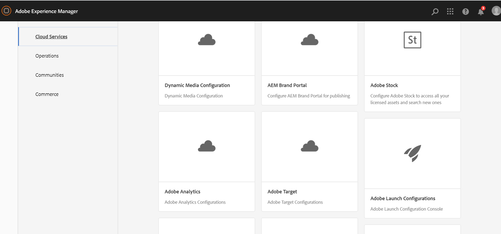
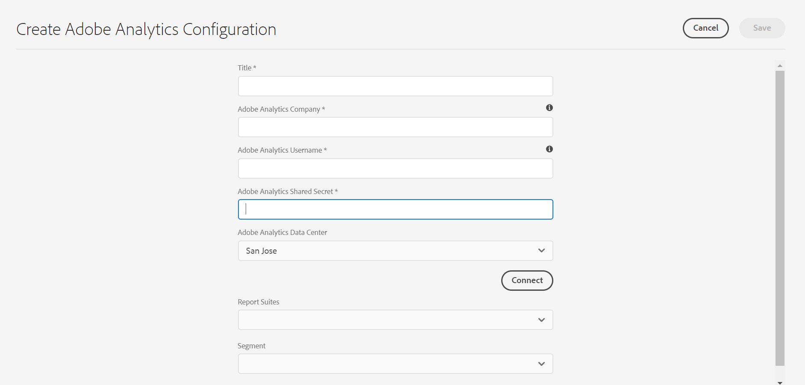

# Integrating with Adobe Analytics{#integrating-with-adobe-analytics}

Integrating Adobe Analytics and AEM as a Cloud Service allows you to track your web page activity. The integration requires:

* using the Touch UI to create an Analytics configuration in AEM as a Cloud Service.
* adding and configuring Adobe Analytics as an extension in [Adobe Launch](#analytics-launch). For more details about Adobe Launch, see [this page](https://docs.adobe.com/content/help/en/launch/using/intro/get-started/quick-start.html).

Compared to previous versions of AEM, framework support is not provided in the Analytics Configuration in AEM as a Cloud Service. Instead, it is now done through Adobe Launch, which is the defacto tool for instrumenting an AEM site with Analytics capabilities (JS libraries). In Adobe Launch, a property is created where the Adobe Analytics extension can be configured and rules are created to send data to Adobe Analytics. Adobe Launch has replaced the task of analytics provided by the sitecatalyst.

>[!NOTE]
>
>Adobe Experience Manager as a Cloud Service customers who do not have an existing Analytics account, can request access to the Analytics Foundation Pack for Experience Cloud. This Foundation Pack provides volume limited use of Analytics.

## Creating the Adobe Analytics Configuration {#analytics-configuration}

1. Navigate to **Tools** → **Cloud Services**.
2. Select **Adobe Analytics**.

3. Select the **Create** button.
4. Fill in the details (see below), and click **Connect**.

### Configuration Parameters {#configuration-parameters}

The configuration fields present in the Adobe Analytics Configuration window are:

| Property | Description |
|---|---|
| Company | Adobe Analytics Login Company |
| Username | Adobe Analytics API user |
| Password | Adobe Analytics password used for authentication |
| Data Center | The Adobe Analytics data center your account is associated with (server for instance San Jose, London) |
| Segment | Option to use an Analytics segment defined in the current reporting suite. The Analytics reports will be filtered based on the segment. Refer to [this page](https://docs.adobe.com/content/help/en/analytics/components/segmentation/seg-overview.html) for additional details. |
| Report Suites | A repository where you send data and pull reports. A report suite defines the complete, independent reporting on a chosen website, set of websites, or subset of website pages. You can view the reports fetched from a single report suite and can edit this field in a configuration anytime according to your requirements. |

### Adding a configuration to a site {#add-configuration}

To apply a Touch UI configuration to a site, go to: **Sites** → **Select any site page** → **Properties** → **Advanced** → **Configuration** → select the configuration tenant.

## Integrating Adobe Analytics on AEM sites by using Adobe Launch {#analytics-launch}

Adobe Analytics can be added as an extension in the Launch Property. Rules can be defined to perform mapping and making a post call to Adobe Analytics:

* Watch [this video](https://docs.adobe.com/content/help/en/analytics-learn/tutorials/implementation/via-adobe-launch/basic-configuration-of-the-analytics-launch-extension.html) to learn how to configure the Analytics extension in Launch for a basic site.

* See [this page](https://docs.adobe.com/content/help/en/core-services-learn/implementing-in-websites-with-launch/implement-solutions/analytics.html) for details on how to create rules and send data to Adobe Analytics.

>[!NOTE]
>
>Existing (legacy) frameworks still work, but cannot be configured in the Touch UI. It is advisable to rebuild the variable mapping configurations in Launch.

>[!NOTE]
>
>The IMS configuration (technical accounts) for Launch is preconfigured in AEM as a Cloud Service. Users do not have to create this configuration.
