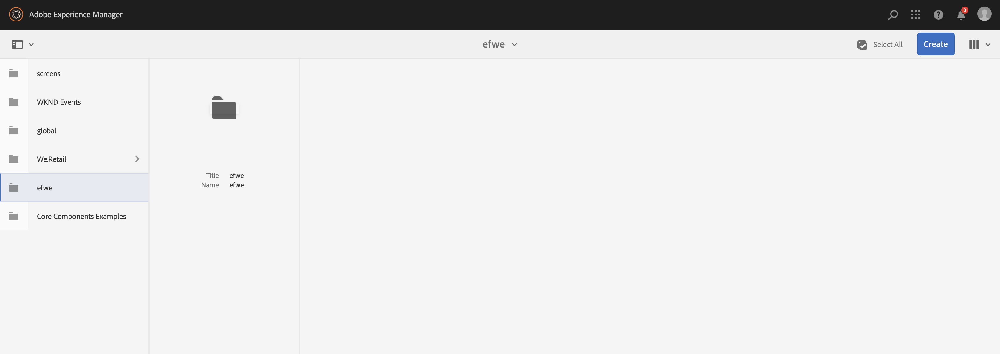
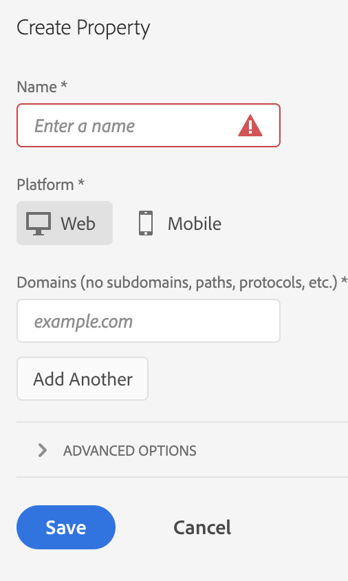
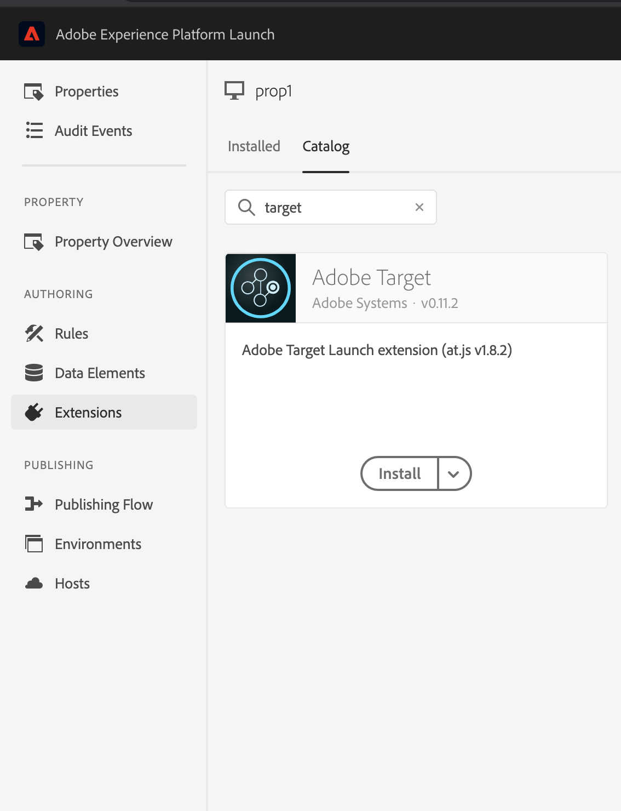
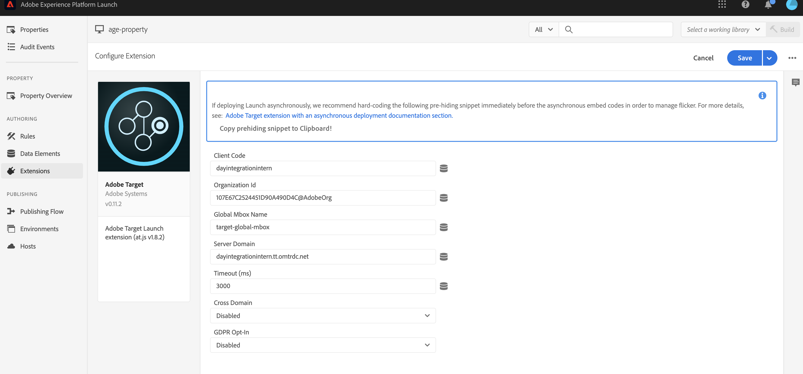
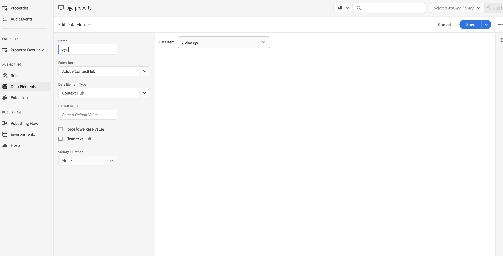

# Integrating with Adobe Target{#integrating-with-adobe-target}

As part of the Adobe Marketing Cloud, Adobe Target lets you increase content relevance through targeting and measuring across all channels. Integrating Adobe Target and AEM as a Cloud Service requires:

* using the Touch UI to create a Target Configuration in AEM as a Cloud Service (IMS configuration required).
* adding and configuring Adobe Target as an extension in [Adobe Launch](https://docs.adobe.com/content/help/en/launch/using/intro/get-started/quick-start.html).

Adobe Launch is necessary for managing client-side properties for both Analytics and Target in AEM pages (JS libraries/tags). That said, the integration with Launch is needed for "experience targeting". For the Experience Fragments export to Target you only need the Adobe Target Configuration and IMS.

>[!NOTE]
>
>Adobe Experience Manager as a Cloud Service customers who do not have an existing Target account, can request access to the Target Foundation Pack for Experience Cloud. The Foundation Pack provides volume limited use of Target.

## Creating the Adobe Target Configuration {#create-configuration}

1. Navigate to **Tools** → **Cloud Services**.

2. Select **Adobe Target**.
3. Select the **Create** button.

4. Fill in the details (see below), and select **Connect**.

### IMS Configuration {#ims-configuration}

An IMS configuration for both Launch and Target is necessary to properly integrate Target with AEM and Launch. While the IMS configuration for Launch is preconfigured in AEM as a Cloud Service, the Target IMS configuration must be created (after Target is provisioned). Refer to [this video](https://helpx.adobe.com/experience-manager/kt/sites/using/aem-sites-target-standard-technical-video-understand.html) and [this page](https://docs.adobe.com/content/help/en/experience-manager-65/administering/integration/integration-ims-adobe-io.html) to learn how to create the Target IMS configuration.

### Adobe Target Tenant ID and Adobe Target Client Code {#tenant-client}

When configuring the Adobe Target Tenant ID and Adobe Target Client Code fields, please be aware of the following:

1. For most customers, the Tenant ID and the Client Code are the same. This means that both fields contain the same information and are identical. Make sure you enter the Tenant ID in both fields.
2. For legacy purposes, you can also enter different values in the Tenant ID and the Client Code fields. In which case, be aware that:

* You have the option to change the default Tenant ID set.
* Accordingly, the backend calls to Target will be based on the Tenant ID and the client side calls to Target will be based on the Client Code.
* By default, the Client Code (if added first) will also be automatically copied into the Tenant ID field.

As stated previously, the first scenario is the most common for AEM as a Cloud Service. Either way, make sure **both** fields contain the correct information depending on your requirements.

>[!NOTE]
>
> If you want to edit an already existing Target Configuration:
>
> 1. Re-enter the Tenant ID.
> 2. Re-connect to Target.
> 3. Save the configuration.

### Editing the Target Configuration {#edit-target-configuration}

To edit the Target configuration, follow these steps:

1. Select an existing configuration and click **Properties**.
2. Edit the properties.
3. Select **Re-connect to Adobe Target**.
4. Select **Save and Close**.

### Adding a configuration to a site {#add-configuration}

To apply a Touch UI configuration to a site, go to: **Sites** → **Select any site page** → **Properties** → **Advanced** → **Configuration** → Select the configuration tenant.

## Integrating Adobe Target on AEM sites by using Adobe Launch {#integrate-target-launch}

AEM offers an out of the box integration with Experience Platform Launch. By adding the Adobe Target extension to Experience Platform Launch you can use the features of Adobe Target on AEM web page(s).Target libraries will only be rendered using Launch.

>[!NOTE]
>
>Existing (legacy) frameworks still work, but cannot be configured in the Touch UI. It is advisable to rebuild the variable mapping configurations in Launch.

As a general overview, the integration steps are:

1. Create a Launch Property
2. Add the required extensions
3. Create a Data Element(to capture context hub parameters)
4. Create a Page Rule
5. Build and Publish

### Creating a Launch Property {#create-property}

A property is a container that will be filled with extensions, rules, data elements.

1. Select the **New Property** button.
2. Provide a name for your property.
3. As the domain enter the IP/host on which you want to load the launch library.
4. Select the **Save** button.

### Adding the required extensions {#add-extension}

**Extensions** is the container that manages the core library settings. The Adobe Target extension supports client-side implementations by using Target JavaScript SDK for the modern web, at.js. You need to add both the **Adobe Target** and **Adobe ContextHub** extensions.

1. Select the Extension Catalog option, and search for Target in the filter.
2. Select **Adobe Target** at.js and Click on the Install option.

3. Select the **Configure** button. Notice the configuration window with the Target account credentials imported, and the at.js version for this extension.
4. Select **Save** to add the Target extension to your Launch property. You should be able to see the Target extension listed under the **Installed Extensions** list.

5. Repeat the steps above to search for the **Adobe ContextHub** extension and install it (this is required for the integration with contexthub parameters, based on which targeting will be done).

### Creating a Data Element {#data-element}

**Data elements** are the placeholders to which you can map context hub parameters.

1. Select **Data Elements**.
2. Select **Add Data Element**.
3. Provide the name of data element and map it to a context hub parameter.
4. select **Save**.

### Creating a Page Rule {#page-rule}

In **Rule** we define and order a sequence of actions, which will be executed on site, to achieve targeting.

1. Add a set of actions as exemplified in the screenshot.

2. In Add Params to All Mboxes add the data element configured earlier (see data element above), to the parameter which will be sent in the mbox call.

### Build and Publish {#build-publish}

To learn how to build and publish please refer to this [page](https://docs.adobe.com/content/help/en/experience-manager-learn/aem-target-tutorial/aem-target-implementation/using-launch-adobe-io.html).

## Changes in content structure between Classic and Touch UI configurations {#changes-content-structure}

| **Change** | **Classic UI Configuration** | **Touch UI Configuration** | **Consequences** |
|---|---|---|---|
| Location of the Target Configuration. | /etc/cloudservices/testandtarget/ | /conf/tenant/settings/cloudservices/target | Earlier multiple configurations were present under /etc/cloudservices/testandtarget but now single configuration will be present under a tenant. |

>[!NOTE]
>
>Legacy configurations are still supported for the existing customers (without the option to edit or create new ones). Legacy configurations will be part of content-packages uploaded by customer using VSTS.
