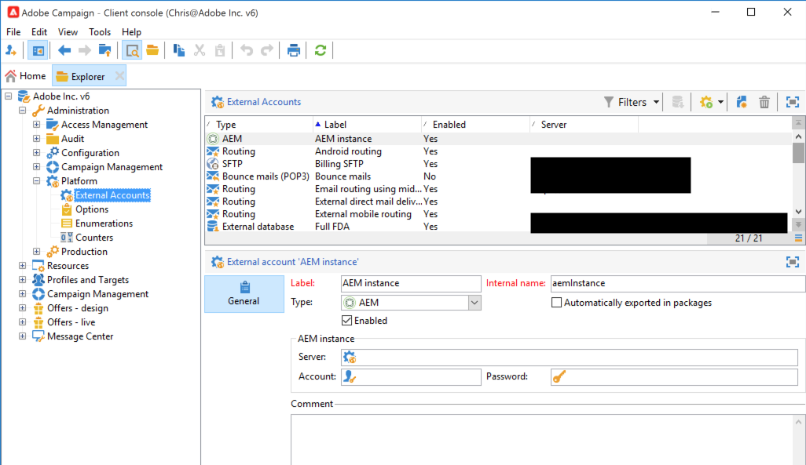

# Integrating with Adobe Campaign Classic {#integrating-campaign-classic}

By integrating AEM as a Cloud Service with Adobe Campaign you can manage email delivery, content, and forms directly in AEM as a Cloud Service. Configuration steps in both Adobe Campaign Classic and AEM as a Cloud Service are needed to enable the bidirectional communication between solutions.

This integration allows AEM as a Cloud Service and Adobe Campaign Classic to be used independently. Marketers can create campaigns and use targeting in Adobe Campaign, while content creators can in parallel work on the design in AEM as a Cloud Service. The integration allows the content and design of the campaign in AEM to be targeted and delivered by Campaign. 

## Integration Steps {#integration-steps}

This document details how to integrate AEMaaCS and Campaign Classic and requires configuration steps in both solutions including the following.

* [Install the AEM Integration Package](#install-package)
* [Create the Operator User](#create-operator)
* [Configure AEM as a Cloud Service for the integration](#aem-configuration)
* [Configure the Campaign Remote User](#configure-user)
* [Setup the Adobe Campaign Classic External Account](#acc-setup)

### Prerequisites {#prerequisites}

* Administrator access to Adobe Campaign Classic
  * To perform the integration you need a working Adobe Campaign Classic instance, including a configured database.
  * If you need additional details on how to set up and configure Adobe Campaign Classic please refer to the [Adobe Campaign Classic documentation,](https://experienceleague.adobe.com/docs/campaign-classic/using/campaign-classic-home.html) particularly the Installation and Configuration guide.

* Administrator access to AEM as a Cloud Service

### Installation the AEM Integration Package {#install-package}

To use the integration, you must install the **AEM Integration** package in Adobe Campaign.

1. As an administrator, sign into the Adobe Campaign instance using the client console.

1. Select **Tools** &gt; **Advanced** &gt; **Import package...**.

   

1. Click **Install a standard package** and then click **Net**.

1. Check the **AEM Integration** package.

   

1. Click **Next**, and then **Start** to begin the installation.

   

1. Click **Close** when the installation completes.

The integration package is now installed.

### Creating the Operator User in Adobe Campaign Classic {#create-operator}

The integration package creates the `aemserver` operator that will be used to connect the AEM to Adobe Campaign. You need to set the security zone for this operator and define a password in order to use it.

1. Log into Adobe Campaign as an administrator using the client console.

1. Select **Tools** -&gt; **Explorer** from the menu bar.

1. In the explorer, navigate to the **Administration** &gt; **Access Management** &gt; **Operators** node.

1. Select the `aemserver` operator.

1. On the **Edit** tab of the operator select **Access Rights** and then click the **Edit the access parameters...** link.

  

1. Select the appropriate security zone and define the trusted IP mask as necessary.

1. Click **Save**.

1. Log out of the Adobe Campaign client.

1. Go to the Adobe Campaign Classic v7 install location and open the `serverConf.xml` as an administrator. This file is typically located under:
   * `C:\Program Files\Adobe\Adobe Campaign Classic v7\conf` in Windows
   * `/usr/local/neolane/nl6/conf/eng` in Linux

1. Search for `security zone` and set the following parameters:

   * `allowHTTP="true"`
   * `sessionTokenOnly="true"`
   * `allowUserPassword="true"`.

1. Save the file.

1. Ensure that the security zone does not get overwritten by the respective setting in the `config-<server name>.xml` file.

   * If the configuration file contains a separate security zone setting then change the `allowUserPassword` attribute to `true`.

1. If you want to change the Adobe Campaign Classic server port, replace `8080` with the desired port.

>[!CAUTION]
>
>By default, there is no security zone configured for the operator. To connect to Adobe Campaign with AEM as a Cloud Service, you must select one as detailed in the previous steps.
>
>Adobe strongly recommends creating a security zone dedicated to AEM to avoid any security issues. For more on this topic, please refer to the [Adobe Campaign Classic documentation.](https://experienceleague.adobe.com/docs/campaign-classic/using/installing-campaign-classic/additional-configurations/security-zones.html)

1. Return to the `aemserver` operator and select the **General** tab.

1. Click the **Reset password...** link.

1. Specify a password and store it in a secure location for future use.

1. Click **OK** to save the password for the `aemserver` operator.

### Configuring AEM as a Cloud service {#aem-configuration}

In order for the integration to function, AEM needs to communicate with Adobe Campaign in order to transfer its content. To do this you need to configure the Campaign integration in AEM and ensure that the externalizer is configured correctly.

#### Configure Campaign Integration in AEM {#campaign-integration}

1. Sign into to your AEM authoring instance as an administrator.

1. From the global navigation side rail, select **Tools** &gt; **Cloud Services** &gt; **Legacy Cloud Services** &gt; **Adobe Campaign**, then click **Configure Now**.

   

1. In the dialog, create a Campaign service configuration by entering a **Title** and click **Create**.

   

1. A new window and dialog opens to edit the configuration. Provide the necessary information.

    * **Username** - This is [the Adobe Campaign AEM Integration package operator created in the previous step.](#create-operator) By default it is `aemserver`. 
    * **Password** - This is the password for [the Adobe Campaign AEM Integration package operator created in the previous step.](#create-operator)
    * **API End Point** - This is the Adobe Campaign instance URL.

   

1. Select **Connect to Adobe Campaign** to verify the connection and then click **OK**.

>[!NOTE]
>
>Make sure that your Adobe Campaign server is reachable via the internet. AEM as a Cloud Service can not access private networks.

#### Configure AEM Externalizer {#externalizer}

The externalizer is an OSGi service that lets you transform a resource path into an external and absolute URL. This service provides a central place to configure those external URLs and build them.

Confirm the publish instance in the externalizer configuration by checking the status dump of the OSGi services in the [developer console.](https://experienceleague.adobe.com/docs/experience-manager-learn/cloud-service/debugging/debugging-aem-as-a-cloud-service/developer-console.html#osgi-services)

If it is not correct, make the necessary changes in the corresponding instance git repository and then deploy the configuration by using [cloud manager.](/help/implementing/cloud-manager/deploy-code.md)

```text
Service 3310 - [com.day.cq.commons.Externalizer] (pid: com.day.cq.commons.impl.ExternalizerImpl)",
"  from Bundle 420 - Day Communique 5 Commons Library (com.day.cq.cq-commons), version 5.12.16",
"    component.id: 2149",
"    component.name: com.day.cq.commons.impl.ExternalizerImpl",
"    externalizer.contextpath: ",
"    externalizer.domains: [local https://author-p17558-e33255-cmstg.adobeaemcloud.com, author https://author-p17558-e33255-cmstg.adobeaemcloud.com,
     publish https://publish-p17558-e33255-cmstg.adobeaemcloud.com]",
"    externalizer.encodedpath: false",
"    externalizer.host: ",
"    feature-origins: [com.day.cq:cq-quickstart:slingosgifeature:cq-platform-model_quickstart_author:6.6.0-V23085]",
"    service.bundleid: 420",
"    service.description: Creates absolute URLs",
"    service.scope: bundle",
"    service.vendor: Adobe Systems Incorporated",

```

>[!NOTE]
>
>The publish instance must be reachable from the Adobe Campaign server.

### Configuring the Adobe Campaign Remote User {#configure-user}

You need to set a password for the AEM `campaign-remote` user. It is necessary in order to connect Adobe Campaign Classic with AEM as a Cloud service.

1. Log into AEM as an administrator.
1. On the main navigation console, click on **Tools** in the left rail.
1. Then click **Security** -&gt; **Users** to open the the user administration console.
1. Locate the `campaign-remote` user.
1. Select the `campaign-remote` user and click **Properties** to edit the user.
1. In the **Edit User Settings** window, click **Change Password**.
1. Provide a new password for the user and note the password in a secure location for future use.
1. Click **Save** to save the password change.
1. Click **Save &amp; Close** to save the changes to the `campaign-remote` user.

### Configuring the Adobe Campaign Classic External Account {#acc-setup}

When [installing the **AEM Integration** package,](#install-package) an external AEM account is created. You must configure this external account in Adobe Campaign in order to connect Adobe Campaign Classic with the AEM as a Cloud Service instance.

1. Log into Adobe Campaign as an administrator.

1. Select **Tools** -&gt; **Explorer** from the menu bar.

1. In the explorer, navigate to the **Administration** &gt; **Platform** &gt; **External Accounts** node.

   

1. Locate the external AEM account.

1. Enter the access parameters for your AEM authoring instance.

   * The AEM author server address
     * The AEM author server must be reachable from the Adobe Campaign Classic server instance. 
     * Ensure that the server address does **not** end in a trailing slash.
   * User ID
   * Password
     * This password is the same as the `campaign-remote` user that you set in AEM in the [Set campaign-remote User Password](#set-campaign-remote-password) step.

1. Select the **Enabled** checkbox.

1. Click **Save**.

Having configured both Adobe Campaign Classic and AEM as a Cloud Service, the integration is now complete. Additionally, you can also learn how to create an Adobe Experience Manager Newsletter by reading [this page](/help/sites-cloud/integrating/creating-newsletter.md).
