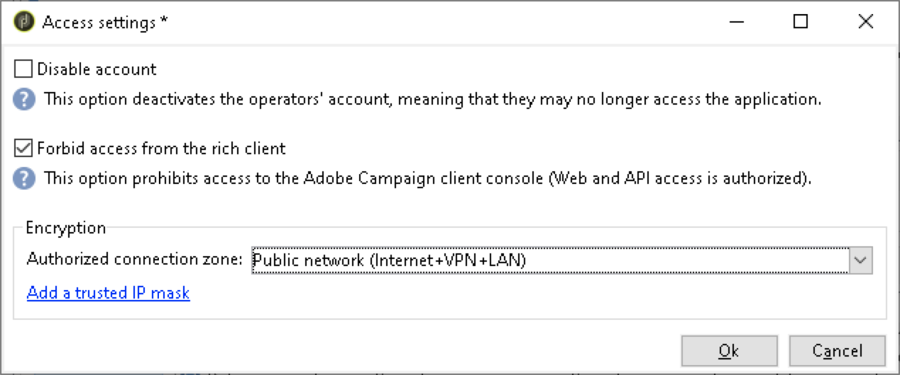
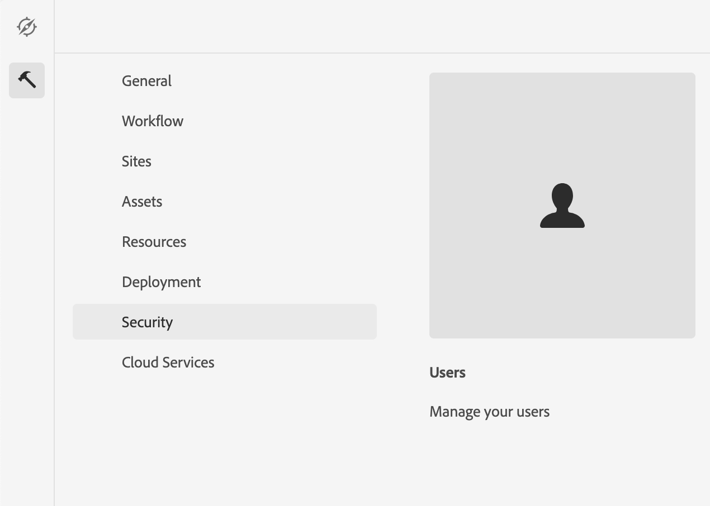

# Integrating with Adobe Campaign Classic {#integrating-campaign-classic}

By integrating with Adobe Campaign you can manage email delivery, content and forms directly in AEM as a Cloud Service. Configuration steps in both Adobe Campaign Classic and AEM as a Cloud Service are needed to enable the bidirectional communication between solutions.

Please note that AEM as a Cloud Service and Adobe Campaign Classic can also be used independently. For example, marketers can start creating campaigns and use targeting in Adobe Campaign, while content creators can work on the design in AEM as a Cloud Service.

## Integration workflow {#integration-workflow}

The following chapters detail how to integrate the solutions. This requires configuration steps both in Adobe Campaign Classic and AEM as a Cloud Service. As such, you will learn how to:

* [Create the Operator User](#create-operator)
* [Configure AEM as a Cloud Service for the integration](#aem-configuration)
* [Configure the Campaign Remote User](#configure-user)
* [Setup the Adobe Campaign Classic External Account](#acc-setup)

### Prerequisites {#prerequisites}

**Adobe Campaign Classic**

To perform the integration you need a working Adobe Campaign Classic instance, including a database. If you need additional details on how to set up and configure Adobe Campaign Classic please read the official [Adobe Campaign Classic documentation](https://experienceleague.adobe.com/docs/campaign-classic/using/campaign-classic-home.html) especially the Installation and Configuration guide. Keep in mind that in order to perform the operations presented below you also need to have the administrator role.  

**AEM as a Cloud Service**

You need the [AEM as a Cloud Service](https://experienceleague.adobe.com/docs/experience-manager-cloud-service/content/overview/introduction.html) solution.

### Creating the Operator user in Adobe Campaign Classic {#create-operator}

Open the Adobe Campaign Classic client console from start menu and log in. The home page should appear.

1. Click on **Explorer** to open the Explorer view.

1. In the tree view on the left, navigate to **Administration->Access Management->Operators**.
1. Double-click on the `aemserver` entry in the Operators list on the right.
1. Switch to the **Edit** tab. Set the password for the aemserver.

1. Click on the **Access rights** tab and click on the **Edit the access parameters** link under the security settings.
1. Under Encryption, select Public network as the authorized connection zone. Click **OK**.

1. Click **Save**.
1. Log out.
1. Go to the Adobe Campaign Classic v7 install location, for example `C:\Program Files\Adobe\Adobe Campaign Classic v7\conf` and open the `serverConf.xml` as an administrator.
    * Search for **security zone**
    * Set the following parameters `allowHTTP="true"` `sessionTokenOnly="true"` `allowUserPassword="true"`
    * Save the file
1. Ensure that the security zone does not get overwritten by the respective setting in `config-<server name>.xml` file (C:\Program Files\Adobe\Adobe Campaign Classic v7\conf\config_acc-test.xml).
    * If the configuration file contains a separate security zone setting then change the `allowUserPassword` attribute to true.
1. If you want to change the Adobe Campaign Classic server port, replace 8080 with the desired port(for example: 80).

>[!NOTE]
>
>By default, there is no security zone configured for the operator. To connect to Adobe Campaign with AEM as a Cloud Service, you must select one (see the steps above). We strongly recommend creating a security zone dedicated to AEM to avoid any security issues.

### Configuring AEM as a Cloud service {#aem-configuration}

1. Log into cloud manager and launch the AEM as a Cloud Service author instance.
1. Go to **Tools→Cloud Service→Legacy Cloud Service**.

1. Scroll down to Adobe Campaign and click the **Configure Now** link.
    * Enter a title
    * Enter a name
    * Click **Create**
1. On the Edit Component screen
    * Enter the Username, See [Create the Operator User](#create-operator)
    * Enter the Password
    * Enter the Adobe Campaign Classic server API end point (for example, `http://3.22625.51:80`)
    * Click **Connect to Adobe Campaign**
    * Click **OK**.
    >[!NOTE]
    >
    >Please make sure that your Adobe Campaign server is reachable on the internet because AEM as a Cloud Service can not reach private networks.
1. Please check the publish instance in the Link Externalizer configuration.
You can view this configuration by checking the status dump of the OSGi services in the [developer console](https://experienceleague.adobe.com/docs/experience-manager-learn/cloud-service/debugging/debugging-aem-as-a-cloud-service/developer-console.html#osgi-services).
If it is not correct then make changes in the corresponding instance git repository and then deploy the configuration by using [cloud manager](https://experienceleague.adobe.com/docs/experience-manager-cloud-service/content/implementing/using-cloud-manager/deploy-code.html).

```
Service 3310 - [com.day.cq.commons.Externalizer] (pid: com.day.cq.commons.impl.ExternalizerImpl)",
"  from Bundle 420 - Day Communique 5 Commons Library (com.day.cq.cq-commons), version 5.12.16",
"    component.id: 2149",
"    component.name: com.day.cq.commons.impl.ExternalizerImpl",
"    externalizer.contextpath: ",
"    externalizer.domains: [local https://author-p17558-e33255-cmstg.adobeaemcloud.com, author https://author-p17558-e33255-cmstg.adobeaemcloud.com,
     publish https://publish-p17558-e33255-cmstg.adobeaemcloud.com]",
"    externalizer.encodedpath: false",
"    externalizer.host: ",
"    feature-origins: [com.day.cq:cq-quickstart:slingosgifeature:cq-platform-model_quickstart_author:6.6.0-V23085]",
"    service.bundleid: 420",
"    service.description: Creates absolute URLs",
"    service.scope: bundle",
"    service.vendor: Adobe Systems Incorporated",

```

>[!NOTE]
>
>The publish instance must also be reachable from the Adobe Campaign server.

### Configuring the Adobe Campaign Remote User {#configure-user}

You need to set a password for the campaign-remote user. It is necessary in order to connect Adobe Campaign Classic with AEM as a Cloud service.

1. Go to **AEM→Tools→Security→Users**.

1. Search for the `campaign-remote` user and click on it.
1. Click on Change Password
    * Enter the new password twice
    * Enter your AEM password
    * Click **Save**.

### Configuring the Adobe Campaign Classic External Account {#acc-setup}

You must also configure an external account in order to connect Adobe Campaign Classic with the AEM as a Cloud Service instance.

1. Log into the Adobe Campaign Classic server by using the client console.
1. Go to the Explorer View.
1. In the tree view on the left, go to **Administration→Platform→External Accounts**.
1. In the list view on the top right, click AEM instance.
1. In the AEM instance configuration
    * Enter AEM as a Cloud Service author IP/FQN for example `https://author-p17558-e33255-cmstg.adobeaemcloud.com`.
    * Enter the user and account
    * Enter the password for the campaign-remote user that you set in the AEM as a Cloud Service instance (see the procedure above)
    * Select the **Enabled** checkbox
    * Click **Save**.
    >[!NOTE]
    >
    >The AEM Author server IP/FQN must be reachable from the Adobe Campaign Classic server instance. Also, do not add the backslash character in the AEM Author server IP/FQN.

Having configured both Adobe Campaign Classic and AEM as a Cloud Service, the integration is now complete. Additionally, you can also learn how to create an Adobe Experience Manager Newsletter by reading [this page](/help/sites-cloud/integrating/creating-newsletter.md).
