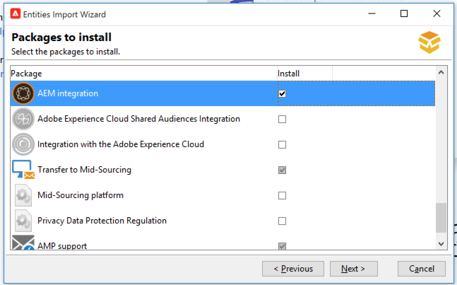
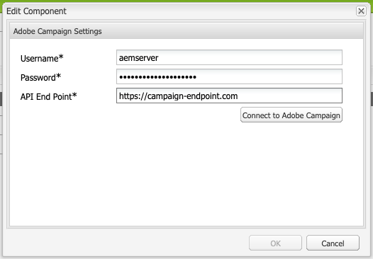

# Integrating with Adobe Campaign Classic {#integrating-campaign-classic}

By integrating AEM as a Cloud Service with Adobe Campaign, you can manage email delivery, content, and forms directly in AEM as a Cloud Service. Configuration steps in both Adobe Campaign Classic and AEM as a Cloud Service are needed to enable bidirectional communication between solutions.

This integration allows AEM as a Cloud Service and Adobe Campaign Classic to be used independently. Marketers can create campaigns and use targeting in Adobe Campaign, while content creators in parallel can work on content design in AEM as a Cloud Service. The integration allows the content and design of the campaign in AEM to be targeted and delivered by Campaign. 

## Integration Steps {#integration-steps}

Integration between AEM and Campaign requires a number of steps in both solutions.

1. [Install the AEM Integration Package in Campaign.](#install-package)
1. [Create an operator for AEM in Campaign](#create-operator)
1. [Configure Campaign integration in AEM](#campaign-integration)
1. [Configure the AEM Externalizer](#externalizer)
1. [Configure the campaign-remote user in AEM](#configure-user)
1. [Configure the AEM external account in Campaign](#acc-setup)

This document leads you through each of these steps in detail

## Prerequisites {#prerequisites}

* Administrator access to Adobe Campaign Classic
  * To perform the integration, you need a working Adobe Campaign Classic instance, including a configured database.
  * If you need additional details on how to set up and configure Adobe Campaign Classic please refer to the [Adobe Campaign Classic documentation,](https://experienceleague.adobe.com/docs/campaign-classic/using/campaign-classic-home.html) particularly the Installation and Configuration guide.

* Administrator access to AEM as a Cloud Service

## Installing the AEM Integration Package in Campaign {#install-package}

The **AEM Integration** package in Adobe Campaign includes a number of standard configurations necessary to connect to AEM.

1. As an administrator, sign into the Adobe Campaign instance using the client console.

1. Select **Tools** &gt; **Advanced** &gt; **Import package...**.

   

1. Click **Install a standard package** and then click **Next**.

1. Check the **AEM Integration** package.

   

1. Click **Next**, and then **Start** to begin the installation.

   

1. Click **Close** when the installation completes.

The integration package is now installed.

## Creating the Operator for AEM in Campaign {#create-operator}

The integration package automatically creates the `aemserver` operator that AEM uses to connect to Adobe Campaign. You must define a security zone for this operator and set its password.

1. Log into Adobe Campaign as an administrator using the client console.

1. Select **Tools** -&gt; **Explorer** from the menu bar.

1. In the explorer, navigate to the **Administration** &gt; **Access Management** &gt; **Operators** node.

1. Select the `aemserver` operator.

1. On the **Edit** tab of the operator, select the **Access Rights** sub-tab and then click the **Edit the access parameters...** link.

   

1. Select the appropriate security zone and define the trusted IP mask as necessary.

1. Click **Save**.

1. Log out of the Adobe Campaign client.

1. On the filesystem of the Adobe Campaign server, navigate to the Campaign installation location and edit the `serverConf.xml` file as an administrator. This file is typically located under:
   * `C:\Program Files\Adobe\Adobe Campaign Classic v7\conf` in Windows.
   * `/usr/local/neolane/nl6/conf/eng` in Linux.

1. Search for `securityZone` and ensure that the following parameters are set for the security zone of the AEM operator.

   * `allowHTTP="true"`
   * `sessionTokenOnly="true"`
   * `allowUserPassword="true"`.

1. Save the file.

1. Ensure that the security zone does not get overwritten by the respective setting in the `config-<server name>.xml` file.

   * If the configuration file contains a separate security zone setting, then change the `allowUserPassword` attribute to `true`.

1. If you want to change the Adobe Campaign Classic server port, replace `8080` with the desired port.

>[!CAUTION]
>
>By default, there is no security zone configured for the operator. For AEM to connect to Adobe Campaign, you must select a zone as detailed in the previous steps.
>
>Adobe strongly recommends creating a security zone dedicated to AEM to avoid any security issues. For more on this topic, please refer to the [Adobe Campaign Classic documentation.](https://experienceleague.adobe.com/docs/campaign-classic/using/installing-campaign-classic/additional-configurations/security-zones.html)

1. In the Campaign client, return to the `aemserver` operator and select the **General** tab.

1. Click the **Reset password...** link.

1. Specify a password and store it in a secure location for future use.

1. Click **OK** to save the password for the `aemserver` operator.

## Configuring Campaign Integration in AEM {#campaign-integration}

AEM uses [the operator you already set up in Campaign](#create-operator) in order to communicate with Campaign

1. Sign into to your AEM authoring instance as an administrator.

1. From the global navigation side rail, select **Tools** &gt; **Cloud Services** &gt; **Legacy Cloud Services** &gt; **Adobe Campaign**, then click **Configure Now**.

   

1. In the dialog, create a Campaign service configuration by entering a **Title** and click **Create**.

   

1. A new window and dialog opens to edit the configuration. Provide the necessary information.

    * **Username** - This is [the Adobe Campaign AEM Integration package operator created in the previous step.](#create-operator) By default it is `aemserver`. 
    * **Password** - This is the password for [the Adobe Campaign AEM Integration package operator created in the previous step.](#create-operator)
    * **API End Point** - This is the Adobe Campaign instance URL.

    

1. Select **Connect to Adobe Campaign** to verify the connection and then click **OK**.

AEM can now communicate with Adobe Campaign.

>[!NOTE]
>
>Make sure that your Adobe Campaign server is reachable via the internet. AEM as a Cloud Service can not access private networks.

## Configuring the AEM Externalizer {#externalizer}

The Externalizer is an OSGi service in AEM that transforms a resource path into an external and absolute URL, which is necessary for AEM to serve content that Campaign can use.

1. Sign into the AEM authoring instance as an administrator.
1. Confirm the publish instance in the Externalizer configuration by checking the status dump of the OSGi services in the [developer console.](https://experienceleague.adobe.com/docs/experience-manager-learn/cloud-service/debugging/debugging-aem-as-a-cloud-service/developer-console.html#osgi-services)
1. If it is not correct, make the necessary changes in the corresponding instance git repository and then [deploy the configuration by using cloud manager.](/help/implementing/cloud-manager/deploy-code.md)

```text
Service 3310 - [com.day.cq.commons.externalizer] (pid: com.day.cq.commons.impl.externalizerImpl)",
"  from Bundle 420 - Day Communique 5 Commons Library (com.day.cq.cq-commons), version 5.12.16",
"    component.id: 2149",
"    component.name: com.day.cq.commons.impl.externalizerImpl",
"    externalizer.contextpath: ",
"    externalizer.domains: [local https://author-p17558-e33255-cmstg.adobeaemcloud.com, author https://author-p17558-e33255-cmstg.adobeaemcloud.com,
     publish https://publish-p17558-e33255-cmstg.adobeaemcloud.com]",
"    externalizer.encodedpath: false",
"    externalizer.host: ",
"    feature-origins: [com.day.cq:cq-quickstart:slingosgifeature:cq-platform-model_quickstart_author:6.6.0-V23085]",
"    service.bundleid: 420",
"    service.description: Creates absolute URLs",
"    service.scope: bundle",
"    service.vendor: Adobe Systems Incorporated",

```

>[!NOTE]
>
>The publish instance must be reachable from the Adobe Campaign server.

## Configuring the campaign-remote User in AEM {#configure-user}

In order for Campaign to communicate with AEM, you need to set a password for the `campaign-remote` user in AEM.

1. Log into AEM as an administrator.
1. On the main navigation console, click on **Tools** in the left rail.
1. Then click **Security** -&gt; **Users** to open the user administration console.
1. Locate the `campaign-remote` user.
1. Select the `campaign-remote` user and click **Properties** to edit the user.
1. In the **Edit User Settings** window, click **Change Password**.
1. Provide a new password for the user and note the password in a secure location for future use.
1. Click **Save** to save the password change.
1. Click **Save &amp; Close** to save the changes to the `campaign-remote` user.

## Configuring the AEM External Account in Campaign {#acc-setup}

When [installing the **AEM Integration** package in Campaign,](#install-package) an external account is created for AEM. By configuring this external account, Adobe Campaign can connect to AEM as a Cloud Service, enabling two-way communication between the solutions.

1. Log into Adobe Campaign as an administrator using the client console.

1. Select **Tools** -&gt; **Explorer** from the menu bar.

1. In the explorer, navigate to the **Administration** &gt; **Platform** &gt; **External Accounts** node.

   

1. Locate the external AEM account. By default it has the values:

   * **Type** - AEM
   * **Label** - AEM Instance
   * **Internal Name** - aemInstance

1. On the **General** tab of this account, enter the user information that you defined in the [Set campaign-remote User Password](#set-campaign-remote-password) step.

   * **Server** - The AEM author server address
     * The AEM author server must be reachable from the Adobe Campaign Classic server instance. 
     * Ensure that the server address does **not** end in a trailing slash.
   * **Account** - By default, this is the `campaign-remote` user that you set in AEM in the [Set campaign-remote User Password](#set-campaign-remote-password) step.
   * **Password** - This password is the same as the `campaign-remote` user that you set in AEM in the [Set campaign-remote User Password](#set-campaign-remote-password) step.

1. Select the **Enabled** checkbox.

1. Click **Save**.

Adobe Campaign can now communicate with AEM.

## Next Steps {#next-steps}

With both Adobe Campaign Classic and AEM as a Cloud Service configured, the integration is now complete.

You can now learn how to create a newsletter in Adobe Experience Manager by continuing with [this document.](/help/sites-cloud/integrating/creating-newsletter.md)
