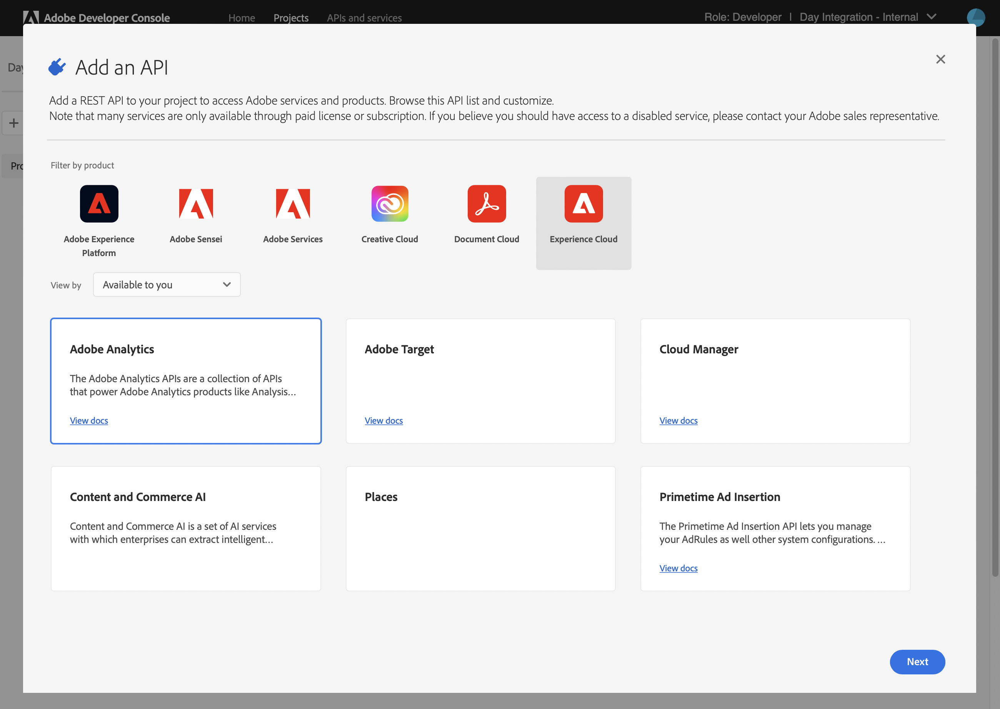
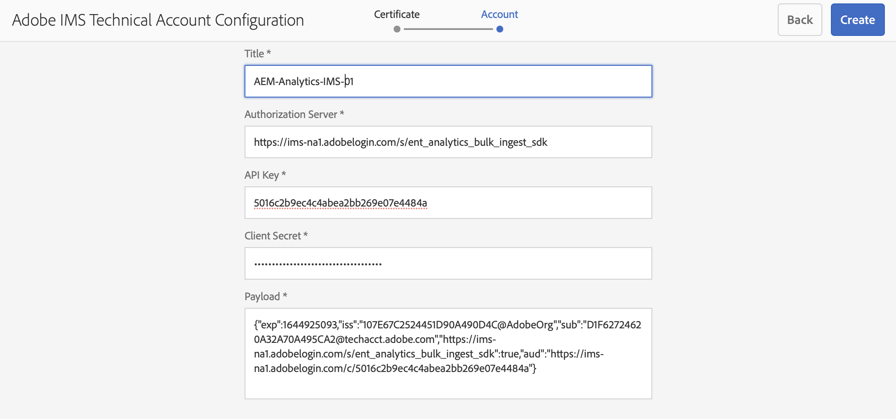
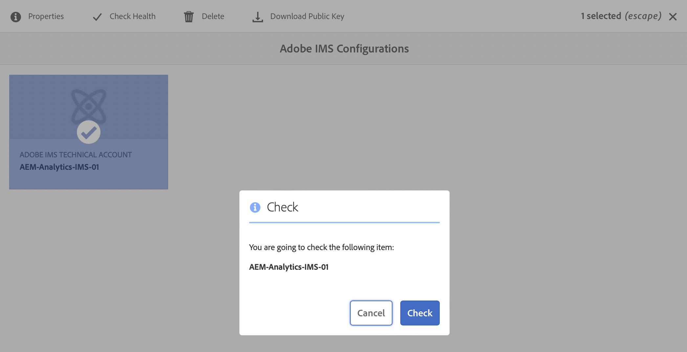

# Integration with Adobe Analytics using Adobe I/O {#integration-with-adobe-analytics-using-adobe-i-o}

The integration of AEM with Adobe Analytics via the Analytics Standard API requires the configuration of Adobe IMS (Identity Management System) and Adobe I/O.

>[!NOTE]
>
>Support for the Adobe Analytics Standard API 2.0 is new in AEMaaCS 2022.2.0. This version of the API supports IMS authentication.
>
>The API selection is driven by the authentication method used for AEM/Analytics integration.
>
>Further information is also available under [Migrating to the 2.0 APIs](https://developer.adobe.com/analytics-apis/docs/2.0/guides/migration/).

## Prerequisites {#prerequisites}

Before starting this procedure:

* [Adobe Support](https://helpx.adobe.com/contact/enterprise-support.ec.html) must provision your account for:

  * Adobe Console
  * Adobe I/O
  * Adobe Analytics and 
  * Adobe IMS (Identity Management System)

* Your organization's System Admininstrator should use the Admin Console to add the required developers in your organization to the relevant product profiles. 

  * This provides the specific developers with permissions to enable integrations within Adobe I/O. 
  * For further details see [Manage Developers](https://helpx.adobe.com/enterprise/admin-guide.html/enterprise/using/manage-developers.ug.html).

## Configuring an IMS Configuration - Generating a Public Key {#configuring-an-ims-configuration-generating-a-public-key}

The first stage of the configuration is to create an IMS Configuration in AEM and generate the Public Key.

1. In AEM open the **Tools** menu.
1. In the **Security** section select **Adobe IMS Configurations**.
1. Select **Create** to open the **Adobe IMS Technical Account Configuration**.
1. Using the drop down under **Cloud Configuration**, select **Adobe Analytics**.
1. Activate **Create new certificate** and enter a new alias.
1. Confirm with **Create certificate**.

   

1. Select **Download** (or **Download Public Key**) to download the file to your local drive, so that it is ready for use when [configuring Adobe I/O for Adobe Analytics integration with AEM](#configuring-adobe-i-o-for-adobe-analytics-integration-with-aem).

   >[!CAUTION]
   >
   >Keep this configuration open, it will be needed again when [Completing the IMS Configuration in AEM](#completing-the-ims-configuration-in-aem).

   

## Configuring Adobe I/O for Adobe Analytics integration with AEM {#configuring-adobe-i-o-for-adobe-analytics-integration-with-aem}

You need to create the Adobe I/O Project (integration) with Adobe Analytics that AEM will use, then assign the required privileges.

### Creating the Project {#creating-the-project}

Open the Adobe I/O console to create an I/O Project with Adobe Target that AEM will use:

1. Open the Adobe I/O console for Projects:

   [https://console.adobe.io/projects](https://console.adobe.io/projects)

1. Any projects that you have will be shown. Select **Create New Project** - the location and usage will depend on:

   * If you do not have any project yet, **Create new project** will be center, bottom. 
     
   * If you already have existing projects these will be listed and **Create new project** will be top right. 
     

1. Select **Add to Project** followed by **API**:

   

1. Select **Adobe Analytics**, then **Next**:

   >[!NOTE]
   >
   >If you are subscribed to Adobe Analytics, but do not see it listed then you should check the [Prerequistes](#prerequisites).

   

1. Select **Service Account (JWT)** as the type of type of authentication, then continue with **Next**:

   

1. **Upload your public key**, and when complete, continue with **Next**:

   

1. Review the credentials, and continue with **Next**:

   

1. Select the required product profiles, and continue with **Save configured API**:

   >[!NOTE]
   >
   >The product profiles displayed with depend on whether you have:
   >
   >* Adobe Target Standard - only **Default Workspace** is available
   >* Adobe Target Premium - all available workspaces are listed, as shown below

   

1. The configuration will be confirmed.

### Assigning privileges to the Integration {#assigning-privileges-to-the-integration}

You must now assign the required privileges to the integration:

1. Open the Adobe **Admin Console**:

    * [https://adminconsole.adobe.com](https://adminconsole.adobe.com/)

1. Navigate to **Products** (top toolbar), then select **Adobe Analytics - &lt;*your-tenant-id*&gt;** (from the left panel).
1. Select **Product Profiles**, then your required workspace from the list presented. For example, Default Workspace.
1. Select **API Credentials**, then the required integration configuration.
1. Select **Editor** as the **Product Role**; instead of **Observer**.

## Details stored for the Adobe I/O Integration Project {#details-stored-for-the-adobe-io-integration-project}

From the Adobe I/O Projects console you can see a list of all your integration projects:

* [https://console.adobe.io/projects](https://console.adobe.io/projects)

Select a specific project entry to show further details about the configuration. These include:

* Project overview
* Insights
* Credentials
  * Service Account (JWT)
    * Credential details
    * Generate JWT
* APIS
  * For example, Adobe Analytics

Some of these you will need to complete the Adobe I/O integration for Adobe Analytics in AEM.

## Completing the IMS Configuration in AEM {#completing-the-ims-configuration-in-aem}

Returning to AEM you can complete the IMS configuration by adding required values from the Adobe I/O integration for Target:

1. Return to the [IMS Configuration open in AEM](#configuring-an-ims-configuration-generating-a-public-key).
1. Select **Next**.

1. Here you can use the [details from the project configuration in Adobe I/O](#details-stored-for-the-adobe-io-integration-project):

    * **Title**: Your text.
    * **Authorization Server**: Copy/paste this from the `aud` line of the **Payload** section below, e.g. `https://ims-na1.adobelogin.com` in the example below
    * **API Key**: Copy this from the **Credentials** section of the [Project overview](#details-stored-for-the-adobe-io-integration-project) 
    * **Client Secret**: Generate this in the [Client Secret tab of the Service Account (JWT) section](#details-stored-for-the-adobe-io-integration-project), and copy
    * **Payload**: Copy this from the [Generate JWT tab of the Service Account (JWT) section](#details-stored-for-the-adobe-io-integration-project) 

    

1. Confirm with **Create**.

1. Your Adobe Target configuration will be shown in the AEM console.

   

## Confirming the IMS Configuration {#confirming-the-ims-configuration}

To confirm that the configuration is operating as expected:

1. Open:

    * `https://localhost<port>/libs/cq/adobeims-configuration/content/configurations.html`

   For example:

    * `https://localhost:4502/libs/cq/adobeims-configuration/content/configurations.html`

1. Select your configuration.
1. Select **Check Health** from the toolbar, followed by **Check**.

   

1. If successful, you will see a confirmation message.

<!--
## Configuring the Adobe Analytics Cloud Service {#configuring-the-adobe-analytics-cloud-service}

The configuration can now be referenced for a Cloud Service to use the Analytics Standard API:

1. Open the **Tools** menu. Then, within the **Cloud Services** section, select **Legacy Cloud Services**.
1. Scroll down to **Adobe Analytics** and select **Configure now**.

   The **Create Configuration** dialog will open.

1. Enter a **Title** and, if you want, a **Name** (if left blank this will be generated from the title).

   You can also select the required template (if more than one is available).

1. Confirm with **Create**.

   The **Edit Component** dialog will open.

1. Enter the details in the **Analytics Settings** tab:

    * **Authentication**: IMS

    * **IMS Configuration**: select the name of the IMS Configuration

1. Click **Connect to Analytics** to initialize the connection with Adobe Target.

   If the connection is successful, the message **Connection successful** is displayed.

1. Select **OK** on the message.

1. Complete other parameters as required, followed by **OK** on the dialog to confirm the configuration.

1. You can now proceed to [Adding an Analytics Framework](/help/sites-administering/adobeanalytics-connect.md) to configure parameters that will be sent to Adobe Analytics. 
-->
