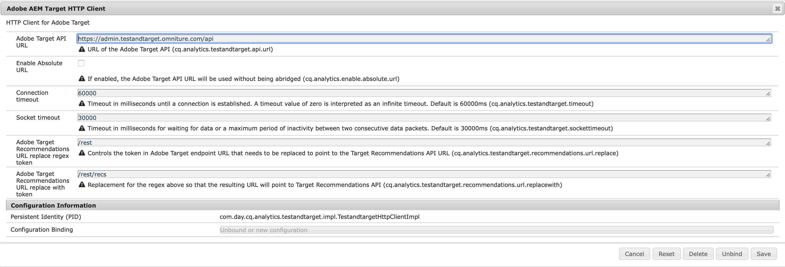

# Introduction {#introduction}

This page describes the configurable parameters present in the Adobe AEM Target HTTP Window.

## Parameters {#parameters}

The window contains the following configurable parameters:

| Parameter | Description |
|---|---|
| Adobe Target API URL | The URL of the Adobe Target API. |
| Enable Absolute URL | Determines if either the host part of the URL or the full URL is used. Enable the checkbox if you want to use the full (unabridged) URL. By default, the checkbox is disabled. |
| Connection Timeout | The timeout (in milliseconds) until a connection is established. The default value is 60000 milliseconds. A value of 0 is interpreted as an infinite timeout. |
| Socket Timeout | The timeout (in milliseconds) to wait for data or a maximum period of inactivity between two consecutive data packets. The default value is 30000 milliseconds. |
| Adobe Target Recommendations URL Replace Regex Token | Controls the token in the Adobe Target endpoint URL that needs to be replaced to point to the Target Recommandations API URL. |
| Adobe Target Recommendations URL Replace with Token | Replacement for the regex described in the above parameter, so the resulting URL will point to the Target Recommandations API. |
