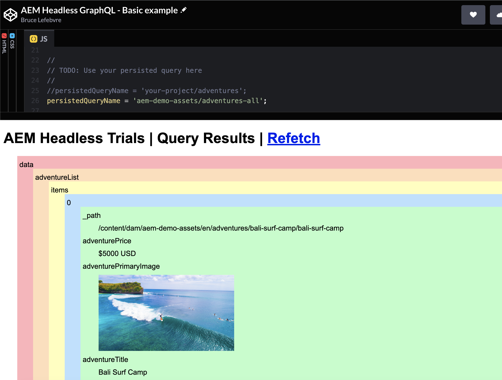

# Render Your Content in a Simple App {#render-content-simple-app}

>[!CONTEXTUALHELP]
>id="aemcloud_sites_trial_fetch_json_with_javascript"
>title="Render your content in a simple app"
>abstract="Explore fetching JSON content from your trial environment with a CodePen example app and the AEM Headless Client for JavaScript."

>[!CONTEXTUALHELP]
>id="aemcloud_sites_trial_fetch_json_with_javascript_guide"
>title="Launch the sample CodePen app"
>abstract="This guide walks through querying JSON data from your trial environment into a basic JavaScript web app. You use the Content Fragments you modeled and created in the earlier learning modules. If necessary, work through those guides first before jumping into this one."

>[!CONTEXTUALHELP]
>id="aemcloud_sites_trial_fetch_json_with_javascript_guide_footer"
>title="In this module, you learned how to use the AEM Headless Client for JavaScript to fetch JSON data from your trial environment using GraphQL persisted queries.<br><br>Now you understand how you can use this client to consume data from within your own web application."
>abstract=""

## CodePen {#codepen}

CodePen is an online code editor and playground for front-end web development. It lets you write HTML, CSS, and JavaScript code in your browser and see the results of your work almost instantly. You can also save your work and share it with others. Adobe has created an app in CodePen that you can use to fetch JSON data from your trial environment using the [AEM Headless Client for JavaScript](https://github.com/adobe/aem-headless-client-js). You can use this app as-is, or fork it into your own CodePen account to customize further.

Clicking the **Launch the sample CodePen app** button from the trial takes you to the app in CodePen. The app serves as a minimal example of fetching JSON data with JavaScript. The sample app is designed to render any JSON content which is returned, regardless of the structure of the underlying Content Fragment model. Out-of-the-box, the app fetches data from an `aem-demo-assets` persisted query that is included in your trial environment. You should see a JSON response similar to the following:

```json
{
  "data": {
    "adventureList": {
      "items": [
        {
          "_path": "/content/dam/aem-demo-assets/en/adventures/bali-surf-camp/bali-surf-camp",
          "title": "Bali Surf Camp",
          "price": "$5000 USD",
          ...
```

If you see an error instead, check the browser console for more detail or reach out [by email](mailto:aem-headless-trials-support@adobe.com?subject=AEM%20Trials%20support%20request). 

Now that you know a bit about CodePen, next you will configure the app to fetch data from the persisted query you created in a previous module.

## JavaScript Code Walkthrough {#code-walkthrough}

The **JS** pane to the right in CodePen contains the JavaScript of the example app. Beginning on line 2, you import the AEM Headless Client for JavaScript from the Skypack CDN. Skypack is used to facilitate development without a build step, but you can also use the AEM Headless Client with NPM or Yarn in your own projects. Check out the usage instructions in the [README](https://github.com/adobe/aem-headless-client-js#aem-headless-client-for-javascript) for further detail.

```javascript
import AdobeAemHeadlessClientJs from 'https://cdn.skypack.dev/@adobe/aem-headless-client-js@v3.2.0';
```

On line 6, your publish host details were read from the `publishHost` query parameter. This parameter is the host from which the AEM Headless Client fetches data. This functionality would typically be coded into your app, but you are using a query parameter to make it easier for the CodePen app to work with different environments.

You configure the AEM Headless Client on line 12:

```javascript
const aemHeadlessClient = new AdobeAemHeadlessClientJs({
  // Use a proxy to avoid CORS issues
  serviceURL: 'https://102588-505tanocelot.adobeioruntime.net/api/v1/web/aem/proxy',
  headers: {
    'aem-url': publishHost
  }
});
```

>[!NOTE]
>
>The **serviceURL** is set to use a proxy Adobe I/O Runtime function to avoid CORS issues. This proxy is not required for your own projects, but is required for the CodePen app to work with your trial environment. The proxy function is configured to use the **publishHost** value that was provided in the query parameter.

Finally, the function `fetchJsonFromGraphQL()` is used to perform the fetch request using the AEM Headless Client. It is called each time the code is changed, or can be triggered by clicking the **Refetch** link. The actual `aemHeadlessClient.runPersistedQuery(..)` call occurs on line 34. A bit later you change the way that this JSON data is rendered, but for now print it to the `#output` div using the `resultToPreTag(queryResult)` function.

## Fetch Data from Your Persisted Query {#use-persisted-query}

On line 25, you indicate from which GraphQL persisted query the app should fetch data. The persisted query name is a combination of the name of the endpoint (that is, `your-project` or `aem-demo-assets`), followed by a forward slash, and then the name of the query. If you followed the earlier module instructions exactly, the persisted query you created is in the `your-project` endpoint.

1. Update the `persistedQueryName` variable so it uses the persisted query you created in the previous module. If you followed the naming suggestion you would have created a persisted query named `adventure-list` in the `your-project` endpoint, and you would set the `persistedQueryName` variable to `your-project/adventure-list`:

   ```javascript
   //
   // TODO: Use your persisted query here
   //
   persistedQueryName = 'your-project/adventure-list';
   ```

1. Once this change is made the app should automatically refresh, and print the raw JSON response from your persisted query to the `#output` div. If you see an error message, check the console for additional details. Reach out [by email](mailto:aem-headless-trials-support@adobe.com?subject=AEM%20Trials%20support%20request) if you are still having issues with this step.

1. Does this JSON contain the exact properties your app needs? If not, head back to the [Extract content using the GraphQL API](https://experience.adobe.com/experiencemanager/learn/extract_content_using_graphql) learning guide to make changes. Don't forget to save and publish your query once you are done.

## Change the JSON Rendering {#change-rendering}

The JSON is rendered as-is into a `pre` tag, which is not too creative. You can switch CodePen to use the `resultToDom()` function instead to illustrate how the JSON response can be iterated over to create a more interesting result.

1. To make this change, comment out line 37 and remove the comment from line 40: 

   ```javascript
   // Output the results to a pre tag
   //resultToPreTag(queryResult);
   
   // Alternatively, build a colorful div structure with the JSON results and render images inline
   resultToDom(queryResult);
   ```

1. This function renders any images that are included in the JSON response as an `img` tag. If the **Adventure** content fragments you created do not include any images, you can try switching to use the `aem-demo-assets/adventures-all` persisted query by modifying line 25:

   ```javascript
   persistedQueryName = 'aem-demo-assets/adventures-all';
   ```

This query yields a JSON response that includes images, and the `resultToDom()` function renders them inline.



Now that you have done the work to build the models and queries, your content team can take over with ease. In the next module, you show off the content author flow.
