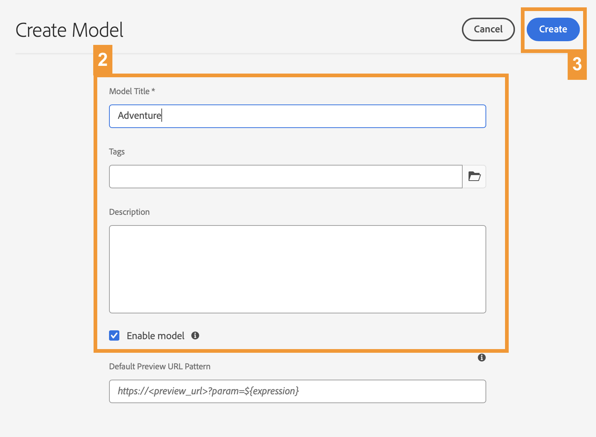
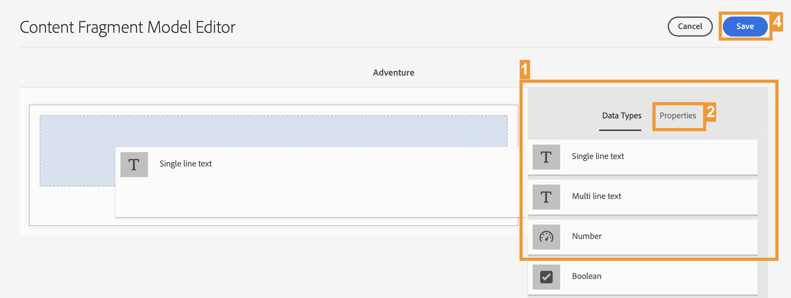

# Create the Content Structure for Your App {#content-structure}

>[!CONTEXTUALHELP]
>id="aemcloud_sites_trial_admin_content_fragments_overview"
>title="Create the content structure for your app"
>abstract="As you follow this series of interactive guides, you learn to create a structure (known as the Content Fragment model) which serves as the foundational structure for your headless content."

>[!CONTEXTUALHELP]
>id="aemcloud_sites_trial_admin_content_fragments_overview_guide"
>title="Launch the model console"
>abstract="Let's explore how to create a reusable schema, called a Content Fragment model, for your content in Adobe Experience Manager as a Cloud Service. Watch the video so you understand why this step is important.   In this learning module, you use a travel site as the example and walk through creating a model that represents a trip.  Launch this module in a new tab by clicking the button below and then follow this guide."
>additional-url="https://video.tv.adobe.com/v/3413261" text="Content structure intro video"

>[!CONTEXTUALHELP]
>id="aemcloud_sites_trial_admin_content_fragments_overview_guide_footer"
>title="Congratulations! You learned how to create a Content Fragment model to represent the structure of your headless data and took the first step to delivering omni-channel content in a scaled and standard way."
>abstract=""

## Create a Model {#create-model}

The Content Fragment model console opens in a new tab. Think of the Content Fragment model console as your library of models, where you create models and manage existing models.

For the example, you create a model that represents the data structure of a trip that is featured on a travel website. A trip using this model is referred to as an **Adventure**.

1. In the upper-right corner of the screen, click **Create** to begin creating a Content Fragment model.

1. The Create Model wizard guides you through creating your model. Provide the mandatory information.

   * **Model Title** - A brief label of the model and usually indicates the purpose of the model. You can call the new model `Adventure`.
   * **Enable model** - This option is checked by default and must be checked to be able to create Content Fragments based on this model.

1. After the mandatory fields are populated, click **Create** at the top-right to create the model. 

1. The **Success** dialog box confirms that the model was created. Click **Open** in the dialog box so you can open your new Content Fragment Model in the editor in a new tab. Then continue to the next step to adding data fields to your model.

## Using the Model Editor {#configure-model}

You now have a model called **Adventure**, but it has no details like duration, destination, and activities. Before you can use your model, you must define the structure of its data. 

The Content Fragment Model editor is where you configure the data types and properties that define the content of your model.

>[!TIP]
>
>It is important to follow the naming schemas in the following instructions because these specific names are referred to in later modules.

1. Drag a **Single line text** field from the **Data Types** panel at the right of the editor and drop it onto your Content Fragment model. 

1. Once a data type is placed, the **Data Types** column automatically changed to the **Properties** tab, where you can define the details of the data type you placed. For this first field, you want to store the title of the trip or adventure. Enter the following properties.

   * **Render As:** **Text Field** - When you create an adventure, this field stores the title of the adventure.
   * **Field Label:** `Title` - The label that is displayed for this field when creating an adventure.

1. After you define the properties of the field, you can switch back to the **Data Types** tab in the right panel and add additional fields by dragging and dropping.

In this way, you can add as many fields as necessary to your model to support whatever data structure you need. The types of data fields vary, but the process of adding them to your model remains the same.

Continue to the next section so you can add the fields necessary to complete and save the **Adventure** model

## Add Fields to the Model {#additional-fields}

You already have a field for the title of the adventure. Now you must add fields to capture the description, price, and a representative image of the adventure.

>[!TIP]
>
>The **Adventure** model is based on the WKND sample site for AEM. You can [visit the WKND site here](https://wknd.site/us/en/adventures/yosemite-backpacking.html) to see content that uses the **Adventure** model.

Follow the same steps as above to add these additional fields. The only difference is the properties that you must set.

1. Add a field so you can store the description of the adventure by dragging and dropping a **Multi line text** field and enter the following properties:

   * **Render As:** **Text Area** - When you create an adventure, this field stores a brief description of the trip.
   * **Field Label:** `Description` - The label that is displayed for this field when creating an adventure.
   * **Default Type**: **Plain Text** - The format required for this example.

1. Add a field so you can store the price of the adventure by dragging and dropping a **Single line text** field and enter the following properties:

   * **Render As:** **Text field** - When you create an adventure, this field stores the price of the trip.
   * **Field Label:** `Price` - The label that is displayed for this field when creating an adventure.

1. Add a field so you can store an image representing the trip. Images in AEM are stored as another type of content called **Assets**. To create a field for them, you drag and drop a **Content Reference** field that references the asset of the image.

   * **Render As:** **Content Reference** - When you create an adventure, this field points to the image asset representing this trip.
   * **Field Label:** `Image` - The label that is displayed for this field when creating an adventure.
   * **Root Path:** `/content/dam/aem-demo-assets/en` - This specifies a starting point path when browsing for assets with the Asset Selector.

1. After you have added the necessary fields for the Content Fragment model, at the top-right of the window, click **Save**.

1. The model is saved and you return to the Content Fragment model Console.
