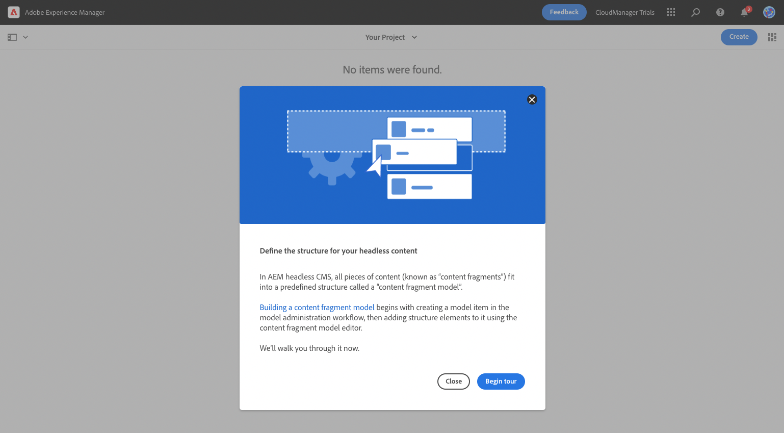
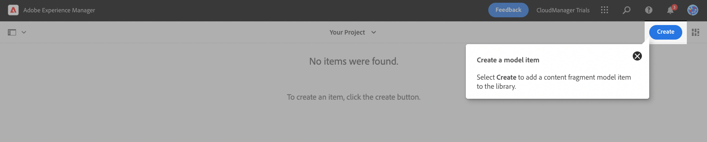
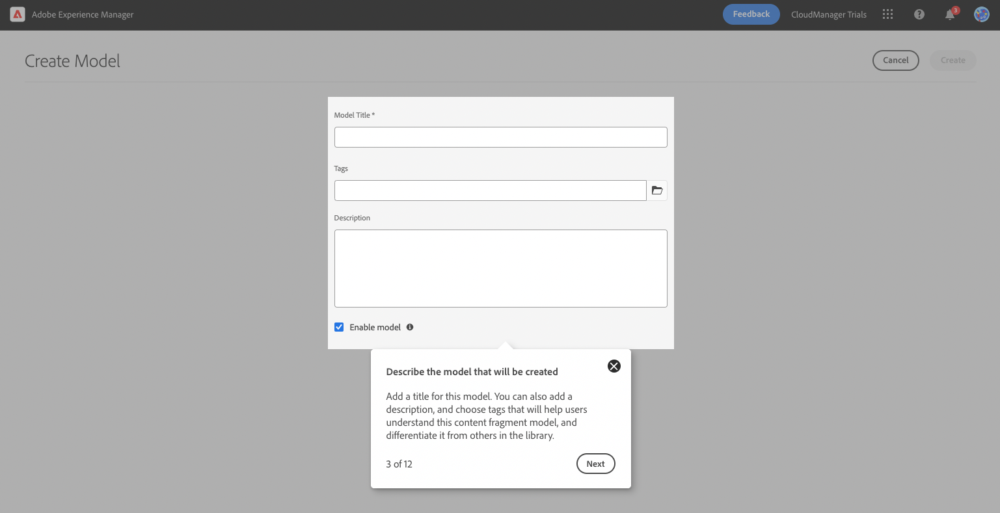
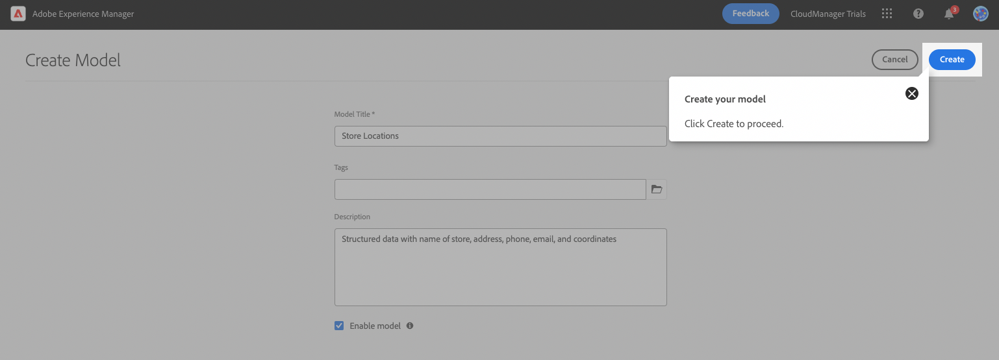
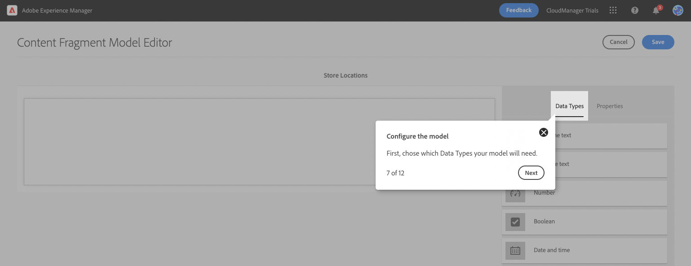
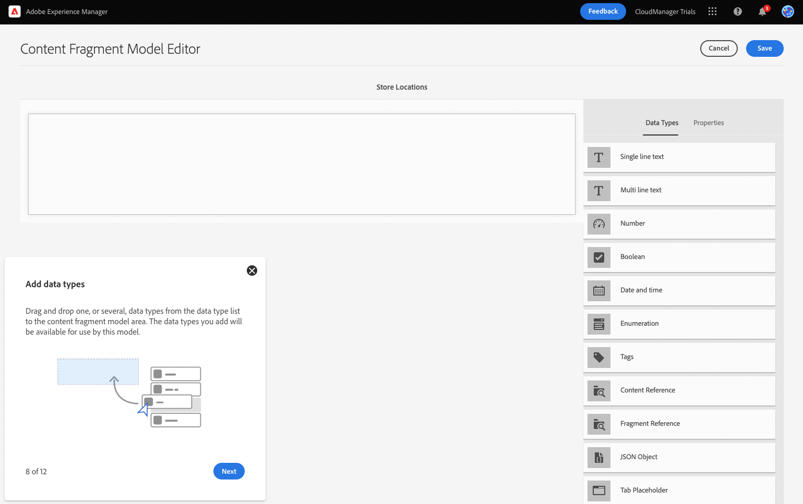
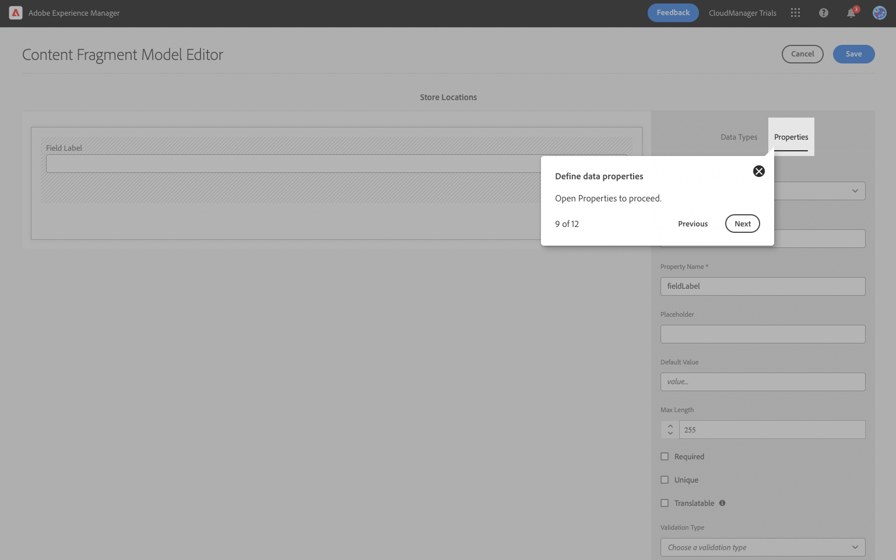

# Create the Content Structure for Your App {#content-structure}

Learn how to create the structure which serves as the foundation for all of your headless content using AEM's Content Fragment Models by following the in-product learning module. This document serves as a supplement to the in-product guidance.

## Step 1 - Define the Structure for Your Headless Content {#define-structure}

Content Fragments allow you to design, create, curate, and publish page-independent content. They allow you to prepare content ready for use in multiple locations and over multiple channels, ideal for headless delivery. Content Fragment Models are used to define the structure of this content and are the first thing you need to create in order to manage your headless content.

To help you understand how this is done, this module of AEM Trials takes you through the process with a quick, interactive tour first creating the model and then adding its structure. This document serves as a supplement of the interactive tour, covering the same steps and linking to additional resources where appropriate.

You start on the Content Fragment Models console. The Content Fragment console can be thought of as your library of models. You use the console to create new models and manage exiting models.

>[!TIP]
>
>If you would like to know more about navigation in AEM, see the [Additional Resources section](#additional-resources) of this document for more information on AEM basic handling.
 
## Step 2 - Create a Model {#create-model}

In the Content Fragment Model console, click the **Create** button at the top-right of the screen to begin creating a Content Fragment model.

## Step 3 - Describe the Model {#describe-model}

The Create Model wizard starts, which guides you through creating a Content Fragment model. 

Provide the mandatory information.

* **Model Title** - This is a brief description of the model, and usually indicates its purpose.
* **Enable model** - This option is checked by default and must be checked to be able to create Content Fragments later based on this model.

You can also choose to add a longer **Description** to the model as well as **Tags** to categorize it and differentiate it for your users later within the Content Fragment model console.

>[!TIP]
>
>If you are interested in how tags can organize your content, see the [Additional Resources section](#additional-resources) of this document for more information on tagging in AEM.

## Step 4 - Create Your Model {#click-create}

Once the mandatory fields are populated, you click **Create** at the top-left to create the model. 

## Step 5 - Open the Model {#open-model}

The **Success** dialog confirms that the model was created.

Before you can use the model, you also need to define the structure of its data. Click **Open** in the dialog to continue defining the model.

## Step 6 - Add Data Types {#add-data-types}

The Content Fragment Model is essentially a schema for your Content Fragments. I.e. it defines what fields/data types that the model contains. By clicking **Open** in the previous **Success** dialog, you are taken to the Content Fragment Editor, where you can define fields for the Content Fragment model using a drag-and-drop interface.

Drag a field from the **Data Types** panel at the right of the screen and drop it onto your Content Fragment Model. There are multiple data types to choose from such as a single-line text, multi-line text, number, and references to other fragments.

>[!TIP]
>
>If you would like more information about the data types available to you, see the [Additional Resources section](#additional-resources) of this document for the detailed Content Fragment Models documentation.

## Step 7 - Define Data Properties {#data-properties}

Once a data type is placed, the **Data Types** column automatically changed to the **Properties** tab, where you can define the details of the data type you just placed.

Properties of the model may include the name of the field, the type of field, the length of the field, if it is mandatory, etc.

>[!TIP]
>
>If you would like more information about the properties available to you, see the [Additional Resources section](#additional-resources) of this document for the detailed Content Fragment Models documentation.

## Step 8 - Save the Content Fragment Model {#save-model}

Once you have added all of the fields necessary for the Content Fragment Model, click **Save** at the top-right of the window.

This saves the model and returns you to the Content Fragment Model Console where you can add more models are necessary.

## Step 9 - You've Learned to Create a Content Fragment Model {#conclusion}

In this module, you learned how to create a Content Fragment Model to represent the structure of your headless data. First you created the model and then populated it with data types and their related properties, thereby defining a schema for your headless content.

## Next Steps {#next-steps}

Now that you have your own Content Fragment Model, continue on to the module [Create New Content](create-content.md) to use your new Content Fragment Model to create headless content.

## Additional Resources {#additional-resources}

For more information about Content Fragments and AEM, consider reviewing this additional documentation.

* [Content Fragment Models](/help/assets/content-fragments/content-fragments-models.md) - Complete documentation on Content Fragment Models
* [Content Fragments](/help/assets/content-fragments/content-fragments.md) - Complete documentation on Content Fragments
* [Basic Handling](/help/sites-cloud/authoring/getting-started/basic-handling.md) - Documentation on how to navigate and use AEM for new users
* [Using Tags](/help/sites-cloud/authoring/features/tags.md) - Documentation on how to use tags in AEM to organize content
