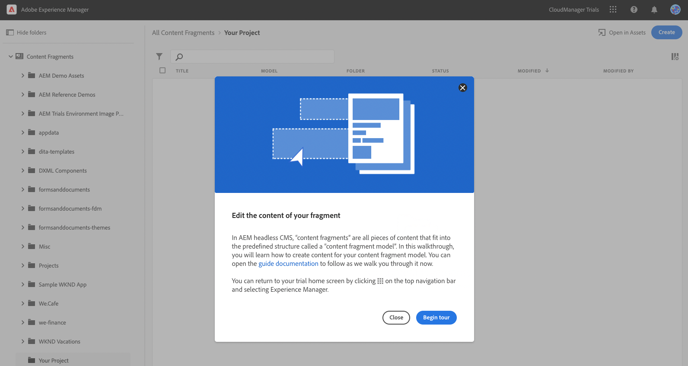
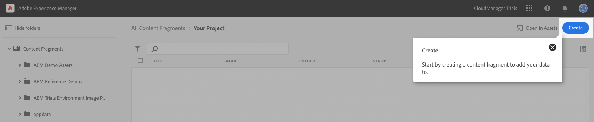
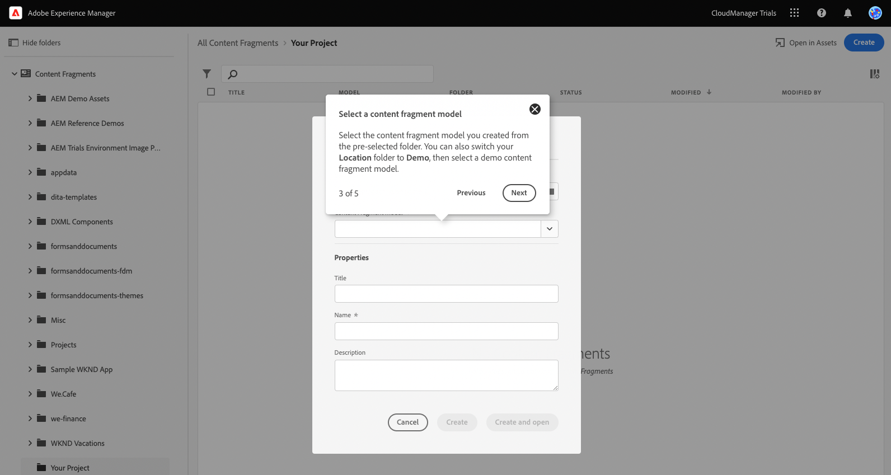
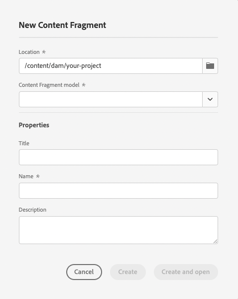
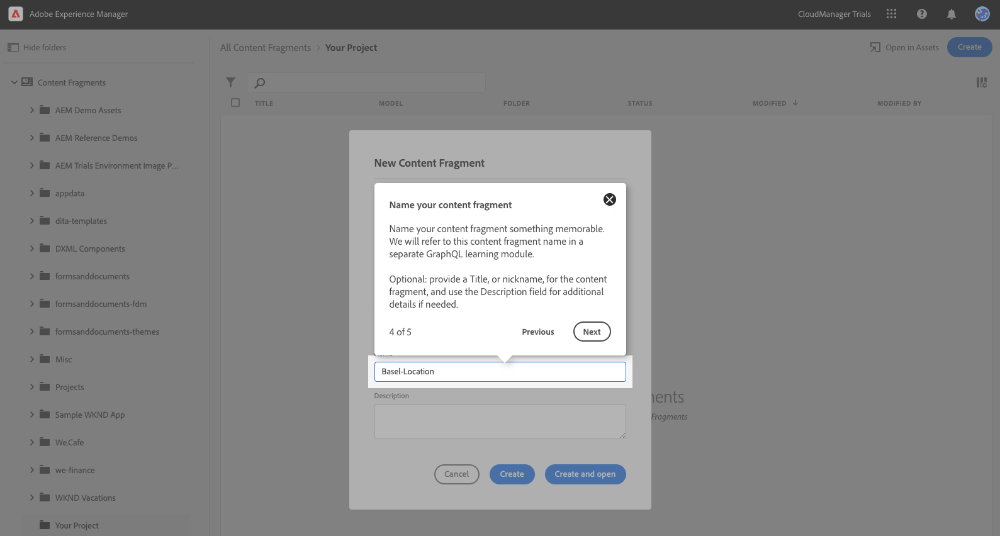

# Create Headless Content {#create-content}

Use [the Content Fragment models you created](content-structure.md) to create content which can be used for page authoring, or as the basis for your headless content.

## Step 1 - Introduction to Editing the Content of Your Fragment {#introduction}

In AEM as a Cloud Service, Content Fragments are pieces of headless content based on the structure defined by a Content Fragment model. In this module, you learn how to create headless content by creating Content Fragments based on [the Content Fragment model that you created previously.](content-structure.md)

Tap or click the **Begin tour** button to start!

## Step 2 - Create {#create}

You begin in the Content Fragments console. It will initially be empty.

Tap or click the **Create** button at the top-right of the console to start creating a new Content Fragment.

## Step 3 - Select a Content Fragment Model {#select-model}

Content Fragments represent your headless content. But they can only be created based on a predefined content structure. The Content Fragment model you created previously serves as that structure.

Select the Content Fragment model you created previously from the drop-down.

If you did not create a Content Fragment model previously, you can use demo content prepared for AEM Trials.

1. In the **New Content Fragment** dialog, tap or click the **Choose location** button (the icon that looks like a folder) in the **Location** field.

   

1. Use the **Choose location** dialog, to choose the path to the demo content.

   

## Step 4 - Name Your Content Fragment {#name-fragment}

## Step 5 - Create Your Content Fragment {#create-fragment}

