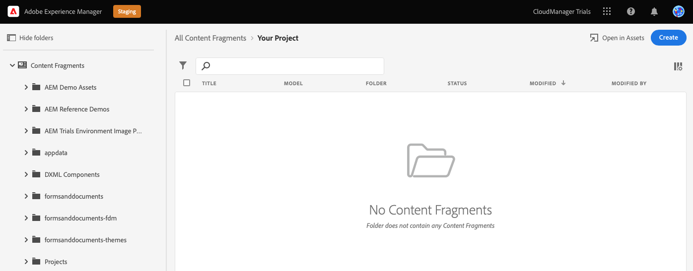
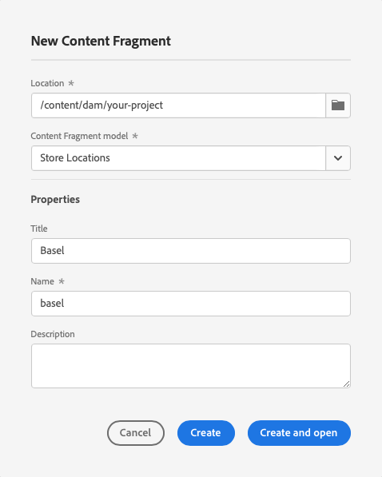
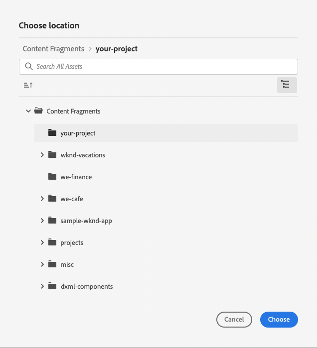
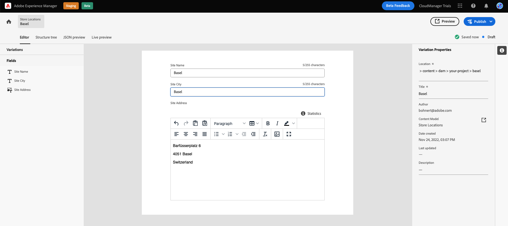
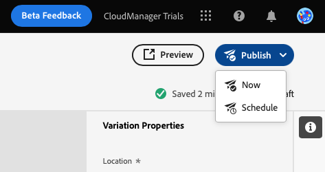
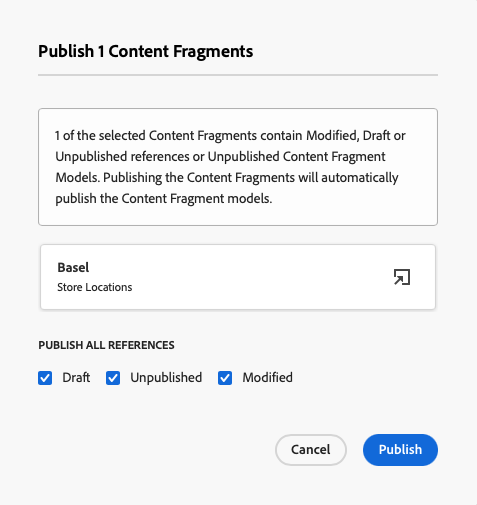
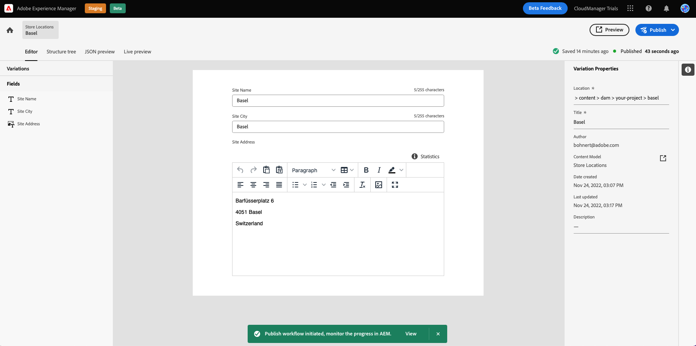
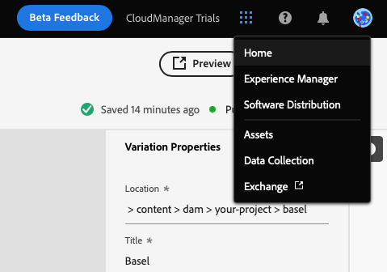

# Create Headless Content {#create-content}

By following the in-product learning module, learn how to use [the Content Fragment models you created previously](content-structure.md) to create content which can be used for page authoring, or as the basis for your headless content. This document serves as a supplement of the interactive tour, covering the same steps and linking to additional resources where appropriate.

## Content Fragments {#introduction}

In AEM as a Cloud Service, Content Fragments are pieces of headless content based on the structure defined by a Content Fragment model. You can create your own Content Fragment by starting in the Content Fragment console. The Content Fragment console can be thought of as your library of headless content. You use the console to create new Content Fragments and manage exiting fragments. Your console starts empty, so let's create a new fragment!

If you wish to navigate to the Content Fragment console yourself outside of the in-app guidance, it is found using the Adobe icon at the top-left of the page. This opens the global navigation of AEM. From here, you choose the **Navigation** tab and then **Assets** -&gt; **Content Fragments**.

>[!TIP]
>
>If you would like to know more about navigation in AEM, see the [Additional Resources section](#additional-resources) of this document for more information on AEM basic handling.

## Create a Content Fragment {#create-fragment}

Content Fragments represent your headless content. But they can only be created based on a predefined content structure. The Content Fragment model you created previously serves as that structure.

1. Tap or click the **Create** button at the top-right of the console to open the **New Content Fragment** dialog to start creating a new Content Fragment.

   

1. **Location** will automatically be populated following the in-app guidance.

   1. If you are not following the guidance, use the path browser to select your project folder.

   1. In the **New Content Fragment** dialog, tap or click the **Choose location** button (the icon that looks like a folder) in the **Location** field.

      

   * Alternatively select the path in the left navigation panel of the Content Fragment console before clicking **Create**.

1. In the **Content Fragment model** drop-down, select the Content Fragment model you created previously from the drop-down.

1. Add a **Title** for the Content Fragment.

1. Tap or click **Create and open**.

## Content Fragment Editor {#edit-fragment}

Once you save your new Content Fragment, the Content Fragment editor opens, where you can provide the actual content of the fragment.

1. The editor shows the fields you defined in the selected model. Here you can edit them to complete your content fragment. Your progress is saved automatically. 

1. If your Content Fragment's model has many fields, you can quickly jump to any field using the **Variables** panel on the left-hand side of the editor. Fields with errors will be flagged here.

1. In order for the Content Fragment to be available for consumption by external app, you need to publish it. Tap or click the **Publish** button at the top-right of the editor.

1. Select **Now** from the drop-down. You can also schedule it to publish at a later time.

   

1. AEM automatically performs a reference check to make sure that all necessary resources are published for your Content Fragment. In this case, you will also need to publish the model that you created. Tap or click **Publish**.

   

1. The publication is confirmed in a banner.

   

## You've learned how to create a Content Fragment! {#conclusion}

In this module you learned how to create a Content Fragment based on the model you made previously. This is how a content author would create structured headless content.

Now that your content is created and published, you can now extract that content via Graph QL via AEM's APIs. You will learn about this in the module [Extract Content via the GraphQL API.](extract-content.md)

You can return to your trial home screen by clicking **Solutions** button at the top-right of the navigation bar and selecting **Experience Manager**.

