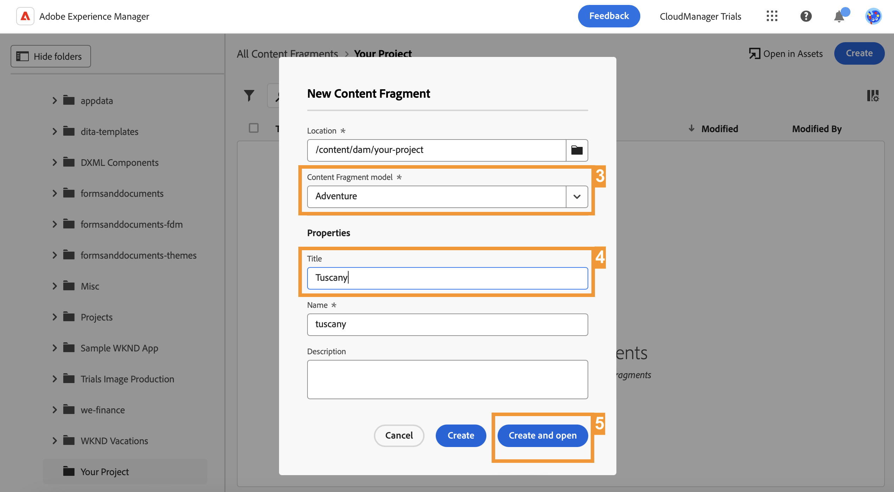
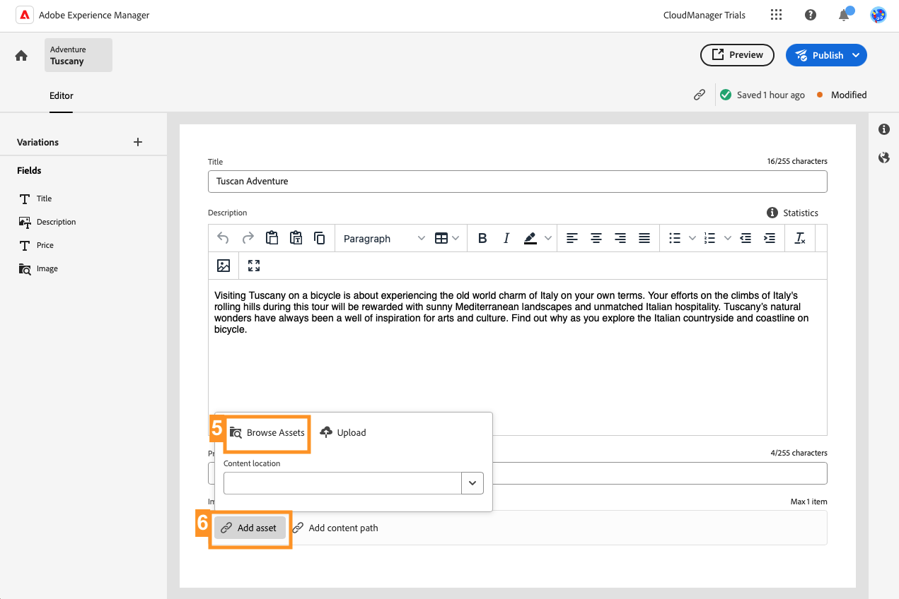
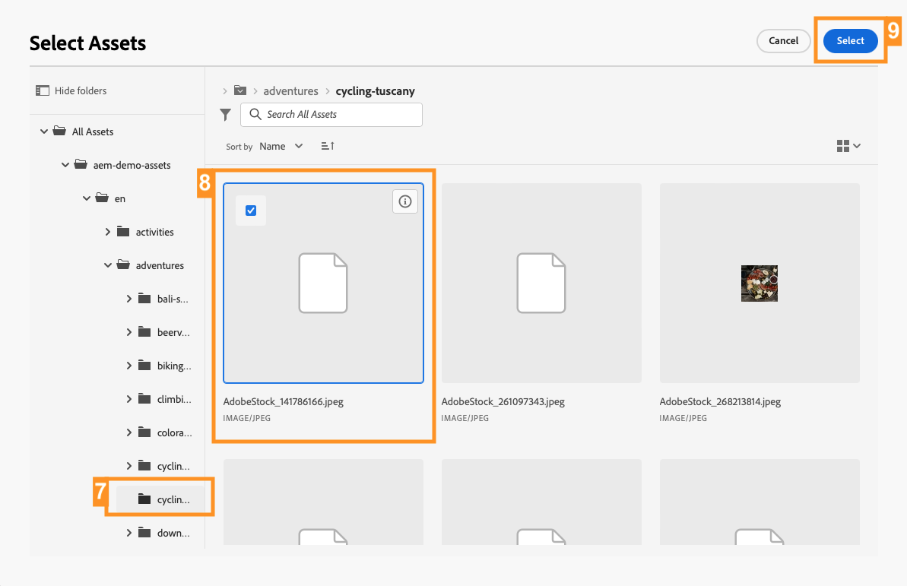
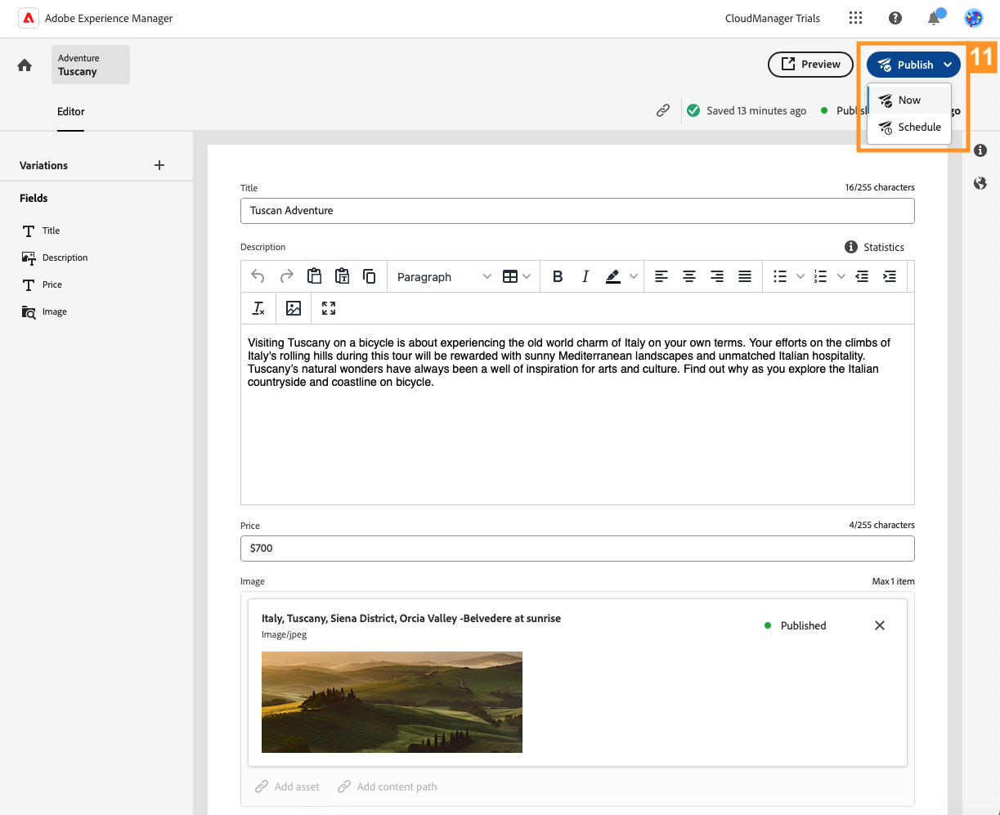
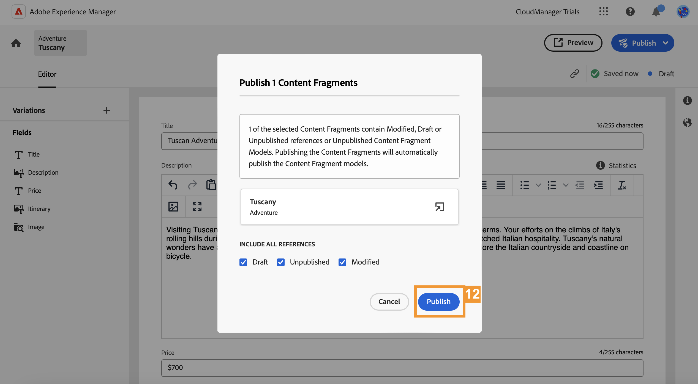

# Create Headless Content {#create-content}

>[!CONTEXTUALHELP]
>id="aemcloud_sites_trial_admin_content_fragments_create_content"
>title="Create headless content"
>abstract="Using the model that you created in the previous module, you learn how to create content which can be used for page authoring, or as the basis of your headless content."

>[!CONTEXTUALHELP]
>id="aemcloud_sites_trial_admin_content_fragments_create_content_guide"
>title="Launch the Content Fragment console"
>abstract="Creating consistent, high-quality content that works seamlessly across your apps and websites leads to great customer experiences. This module guides you through creating your first headless content by using the Content Fragment console.<br><br>Launch this module in a new tab by clicking the button below, then follow this guide."

>[!CONTEXTUALHELP]
>id="aemcloud_sites_trial_admin_content_fragments_create_content_guide_footer"
>title="Great job! In this module, you learned how to author headless content as a Content Fragment based on the model you made previously. You now understand how content teams can create and manage content for apps and websites independent of development cycles."
>abstract=""

## Create a Content Fragment {#create-fragment}

Content Fragments represent your headless content and are based on predefined structures, called Content Fragment models. You already created a model in a previous module.

In this module, you create a Content Fragment based on that model by using the Content Fragment console. Think of the Content Fragment console as your library of headless content. Use it to create new Content Fragments and manage existing fragments.

The Content Fragment console is used to create and edit headless content across delivery channels and independent of context, which can be the most effective method in many authoring cases. In a later module we will explore editing headless content in-context and in-place.

1. Select the **Create** button at the top-right of the console.

1. The **New Content Fragment** dialog box opens where you can start creating a Content Fragment. **Location** is automatically populated with where the new content is saved.

1. In the **Content Fragment model** drop-down, select the **Adventure** Content Fragment model you created previously.

1. Add `Tuscany` as a descriptive **Title** for the Content Fragment. This is to identify your fragment in the console.

1. Select **Create and open**.



>[!TIP]
>
>Depending on your browser settings, the new browser tab might be suppressed by a pop-up blocker. If your new fragment does not open after clicking **Create and open**, check your browser settings.

## Add Content to Your Content Fragment {#add-content}

After you save and open your new Content Fragment, the Content Fragment editor opens on a new tab. Here you can add the content of your new fragment.

1. The Content Fragment editor shows the fields you defined in the selected model. Here you can add content to each field to complete your Content Fragment. Your progress is saved automatically.

1. Provide a **Title** for your fragment by entering `Tuscan Adventure`.

1. Provide a **Description** for your fragment by pasting in the following text.

   ```text
   Visiting Tuscany on a bicycle is about experiencing the old world charm of Italy on your own terms. Your efforts on the climbs of Italy's rolling hills during this tour are rewarded with sunny Mediterranean landscapes and unmatched Italian hospitality. Tuscany's natural wonders have always been a well of inspiration for arts and culture. Find out why as you explore the Italian countryside and coastline on bicycle.
   ```

1. Provide a **Price** for your fragment by entering in `$700`.

1. Provide an **Image** that is representative of the trip by tapping or clicking **Add asset** in the **Image** field.

1. In the asset pop-up, select **Browse Assets** to select from an existing asset in the assets library.

   

1. The **Select Asset** dialog opens. Using the tree navigator in the left panel, navigate to **All assets** &gt; **aem-demo-assets** &gt; **en** &gt; **adventures** &gt; **cycling-tuscany**.

1. The contents of the **cycling-tuscany** folder are displayed to the right. Select the image `ADOBESTOCK_141786166.JPEG`.

1. Select **Select**.

   

1. The selected image is shown in the content fragment. The editor automatically saves the changes.

1. Once you are finished adding content, select the **Publish** button at the top-right of the editor. This makes your Content Fragment available for consumption by external apps. Then select **Now** from the drop-down. You can also schedule it to publish at a later time.

   

1. The **Publish Content Fragments** dialog appears. AEM automatically performs a reference check to make sure that all necessary resources are published for your Content Fragment. In this case, you will also need to publish the model that you created. Select **Publish**.

   

1. The publication is confirmed in a banner.

Your content is published and ready to be delivered to your app or website as a Content Fragment.
