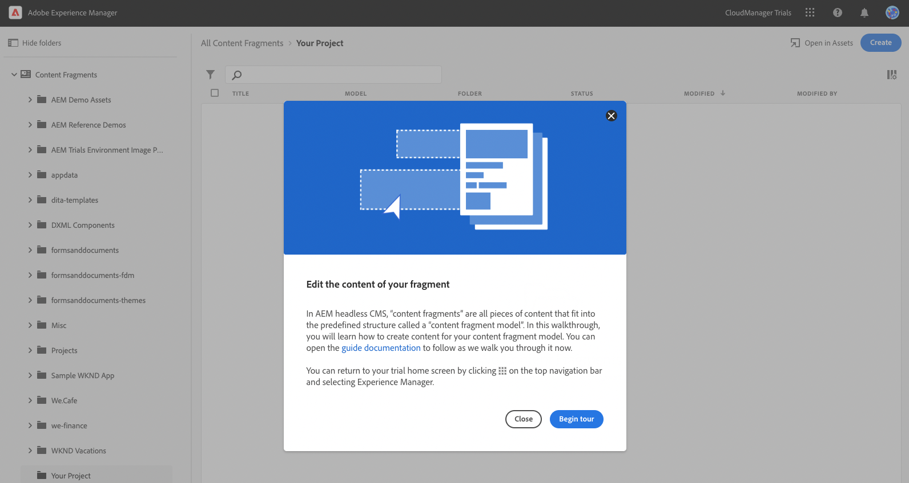
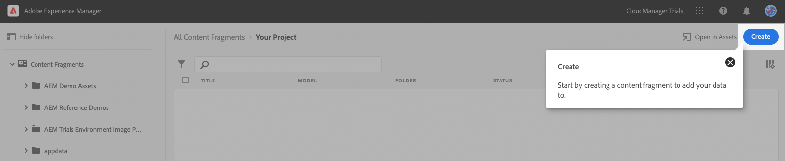
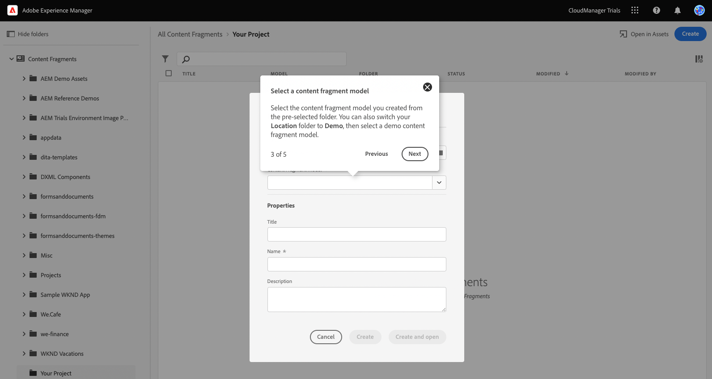
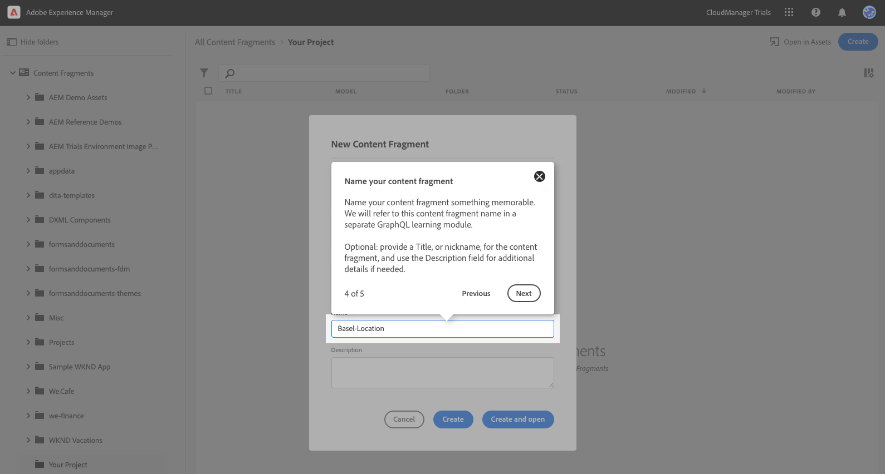
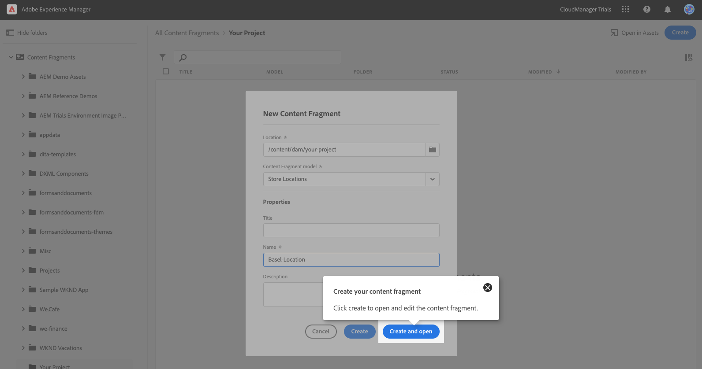

# Create Headless Content {#create-content}

Use [the Content Fragment models you created](content-structure.md) to create content which can be used for page authoring, or as the basis for your headless content.

## Step 1 - Introduction to Editing the Content of Your Fragment {#introduction}

## Step 2 - Create {#create}

## Step 3 - Select a Content Fragment Model {#select-model}

## Step 4 - Name Your Content Fragment {#name-fragment}

## Step 5 - Create Your Content Fragment {#create-fragment}

