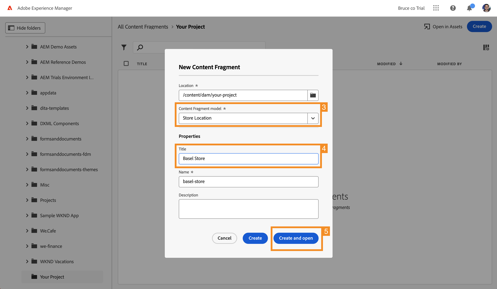
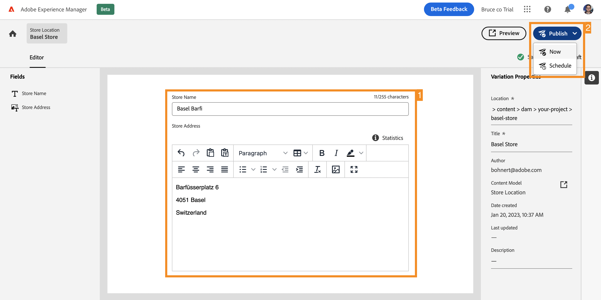
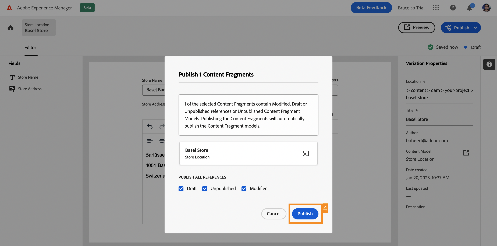

# Create Headless Content {#create-content}

>[!CONTEXTUALHELP]
>id="aemcloud_sites_trial_admin_content_fragments_create_content"
>title="Create new content"
>abstract="Using the model that you created in the previous module, you'll learn how to create content which can be used for page authoring, or as the basis of your headless content."

>[!CONTEXTUALHELP]
>id="aemcloud_sites_trial_admin_content_fragments_create_content_guide"
>title="Launch the Content Fragment console"
>abstract="Creating consistent, high-quality content that works seamlessly across your apps and websites leads to great customer experiences. This module guides you through creating your first Content Fragment to illustrate how to make this happen. Watch the video to understand why this is an important step.  Launch this module in a new tab by clicking the button below, then follow this guide."
>additional-url="https://video.tv.adobe.com/v/328618" text="Create new content intro video"

>[!CONTEXTUALHELP]
>id="aemcloud_sites_trial_admin_content_fragments_create_content_guide_footer"
>title="Great job! In this module, you learned how to author a Content Fragment based on the model you made previously. You now understand how content teams can create and manage content for apps and websites independent of development cycles."
>abstract=""

## Create a Content Fragment {#create-fragment}

Content Fragments represent your headless content and are based on predefined structures, called Content Fragment models. Think of the Content Fragment console as your library of headless content. Use it to create new Content Fragments and manage existing fragments.

1. Tap or click the **Create** button at the top-right of the console.

2. The **New Content Fragment** dialog opens where you can  start creating a new Content Fragment. **Location** is automatically populated with where the new content will be saved.

3. In the **Content Fragment model** drop-down, select the Content Fragment model you created previously.

4. Add a **Title** for the Content Fragment.

5. Tap or click **Create and open**.

## Add Content to your Content Fragment {#add-content}

Once you save and open your new Content Fragment, the Content Fragment editor opens on a new tab. Here you can add the content of your new fragment.

1. The Content Fragment editor shows the fields you defined in the selected model. Here you can add content to each field to complete your Content Fragment. Your progress is saved automatically. 

2. Once you are finished adding content, tap or click the **Publish** button at the top-right of the editor. This makes your Content Fragment available for consumption by external apps. 

3. Select **Now** from the drop-down. You can also schedule it to publish at a later time.

   

4. The **Publish Content Fragments** dialog appears. AEM automatically performs a reference check to make sure that all necessary resources are published for your Content Fragment. In this case, you will also need to publish the model that you created. Tap or click **Publish**.

   

5. The publication is confirmed in a banner.

Your content is published and ready to be delivered to your app or website as a Content Fragment.
