# Customize Content in a Sample React App {#customize-app}

Use a sample React app to learn how to customize content using the headless feature set in AEM as a Cloud Service.

## Step 1 - Introduction to Customizing a Sample React App {#customize-sample-app}

In this tour, you will learn something.

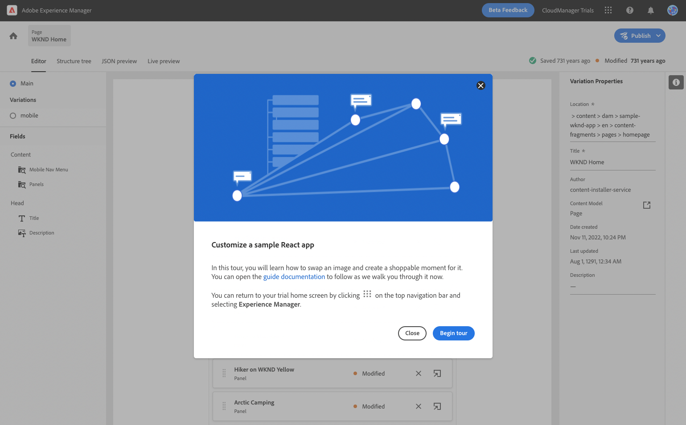

## Step 2 - Preview {#preview}

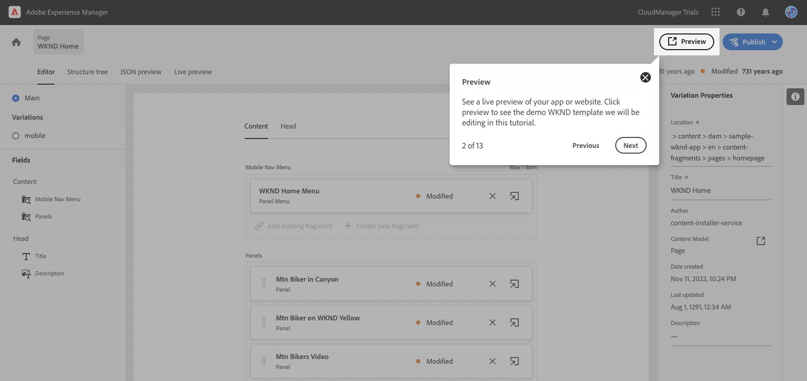

## Step 3 - Edit a Page {#edit-page}

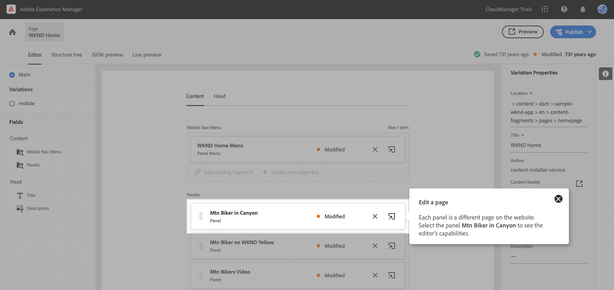

## Step 4 - Change the Header's text {#change-text}

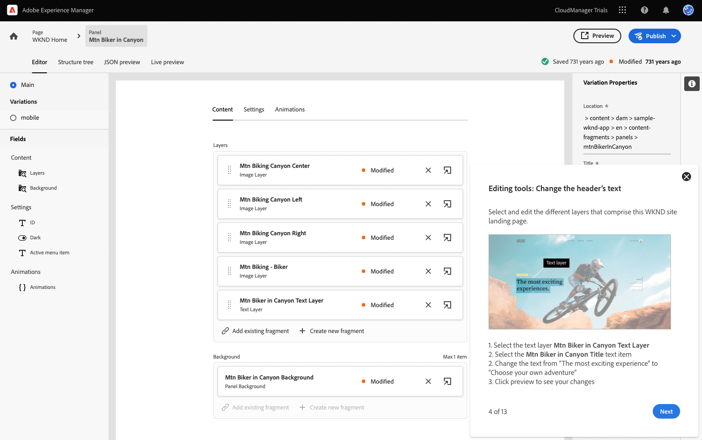

## Step 5 - Navigate Back to the Layer Screen {#navigate-back}

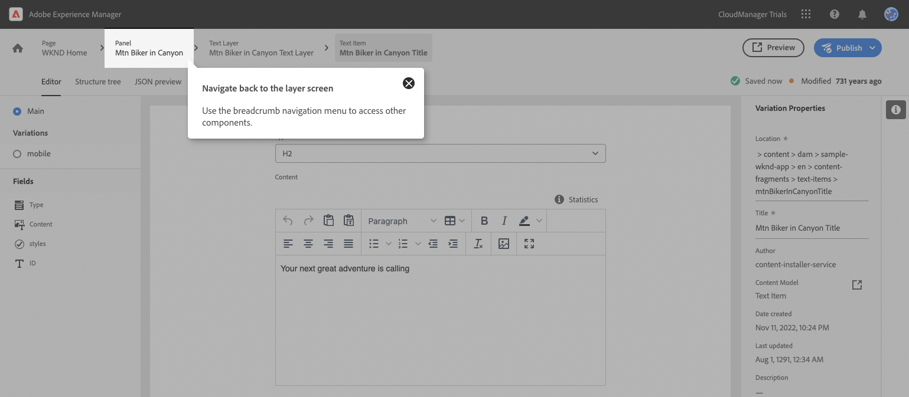

## Step 6 - Change the Site's Main Image {#change-image}

It is not clear that you need to use the tree view to select.

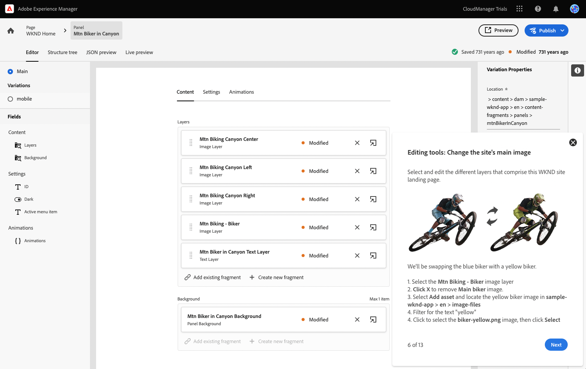

## Step 7 - Navigate Back to the Layer Screen {#navigate-back-2}

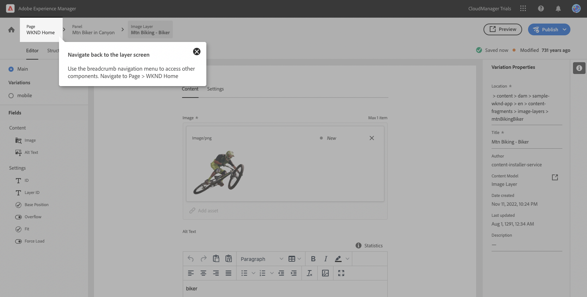

## Step 8 - Create a Shoppable Moment {#create-moment}

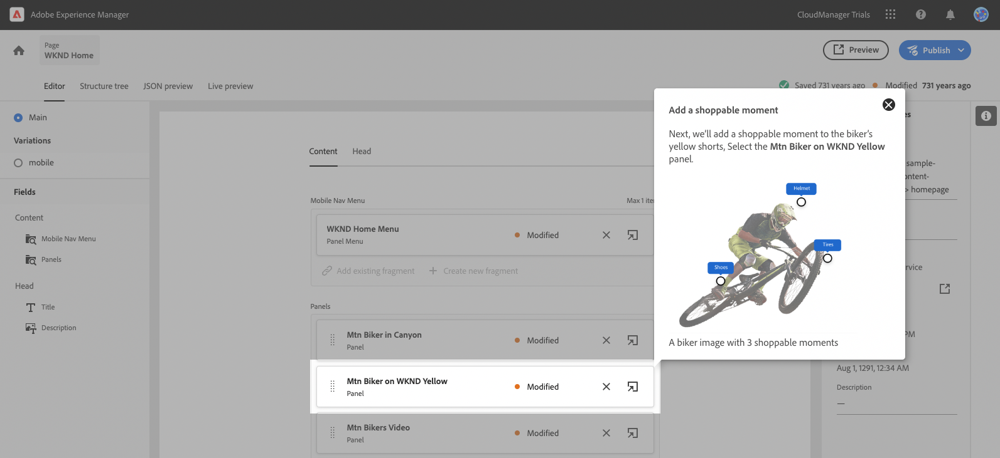

## Step 9 - Select the Shoppable Moment Layer {#select-layer}

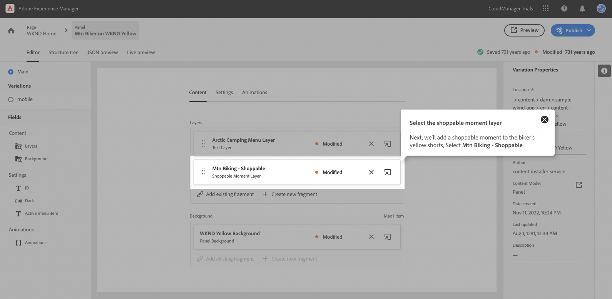

## Step 10 - Add a Shoppable Moment {#add-moment}

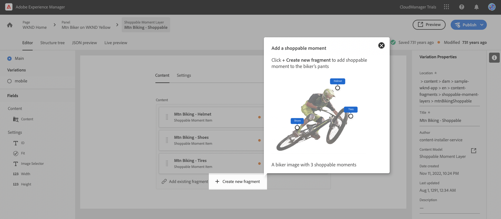

## Step 11 - Choose the Content Fragment Model {#choose-model}

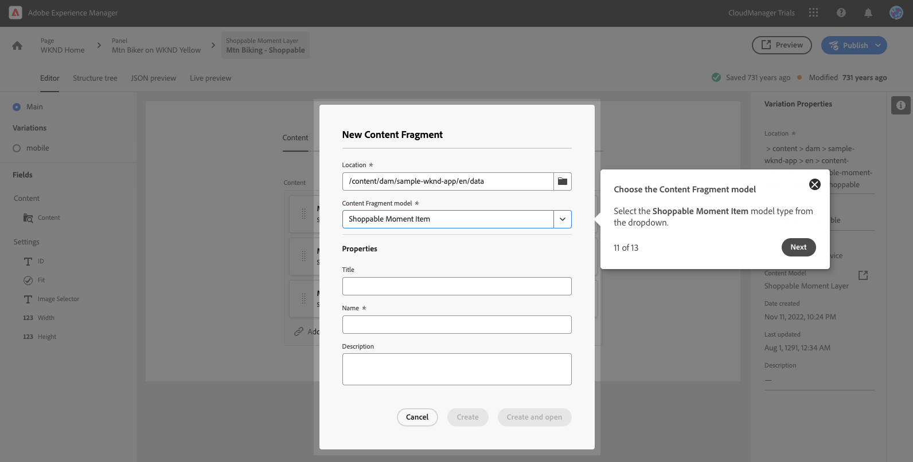

## Step 12 - Name the Shoppable Moment {#name-moment}

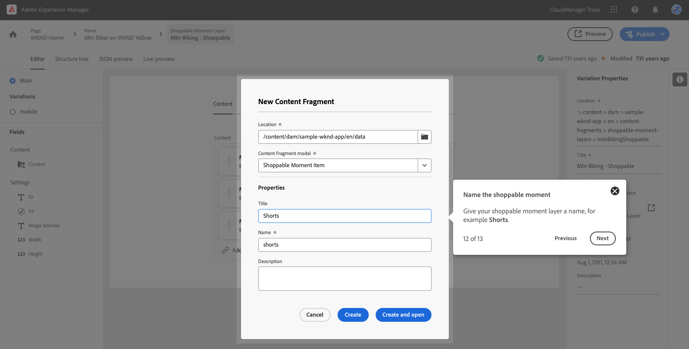

## Step 13 - Create and Open {#create-open}

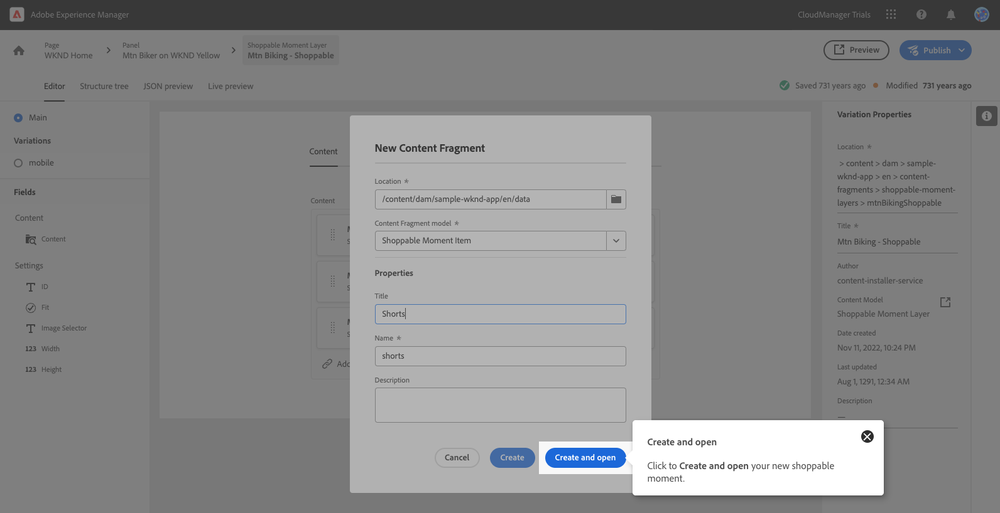

