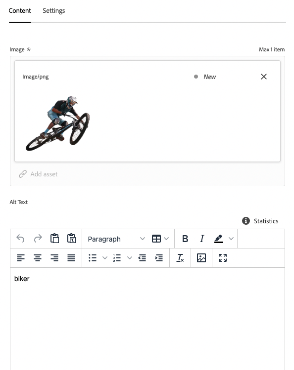
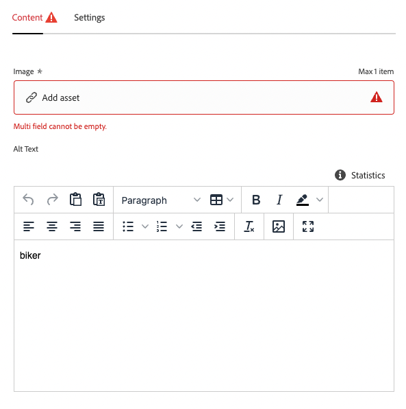
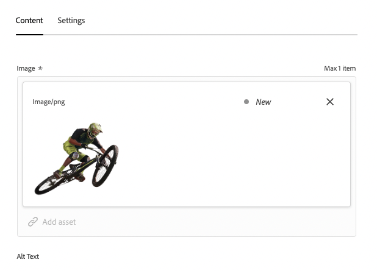

# Customize Content in a Sample React App {#customize-app}

AEM Trials for headless comes preloaded with a simple React app to showcase headless content. In this module, you will learn how to preview that app and make changes to its content by swapping an image and creating a shoppable moment for it.

The app itself is based on the structure of Content Fragments. Using the Content Fragment editor in AEM, you can modify your apps content. To help you understand how this is done, this module of AEM Trials takes you through the process with a quick, interactive tour. 

## Content Fragment Editor {#fragment-editor}

You begin in the Content Fragment editor for the sample app.

If you wish to navigate to the Content Fragment editor yourself outside of the in-app guidance, it is found using the Adobe icon at the top-left of the page. This opens the global navigation of AEM. From here, you choose the **Navigation** tab and then **Assets** -&gt; **Content Fragments**.

This opens the Content Fragment console. From there, you use the content tree in the left panel to navigate to the location of the app. In this case under **Content Fragments** -&gt; **Sample WKND App** -&gt; **English** -&gt; **Content Fragments** -&gt; **pages**.

Tap or click on the **WKND Home** page displayed to start the editor for the app.

>[!TIP]
>
>If you would like to know more about navigation in AEM, see the [Additional Resources section](#additional-resources) of this document for more information on AEM basic handling.

## Preview the App {#preview}

Before you begin modifying the app, first get familiar with it by previewing its current state. Tap or click the **Preview** button at the top-right of the editor screen.

The demo app opens in a new tab.

Return to the tab of the Content Fragment editor to continue.

## Step 3 - Edit the App {#edit-app}

As previously mentioned, the app itself is made up of Content Fragments. These fragments are linked together in a structure to create the app.

The Content Fragment editor displays the basic layout of the app as a page. This page is a Content Fragment, which itself ia a collection of other fragments. The **Panels** represent different pages of the app, each of which is its own Content Fragment. By modifying these fragments, you can change the content of the app.

1. Tap or click **Mtn Biker in Canyon** in the **Panels** section.

   

1. The editor opens up the header panel for the mountain biker. Each panel is made up of layers, representing different content within a page of the app.

   

1. Select the text layer **Mtn Biker in Canyon Text Layer**. This opens the detail of the layer in the editor. The layer is made up of multiple Content Fragments.

   

1. Select the **Mtn Biker in Canyon Title** text item. This opens the Content Fragment editor, showing the content of this fragment and allowing you to modify it.

   

1. Change the text from `The most exciting experience` to `Choose your own adventure`. The change is saved automatically by the editor.

1. Click preview to see your changes. The demo app opens in a new tab.

   

Return to the tab of the Content Fragment editor to continue the module.

## Change the Site's Main Image {#change-image}

Now that you made a change to some text in the app, try changing the app's main image. First you will need to locate that content.

The breadcrumbs at the top-left of the editor show where you are in your content hierarchy.

1. Tap or Click **Mtn Biker in Canyon** in the breadcrumbs to return to that page.

   

The layers don't represent just text content. They represent all content in your app. You can swap images using the Content Fragment editor as well.

1. Select the **Mtn Biking - Biker image layer**. This opens the Content Fragment editor, showing the content of this fragment and allowing you to modify it.

   

1. Click **X** to remove the biker image. The image disappears and the editor shows an error since the image is required data for this Content Fragment model.

   

1. Select **Add asset** and locate the yellow biker image in **sample-wknd-app** &gt; **en** &gt; **image-files**. Use the tree view at the left side of the **Select Assets** dialog to navigate the content hierarchy.

   

1. Filter for the text `yellow`. Use the **Search all assets** field at the top of the **Select Assets** window to search for the image. Enter the search text and press enter or return to search.

   

1. Tap or click to select the `biker-yellow.png` image, then tap or click **Select**.

   

The image of the biker was replaced with the selected image. The editor automatically saves the changes.

## Step 7 - Navigate Back to the Layer Screen {#navigate-back-2}

Return to the Content Fragment editor where you viewed the page components. The breadcrumbs at the top-left of the editor show where you are in your content hierarchy.

Tap or Click **WKND Home** in the breadcrumbs to return to that page.

## Step 8 - Create a Shoppable Moment {#create-moment}

Now that you updated the image of the biker, you can add a shoppable moment for the biker’s yellow shorts. Because the moment is for the image of the biker, select the **Mtn Biker on WKND Yellow** panel.

## Step 9 - Select the Shoppable Moment Layer {#select-layer}

You can now see the layers that make up the image of the biker. Add a shoppable moment to the biker’s yellow shorts by selecting the **Mtn Biking - Shoppable** layer.

## Step 10 - Add a Shoppable Moment {#add-moment}

In order to create a shoppable moment, you must create a new Content Fragment that represents that moment. Tap or click the **+ Create new fragment** button to add shoppable moment for the biker’s pants.

## Step 11 - Choose the Content Fragment Model {#choose-model}

Because Content Fragments represent structured headless data, whenever you create a Content Fragment, you must first choose a model to base it on.

Select the **Shoppable Moment Item** model from the **Content Fragment model** drop-down. 

## Step 12 - Name the Shoppable Moment {#name-moment}

Give the Content Fragment that will represent this new shoppable moment layer a name. For example enter **Shorts** into the **Name** field.

## Step 13 - Create and Open {#create-open}

