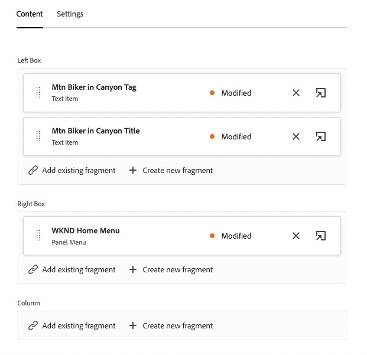
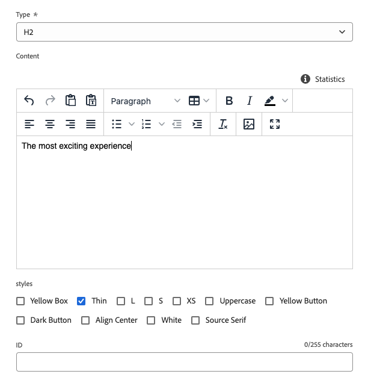
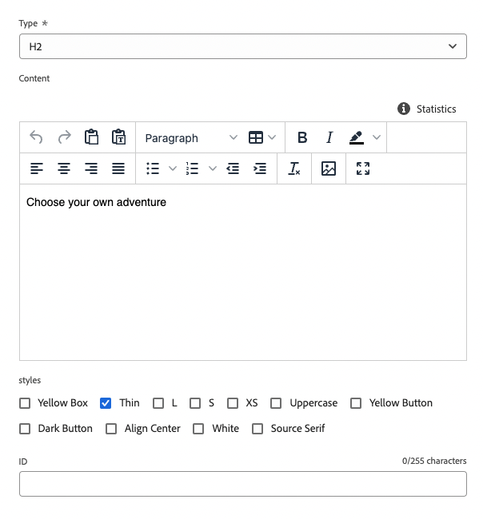
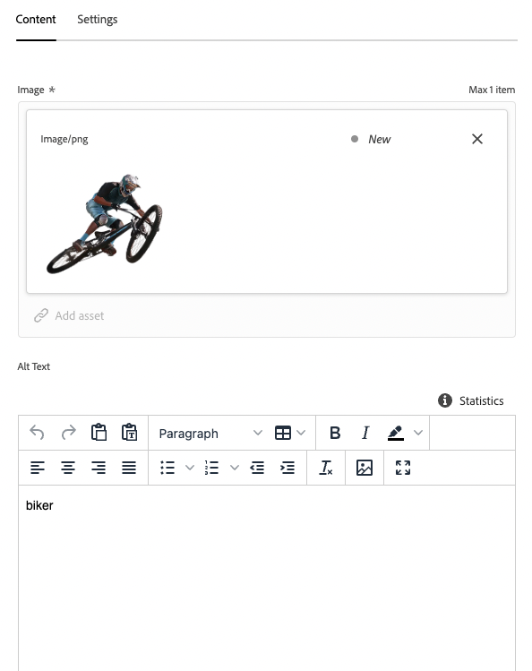
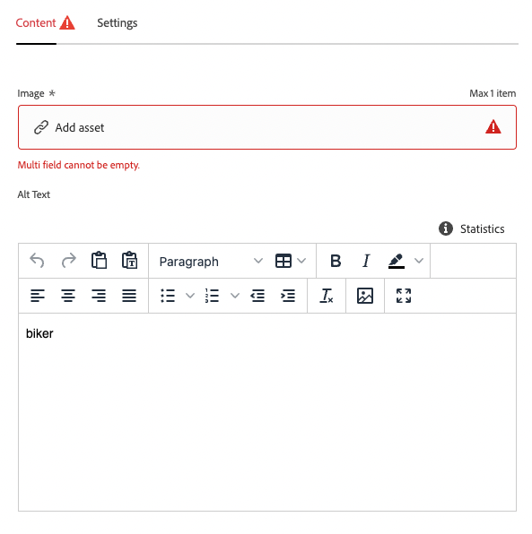
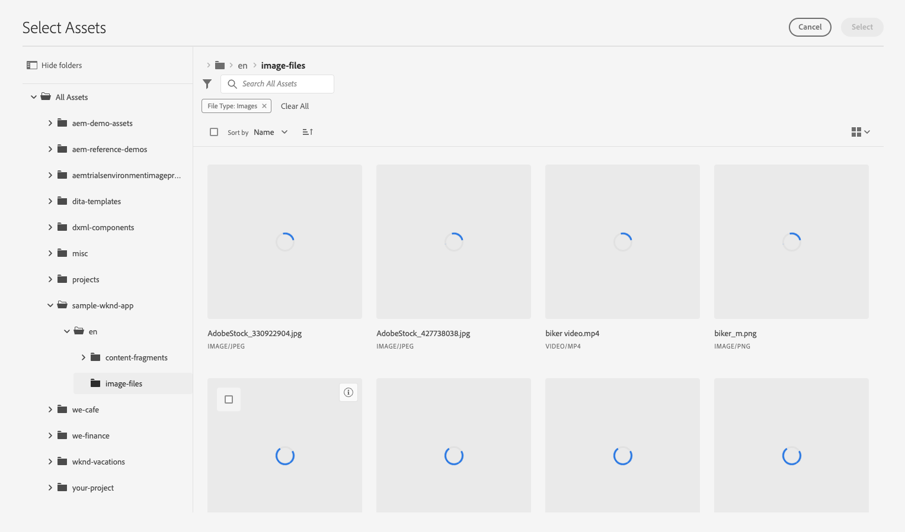
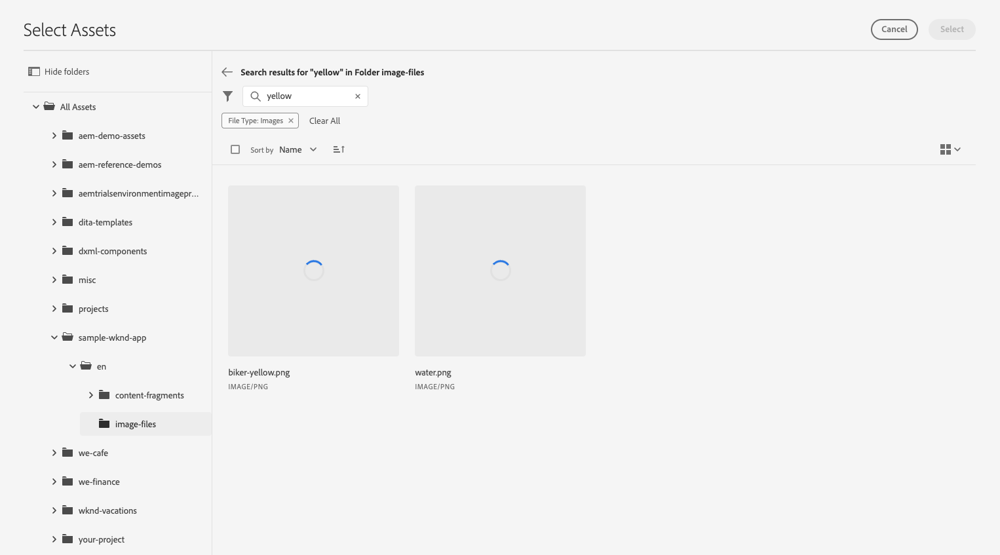
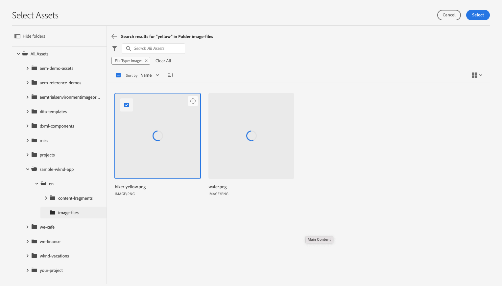
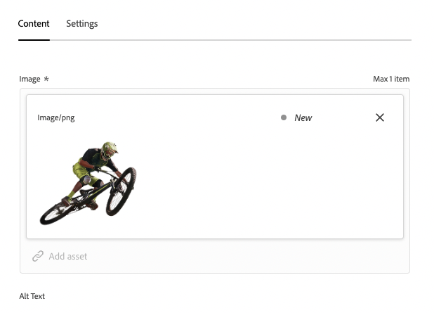

# Customize Content in a Sample React App {#customize-app}

Use a sample React app to learn how to customize content using the headless feature set in AEM as a Cloud Service.

## Step 1 - Introduction to Customizing a Sample React App {#customize-sample-app}

AEM Trials for headless comes preloaded with a simple React app to showcase headless content. In this module, you will learn how to preview that app and make changes to the content of that app by swapping an image and creating a shoppable moment for it.

Tap or click the **Begin tour** button to start!

## Step 2 - Preview {#preview}

You begin in the Content Fragment editor for the sample app. To view the app in its current state, tap or click the **Preview** button at the top-right of the editor screen.

The demo app opens in a new tab.

Return to the tab of the Content Fragment editor to continue the module.

## Step 3 - Edit a Page {#edit-page}

The editor displays the basic layout of the app. The **Panels** represent different pages of the app.

Tap or click **Mtn Biker in Canyon** in the **Panels** section.

## Step 4 - Change the Header's text {#change-text}

The editor opens up the header panel. Each panel is made up of layers, representing different content within a page of the app.

You can use the editor to change the heading text for example.

1. Select the text layer **Mtn Biker in Canyon Text Layer**. This opens the detail of the layer in the editor. The layer is made up of multiple Content Fragments.

   

1. Select the **Mtn Biker in Canyon Title** text item. This opens the Content Fragment editor, showing the content of this fragment and allowing you to modify it.

   

1. Change the text from `The most exciting experience` to `Choose your own adventure`. The change is saved automatically by the editor.

   

1. Click preview to see your changes. The demo app opens in a new tab.

   

Return to the tab of the Content Fragment editor to continue the module.

## Step 5 - Navigate Back to the Layer Screen {#navigate-back}

Return to the Content Fragment editor where you viewed the layers. The breadcrumbs at the top-left of the editor show where you are in your content hierarchy.

Tap or Click **Mtn Biker in Canyon** in the breadcrumbs to return to that page.

## Step 6 - Change the Site's Main Image {#change-image}

The layers don't represent just text content. They represent all content in your app. You can swap images using the Content Fragment editor as well.

1. Select the **Mtn Biking - Biker image layer**. This opens the Content Fragment editor, showing the content of this fragment and allowing you to modify it.

   

1. Click **X** to remove the biker image. The image disappears and the editor shows an error since the image is required data for this Content Fragment model.

   

1. Select **Add asset** and locate the yellow biker image in **sample-wknd-app** &gt; **en** &gt; **image-files**. Use the tree view at the left side of the **Select Assets** dialog to navigate the content hierarchy.

   

1. Filter for the text `yellow`. Use the **Search all assets** field at the top of the **Select Assets** window to search for the image. Enter the search text and press enter or return to search.

   

1. Tap or click to select the `biker-yellow.png` image, then tap or click **Select**.

   

The image of the biker was replaced with the selected image. The editor automatically saves the changes.

## Step 7 - Navigate Back to the Layer Screen {#navigate-back-2}

Return to the Content Fragment editor where you viewed the page components. The breadcrumbs at the top-left of the editor show where you are in your content hierarchy.

Tap or Click **WKND Home** in the breadcrumbs to return to that page.

## Step 8 - Create a Shoppable Moment {#create-moment}

Now that you updated the image of the biker, you can add a shoppable moment for the biker’s yellow shorts. Because the moment is for the image of the biker, select the **Mtn Biker on WKND Yellow** panel.

## Step 9 - Select the Shoppable Moment Layer {#select-layer}

You can now see the layers that make up the image of the biker. Add a shoppable moment to the biker’s yellow shorts by selecting the **Mtn Biking - Shoppable** layer.

## Step 10 - Add a Shoppable Moment {#add-moment}

In order to create a shoppable moment, you must create a new Content Fragment that represents that moment. Tap or click the **+ Create new fragment** button to add shoppable moment for the biker’s pants.

## Step 11 - Choose the Content Fragment Model {#choose-model}

Because Content Fragments represent structured headless data, whenever you create a Content Fragment, you must first choose a model to base it on.

Select the **Shoppable Moment Item** model from the **Content Fragment model** drop-down. 

## Step 12 - Name the Shoppable Moment {#name-moment}

Give the Content Fragment that will represent this new shoppable moment layer a name. For example enter **Shorts** into the **Name** field.

## Step 13 - Create and Open {#create-open}

