# Customize Content in a Sample React App {#customize-app}

AEM Trials for headless comes preloaded with a simple React app to showcase headless content. In this module, you will learn how to preview that app and modify its content by swapping an image and creating a shoppable moment for it.

The app itself is based on the structure of Content Fragments. Using the Content Fragment editor in AEM, you can modify your apps content. To help you understand how this is done, this module of AEM Trials takes you through the process with a quick, interactive tour. This document serves as a supplement of the interactive tour, covering the same steps and linking to additional resources where appropriate.

## Content Fragment Editor {#fragment-editor}

You begin in the Content Fragment editor for the sample app.

If you wish to navigate to the Content Fragment editor yourself outside of the in-app guidance, it is found using the Adobe icon at the top-left of the page. This opens the global navigation of AEM. From here, you choose the **Navigation** tab and then **Assets** -&gt; **Content Fragments**.

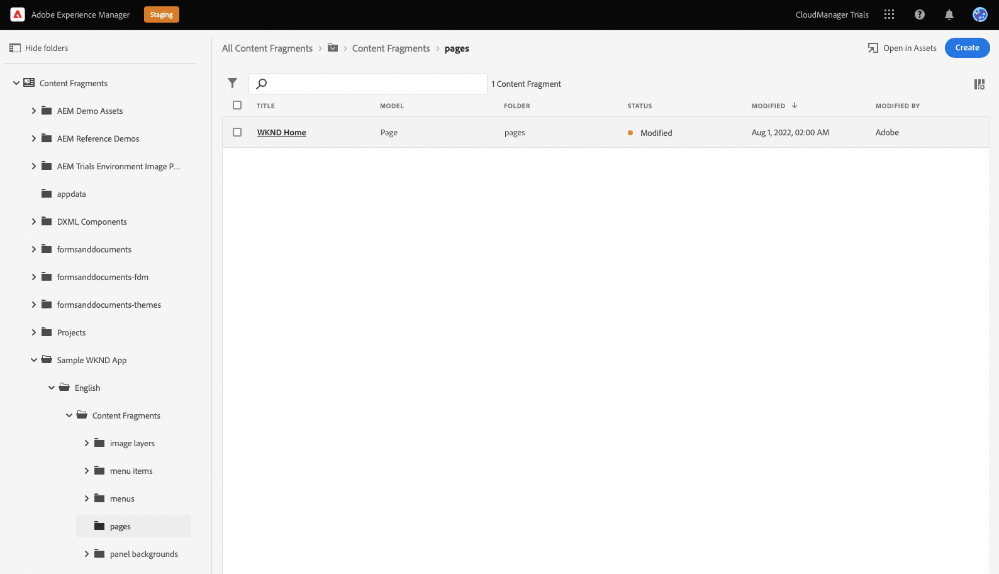

This opens the Content Fragment console. From there, you use the content tree in the left panel to navigate to the location of the app. In this case under **Content Fragments** -&gt; **Sample WKND App** -&gt; **English** -&gt; **Content Fragments** -&gt; **pages**.

>[!TIP]
>
>If you would like to know more about navigation in AEM, see the [Additional Resources section](#additional-resources) of this document for more information on AEM basic handling.

Tap or click on the **WKND Home** page displayed to start the editor for the app.

## Preview the App {#preview}

Before you begin modifying the app, first get familiar with it by previewing its current state. Tap or click the **Preview** button at the top-right of the editor screen.

The demo app opens in a new tab.

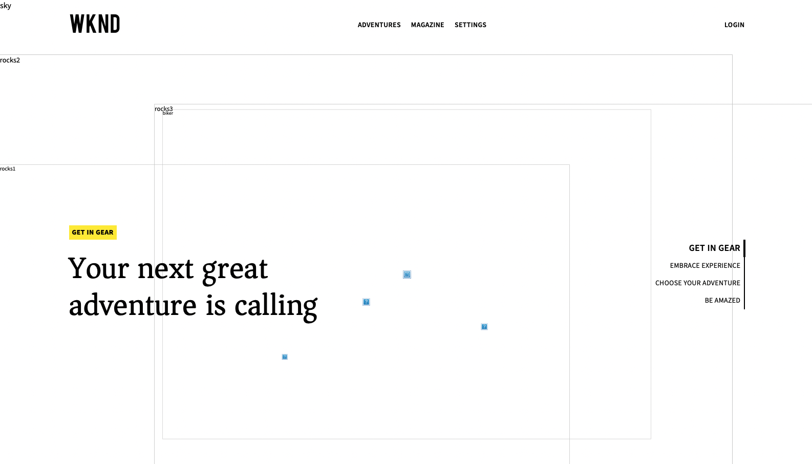

Return to the tab of the Content Fragment editor to continue.

## Edit Text in the App {#edit-app}

As previously mentioned, the app itself is made up of Content Fragments. These fragments are linked together in a structure to create the app.

The Content Fragment editor displays the basic layout of the app as a page. This page is a Content Fragment, which itself ia a collection of other fragments. The **Panels** represent different pages of the app, each of which is its own Content Fragment. By modifying these fragments, you can change the content of the app.

1. Tap or click **Mtn Biker in Canyon** in the **Panels** section.

   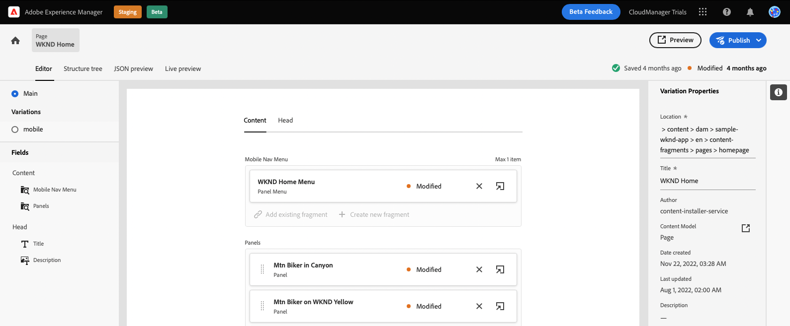

1. The editor opens up the header panel for the mountain biker. Each panel is made up of layers, representing different content within a page of the app.

   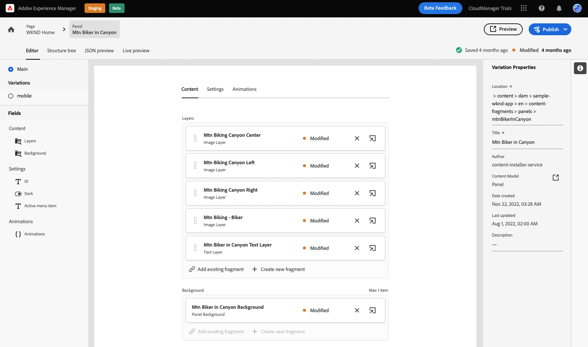

1. Select the text layer **Mtn Biker in Canyon Text Layer**. This opens the detail of the layer in the editor. The layer is made up of multiple Content Fragments.

   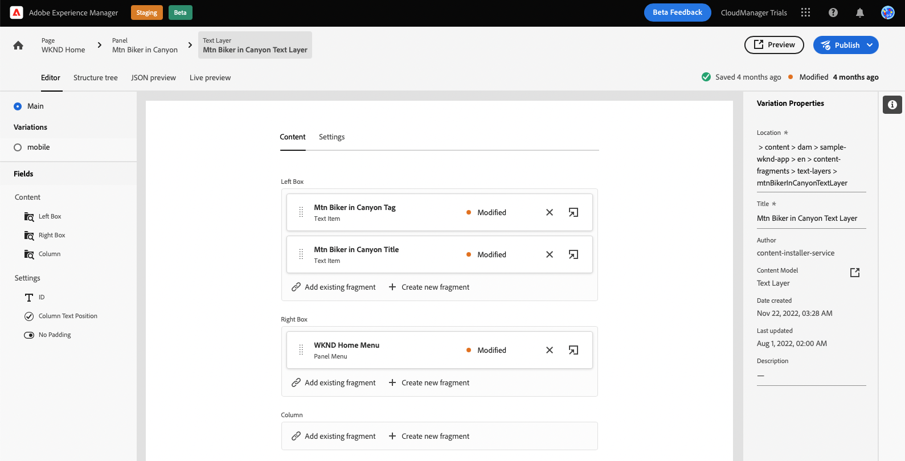

1. Select the **Mtn Biker in Canyon Title** text item. This opens the Content Fragment editor, showing the content of this fragment and allowing you to modify it.

   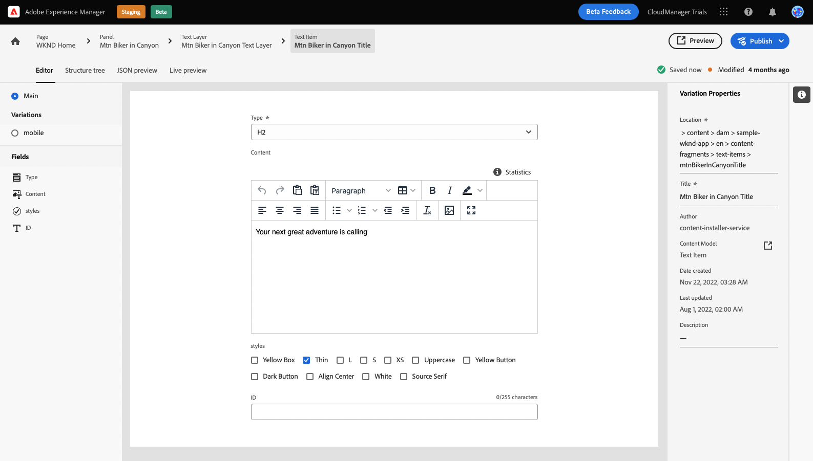

1. Change the text from `The most exciting experience` to `Choose your own adventure`. The change is saved automatically by the editor.

1. Click preview to see your changes. The demo app opens in a new tab.

   

Return to the tab of the Content Fragment editor to continue the module.

## Change the App's Main Image {#change-image}

Now that you modified some text in the app, try changing the app's main image. First you will need to locate that content.

The breadcrumbs at the top-left of the editor show where you are in your content hierarchy.

1. Tap or Click **Mtn Biker in Canyon** in the breadcrumbs to return to that page.

   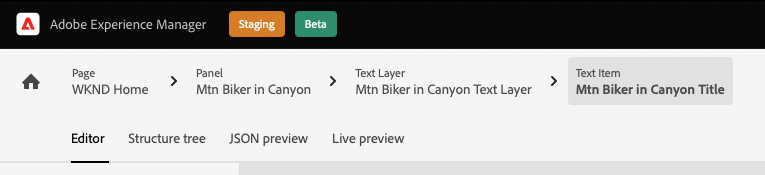

1. Return to the panel with the app's various layers. The layers don't just represent text content. They represent all content in your app. Therefore, you can swap images using the Content Fragment editor as well.

      

1. Select the **Mtn Biking - Biker** image layer. This opens the Content Fragment editor, showing the content of this fragment and allowing you to modify it.

   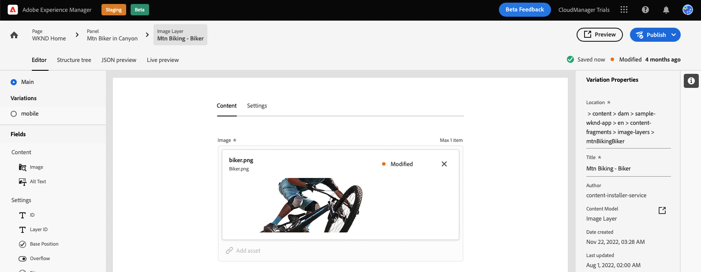

1. Tap or click the **X** to remove the biker image. The image disappears and the editor shows an error since the image is required data for this Content Fragment model.

   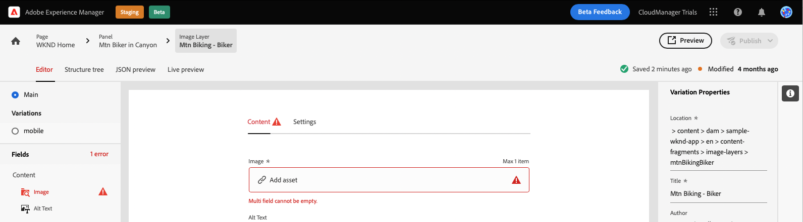

1. Tap or click **Add asset** and locate the yellow biker image in **sample-wknd-app** &gt; **en** &gt; **image-files**. Use the tree view at the left side of the **Select Assets** dialog to navigate the content hierarchy.

   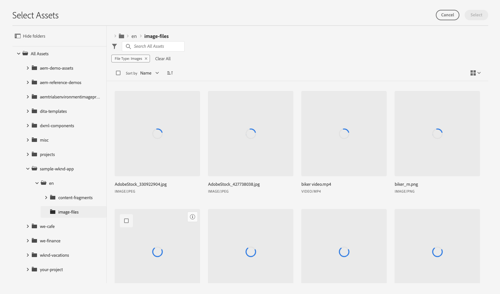

1. Filter for the text `yellow`. Use the **Search all assets** field at the top of the **Select Assets** window to search for the image. Enter the search text and press enter or return to search.

   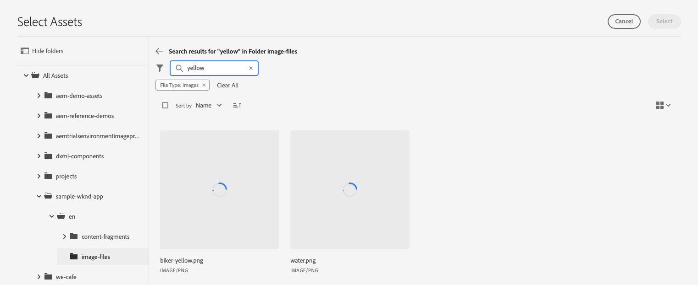

1. Tap or click to select the `biker-yellow.png` image, then tap or click **Select**.

   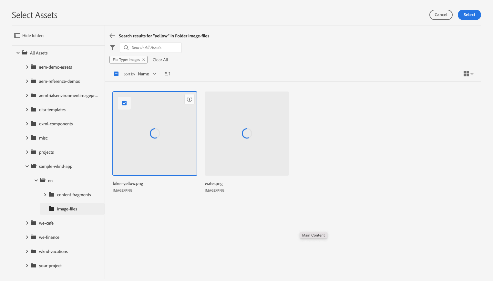

1. The image of the biker was replaced with the selected image. The editor automatically saves the changes.

   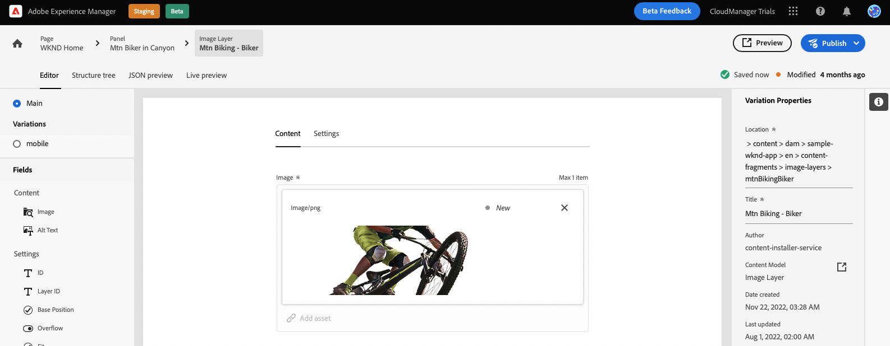

## Create a Shoppable Moment {#create-moment}

Now that you updated the image of the biker, you can add a shoppable moment for the biker’s yellow shorts.

1. Start by returning to the Content Fragment editor for the page fragment. The breadcrumbs at the top-left of the editor show where you are in your content hierarchy. Tap or click **WKND Home** in the breadcrumbs to return to that page.

   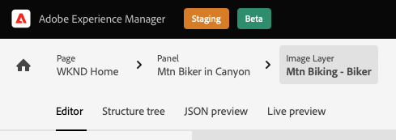

1. Select the **Mtn Biker on WKND Yellow** panel.

   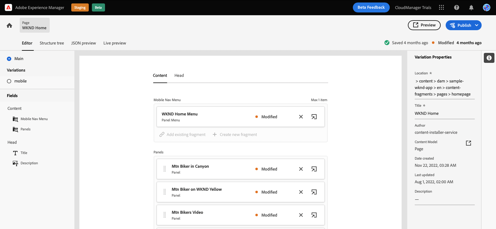

1. You can now see the layers that make up the image of the biker. Add a shoppable moment to the biker’s yellow shorts by selecting the **Mtn Biking - Shoppable** layer.

   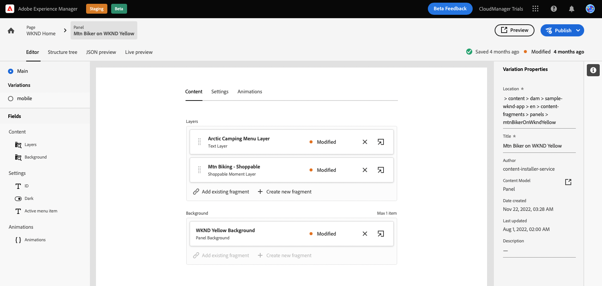

1. In order to create a shoppable moment, you must create a new Content Fragment that represents that moment. Tap or click the **+ Create new fragment** button to add shoppable moment for the biker’s shorts.

   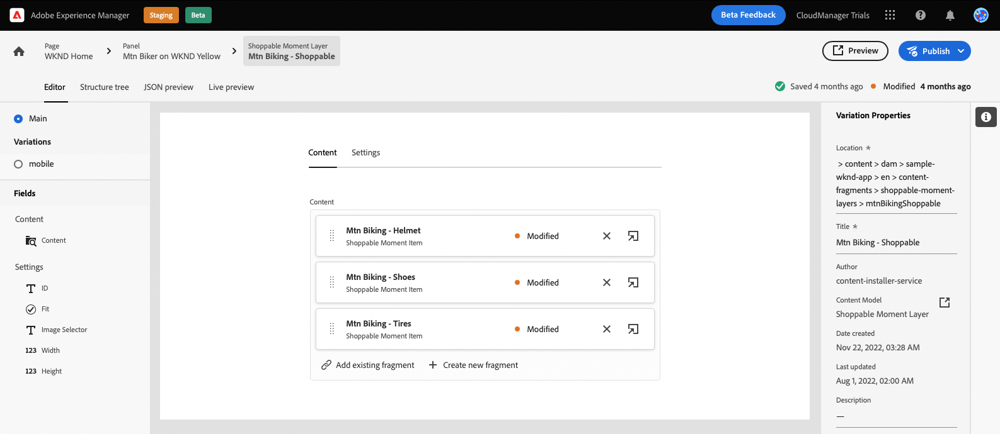

1. Because Content Fragments represent structured headless data, whenever you create a Content Fragment, you must first choose a model on which to base it. Select the **Shoppable Moment Item** model from the **Content Fragment model** drop-down.

   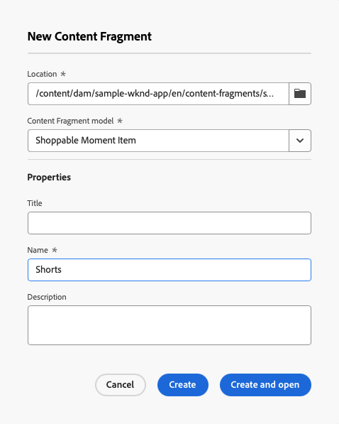

1. Give the Content Fragment that will represent this new shoppable moment a name. For example, enter `Shorts` into the **Name** field.

   

1. Tap or click **Create and open**.

1. The editor opens for your new Content Fragment.
   * Give the shoppable moment a name in the **Text** field such as `Yellow shorts`.
   * Set an X and Y, location for where this shoppable moment should be overlaid.
     * **X**: `-18`
     * **Y**: `-28`
   * Changes to the fragment are automatically saved by the editor

   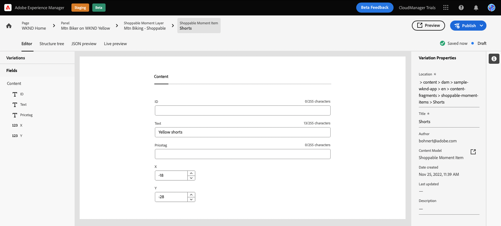

1. Tap or click **Preview** to test this positioning and make adjustments as needed.

## You’ve learned to customize a sample React app! {#conclusion}

In this module, you learned how to customize a sample React app. First you learned how to edit existing ext. Then an image was swapped with another instance of that image. Finally you saw how a shoppable moment item is created and positioned.

Be sure to check out the [Additional Resources section](#additional-resources) for additional resources about using AEM and its Content Fragments.

If you'd like to learn how Content Fragments and headless content is created for consumption by custom apps, you can start by reviewing the module [Create the Content Structure for Your App.](content-structure.md)

You can return to your trial home screen by clicking **Solutions** button at the top-right of the navigation bar and selecting **Experience Manager**.

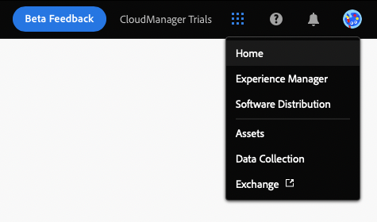

## Additional Resources {#additional-resources}

For more information about Content Fragments and AEM, consider reviewing this additional documentation.

* [Content Fragment Models](/help/assets/content-fragments/content-fragments-models.md) - Complete documentation on Content Fragment models
* [Content Fragments](/help/assets/content-fragments/content-fragments.md) -  Overview of Content Fragments and links to complete documentation on Content Fragments
* [Basic Handling](/help/sites-cloud/authoring/getting-started/basic-handling.md) - Documentation on how to navigate and use AEM for new users
