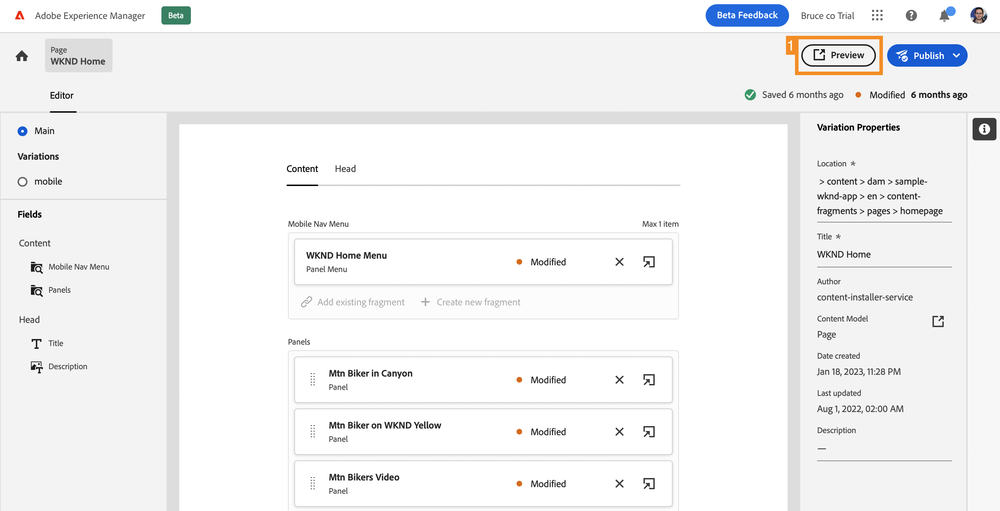
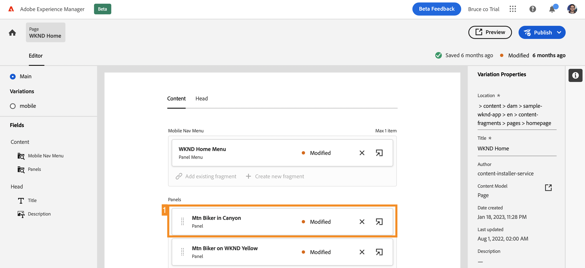
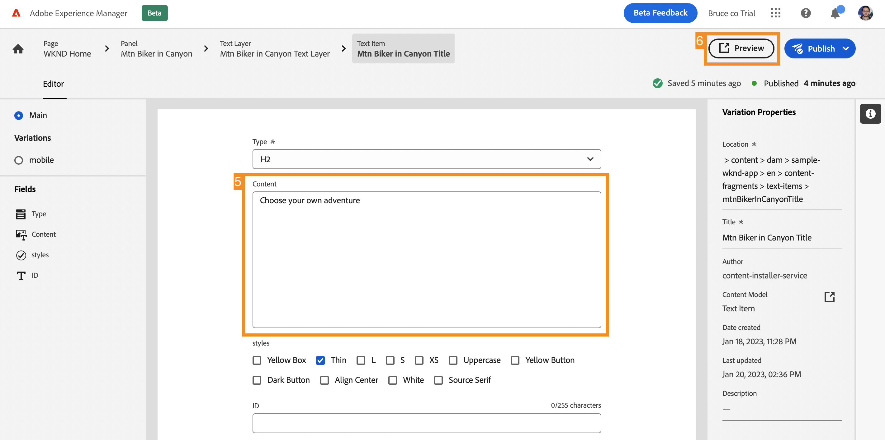
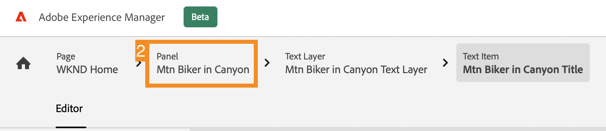
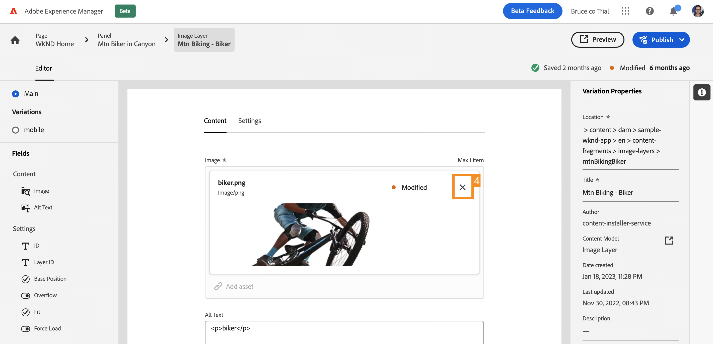
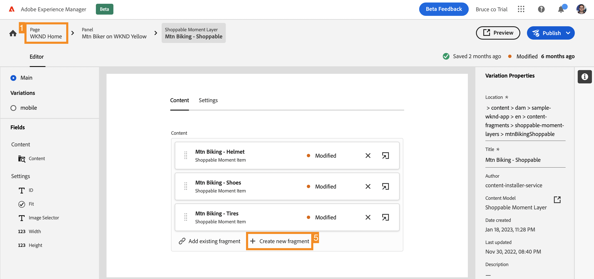
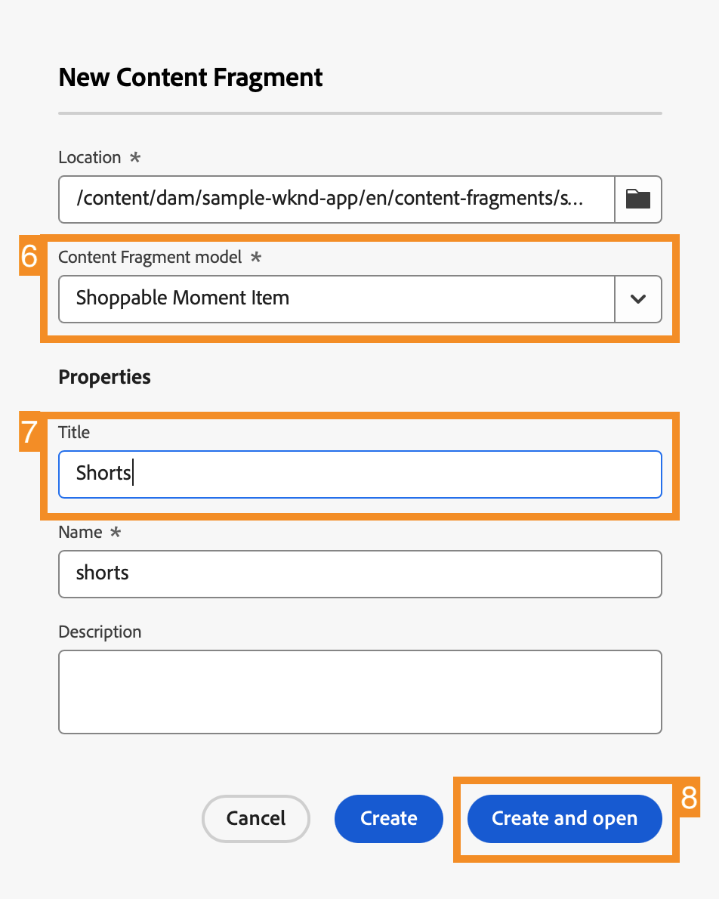
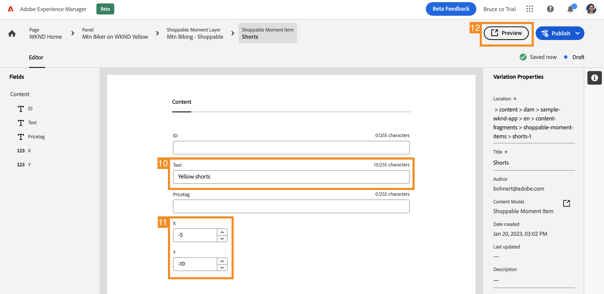

# Customize Content in a Sample React App {#customize-app}

>[!CONTEXTUALHELP]
>id="aemcloud_sites_trial_admin_content_fragments_react_app"
>title="Customize content in a sample React app"
>abstract="Your AEM headless trial comes integrated with a sample React app, which you can customize."

>[!CONTEXTUALHELP]
>id="aemcloud_sites_trial_admin_content_fragments_react_app_guide"
>title="Launch the Content Fragment editor"
>abstract="Now let's explore how headless content authoring works. Your AEM headless trial comes integrated with a sample React app, so you can see how easy it is for anyone to independently manage content without development time.  Launch this module in a new tab by clicking below, then follow this guide."

>[!CONTEXTUALHELP]
>id="aemcloud_sites_trial_admin_content_fragments_react_app_guide_footer"
>title="In this module, you learned how to customize a sample React app.  Time to market: Accelerated! Development cycles: Reduced!  Now you understand how easy managing headless content is for websites and apps that are powered by AEM's headless capabilities."
>abstract=""

## Preview the App {#preview}

You start in the Content Fragment editor with the sample app provided with your AEM headless trial already loaded. The sample app is powered by Content Fragments delivered via GraphQL. Use the Content Fragment editor to get familiar with the editor by previewing the sample app.

1. Select the **Preview** button at the top-right of the editor screen.

1. The demo app opens in a new tab. The app is for the fictional WKND outdoor lifestyle brand. Scroll down the page to navigate the sample content.

1. Return to the browser tab of the Content Fragment editor to continue.

## Edit a Header in the App {#edit-app}

The Content Fragment editor displays the basic layout of the app as a page Content Fragment. The **Panels** represent different pages of the app, each of which is its own Content Fragment. By modifying these fragments, you can change the content of the app.

1. Select **Mtn Biker in Canyon** in the **Panels** section.

   

1. The editor opens up the header panel of the app for the mountain biker. Each panel is made up of layers, representing different images and text that compose the experience.

1. Select the text layer **Mtn Biker in Canyon Text Layer** to open the detail of the layer in the editor. The layer is made up of multiple Content Fragments that control the text that is displayed in this panel of the app.

1. Select the **Mtn Biker in Canyon Title** text item. This opens the Content Fragment editor showing the content of this fragment and allowing you to modify it.

1. Change the text from `Your next great adventure is calling` to `Choose your own adventure`. The change is saved automatically by the editor.

1. Select **Preview** at the top-right of the window to see your changes. The preview of the demo app opens in a new tab.

   

That's how easy it is to update content within a React app when integrated into AEM headless CMS.

## Swap an Image in the App {#change-image}

Now that you modified a headline in the app, try changing an image.

1. Return to the browser tab of the Content Fragment editor from the preview.

1. You need to return to the correct place in the Content Fragment editor. The breadcrumbs at the top-left of the editor show where you are in your content hierarchy. Select **Mtn Biker in Canyon** in the breadcrumbs to return to that page.

   

1. Select the **Mtn Biking - Biker** image layer. This opens the Content Fragment editor

1. Select the **X** to remove the biker image. The image disappears and the editor shows an error since the image is required data for this Content Fragment model.

   

1. Select **Add asset** and then **Browse Assets** in the pop-up menu.

1. The **Select Asset** dialog opens and the path **sample-wknd-app** &gt; **en** &gt; **image-files** is automatically selected for you.

1. Select the image `biker-yellow.png` and then select **Select**.

1. The image of the biker is replaced with the selected image. The editor automatically saves the changes.

1. Select **Preview** at the top-right of the window to see your changes. The preview of the demo app opens in a new tab. Click refresh on the browser and you should see your new biker image with yellow shorts in the app.

It is that easy to update images and assets in your apps with AEM headless CMS.

## Add a Reference to a New Content Fragment in the app {#create-moment}

Now that you updated the image of the biker, let's walk through how to add new content to an app by creating and referencing a new Content Fragment. You will add a product call-out managed by a "shoppable moment" Content Fragment to the second panel of the app.

1. Return to the browser tab of the Content Fragment editor from the preview tab.

1. You need to return to the correct place in the Content Fragment editor. The breadcrumbs at the top-left of the editor show where you are in your content hierarchy. Select **WKND Home** in the breadcrumbs to return to that page.

1. Select the **Mtn Biker on WKND Yellow** panel.

1. Select the **Mtn Biking - Shoppable** layer.

1. To create a call-out on this panel, create a shoppable moment Content Fragment. Select the **+ Create new fragment** button.

   

1. You must first choose a model on which to base the new Content Fragment. Select the **Shoppable Moment Item** model from the **Content Fragment model** drop-down.

1. Give the Content Fragment a name. For example, enter `Shorts` into the **Name** field.

1. Select **Create and open**.

   

1. The editor opens for your new Content Fragment.

1. Give the shoppable moment a name in the **Text** field such as `Yellow shorts`.

1. Set values for **X** and **Y**. This is where this call-out should be overlaid on the panel. Changes to the fragment are automatically saved by the editor

   * **X**: `-5`
   * **Y**: `-10`

1. Select **Preview** at the top-right of the window to see your changes. The preview of the demo app opens in a new tab. Click refresh on the browser to test the positioning and make adjustments as needed in the editor.

   

Now you understand how creating new content and referencing it as a Content Fragment in your app can be completed without any development cycles.
