# Extract Content via the GraphQL API {#extract-content}

Now that you have [created your own Content Fragment models](content-structure.md) as well created your own headless content as [Content Fragments,](create-content.md) learn how to use Content Fragments and the GraphQL API as a headless content management system to deliver your content.

GraphQL provides a query-based API allowing external client applications to query AEM for only the content it needs using a single API call. 

First you will learn how to run two different types of queries: **list** and **byPath** queries. Then you will learn how to retrieve content from the Content Fragment you created previously. This document serves as a supplement of the interactive tour, covering the same steps and linking to additional resources where appropriate.

>[!TIP]
>
>If you'd like more details about the GraphQL API, see the [Additional Resources section](#additional-resources) at the end of this module for the GraphQL API guide.

## The Content Fragment Model Console {#content-fragment-model-console}

You start on the GraphQL Explorer. Here you can build and run queries against your headless content.

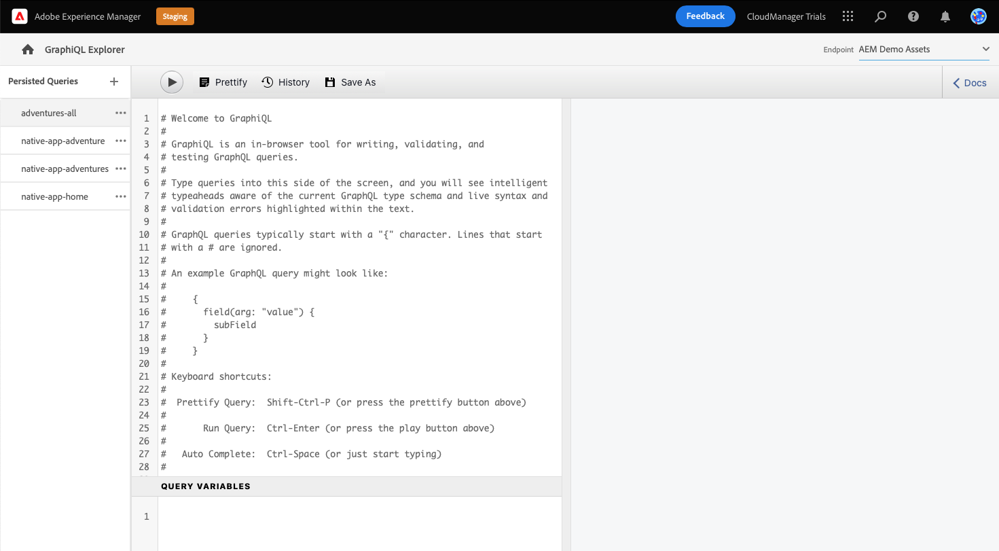

If you wish to navigate to the GraphQL Explorer yourself outside of the in-app guidance, it is found using the Adobe icon at the top-left of the page. This opens the global navigation of AEM. From here, you choose the **Tools** tab and then **General** -&gt; **GraphQL Query Editor**.

>[!TIP]
>
>If you would like to know more about navigation in AEM, see the [Additional Resources section](#additional-resources) of this document for more information on AEM basic handling.

AEM Trials come with an endpoint preloaded with content from which you can extract content for testing purposes.

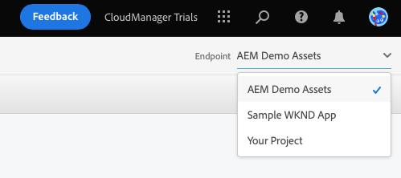

Select the **AEM demo assets** endpoint from the **Endpoint** drop-down menu at the top-right corner of the editor if it is not already.

## Copy and Run a List Query {#list-query}

Start with a simple list query in order to orient yourself with how AEM as a Cloud Service's GraphQL APIs work. This list query example will return a list of all content that uses a specific Content Fragment model. Inventory and category pages typically use this query format.

1. Copy the following code snippet.

   ```text
   {
       adventureList {
         items {
            _path
            adventureTitle
            adventurePrice
            adventureTripLength
            adventurePrimaryImage {
              ... on ImageRef {
               _path
               mimeType
               width
               height
             }
           }
         }
      }
    }
   ```

1. Then replace the existing content in the query editor to the left by pasting the copied code.

    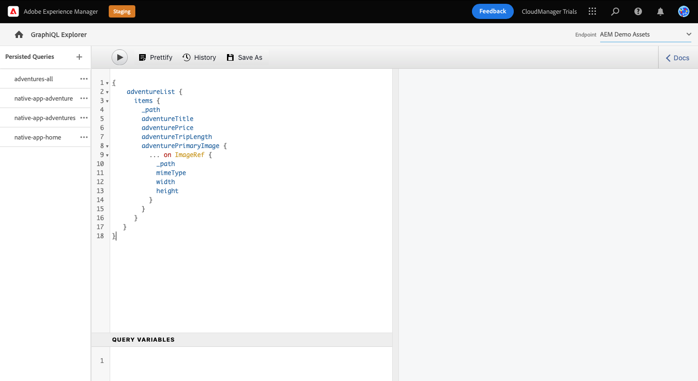

1. Once pasted, click the **Play** button at the top left of the query editor to execute the query.

1. Once the query successfully executes, the results are displayed in the right panel, next to the query editor. Should the query be incorrect, an error would appear in the right panel.

   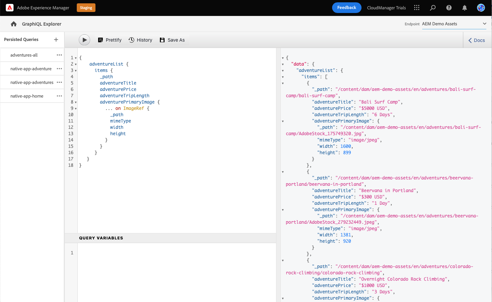

You've just validated a list query for a full list of all content fragments. This process helps to ensure that the response is what your app expects, with results that illustrate how your apps and websites will retrieve the content created in AEM. 

The different channels and platforms where your content needs to appear can now use this query or similar to retrieve your headless content.

## Copy and Run a byPath Query {#bypath-query}

Running a byPath query allows you to retrieve assets for a specific Content Fragment. Product detail pages and pages that focus on a specific set of content typically require this type of query.

1. Copy the following code snippet.

   ```text
    {
     adventureByPath(
       _path: "/content/dam/aem-demo-assets/en/adventures/bali-surf-camp/bali-surf-camp"
     ) {
       item {
         _path
         adventureTitle
         adventureDescription {
           json
         }
         adventurePrimaryImage {
           ... on ImageRef {
             _path
             width
             height
           }
         }
       }
     }
   }
   ```

1. Then replace the existing content in the query editor to the left by pasting the copied code.

   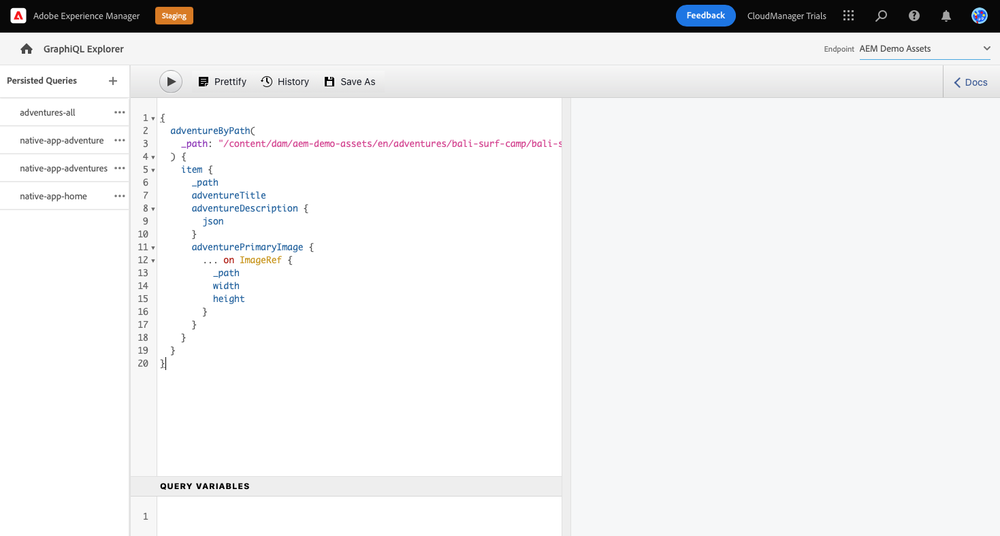

1. Once pasted, click the **Play** button at the top left of the query editor to execute the query.

1. Once the query successfully executes, the results are displayed in the right panel, next to the query editor. Should the query be incorrect, an error would appear in the right panel.

1. Once the query successfully executes, the results are displayed in the right panel, next to the query editor. Should the query be incorrect, an error would appear in the right panel.

   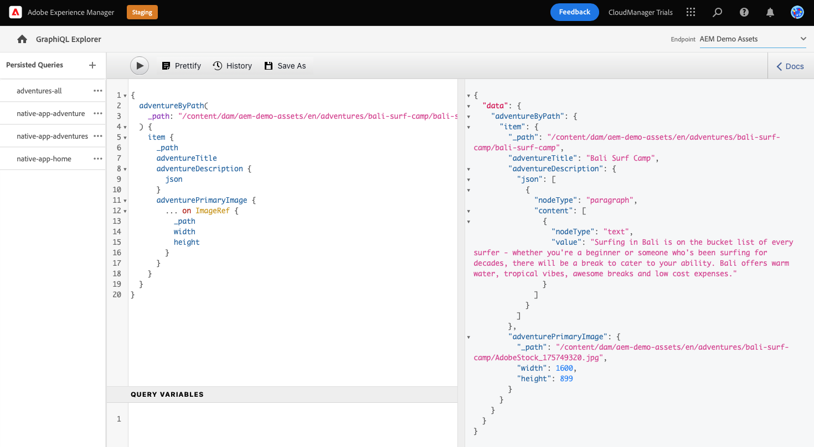

You've just validated a list query for a full list of all content fragments. This process helps to ensure that the response is what your app expects, with results that illustrate how your apps and websites will retrieve the content created in AEM. 

The different channels and platforms where your content needs to appear can now use this query or similar to retrieve your headless content.

## Run Queries on Your Own Content {#own-queries}

Now that you have run the two primary types of queries, you are ready to set up and run queries for content that you created yourself.

1. To run queries against your own Content Fragments, change the endpoint from the **AEM Demo Assets** folder to the **Your Project** folder.

   

1. Start by selecting and deleting all existing content in the query editor. Then type open bracket `{` and press Ctrl+Space or Option+Space for an auto-complete list of the models that were defined in your Content Fragment model. Select the model you created that ends in `List`.

   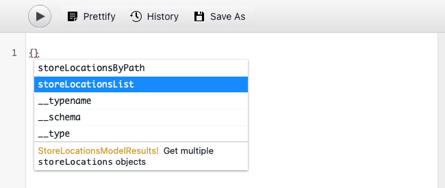

1. Define the items that the query should contain for the content fragment model you selected. Again, type open bracket `{`, then press Ctrl+Space or Option+Space for an auto-complete list. Select `items` from the list.

   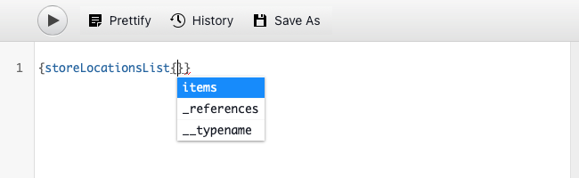

1. Define the fields that the query should contain for the content fragment model you selected. Again, type open bracket `{`, then press Ctrl+Space or Option+Space for an auto-complete list of available fields in the Content Fragment model. Select fields that you wish from your model from the list.

   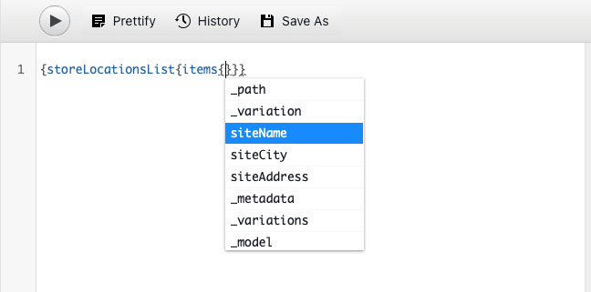

1. Delimit multiple fields with a comma (`,`) and press Ctrl+Space or Option+Space again to select additional fields.

1. As you work, you can tap or click the **Prettify** button to automatically format your code so that it is easier to read.

   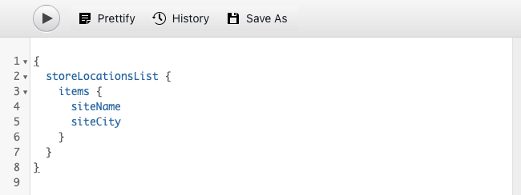

1. Once complete, tap or click the **Play** button at the top left of the editor to run the query.

   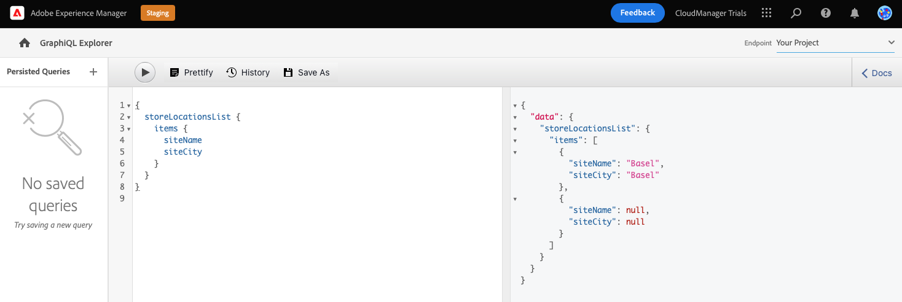

This is how your content can be delivered to omnichannel digital experiences. See the [Additional Resources section](#additional-resources) for additional sample queries and learn how much more you can do with the GraphQL API.

## You've learned how to query content! {#conclusion}

Great work! You've learned about the two basic types of queries and how to query your own content. Be sure to check out the [Additional Resources section](#additional-resources) for additional sample queries and learn how much more you can do with the GraphQL API.

If you'd like to learn how extracted content is then used in a custom React app, be sure to review the module [Customize Content in a Sample React App.](customize-app.md)

You can return to your trial home screen by clicking **Solutions** button at the top-right of the navigation bar and selecting **Experience Manager**.

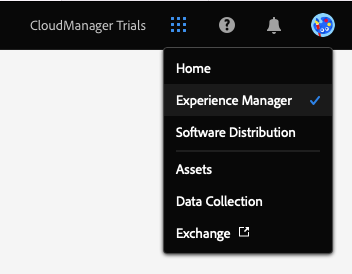

## Additional Resources {#additional-resources}

For more information about Content Fragments and AEM, consider reviewing this additional documentation.

* [The GraphQL API guide](https://experienceleague.adobe.com/docs/experience-manager-learn/getting-started-with-aem-headless/graphql/multi-step/explore-graphql-api.html)
* [Basic Handling](/help/sites-cloud/authoring/getting-started/basic-handling.md) - Documentation on how to navigate and use AEM for new users
* [Learning to use GraphQL with AEM - Sample Content and Queries](https://experienceleague.adobe.com/docs/experience-manager-cloud-service/content/headless/graphql-api/sample-queries.html)
