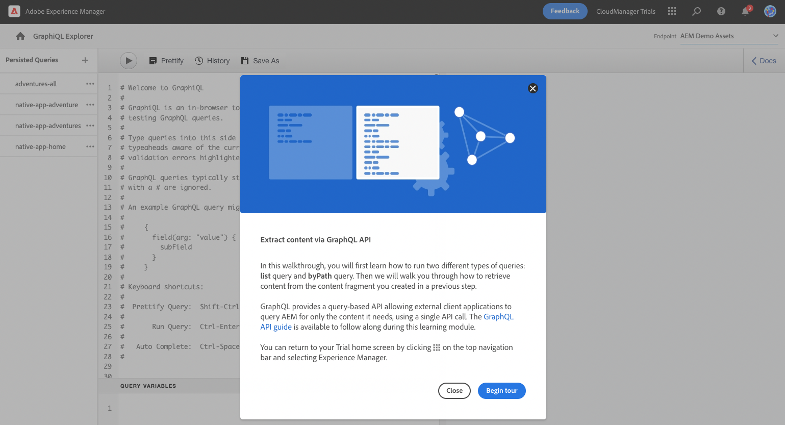
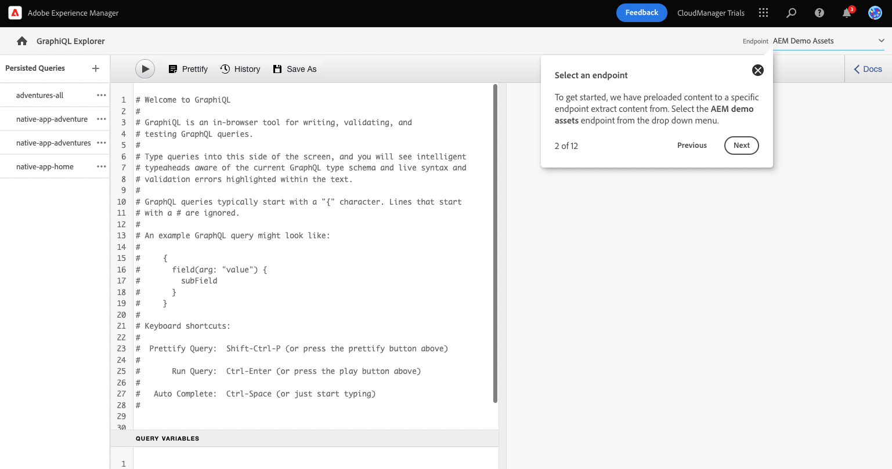
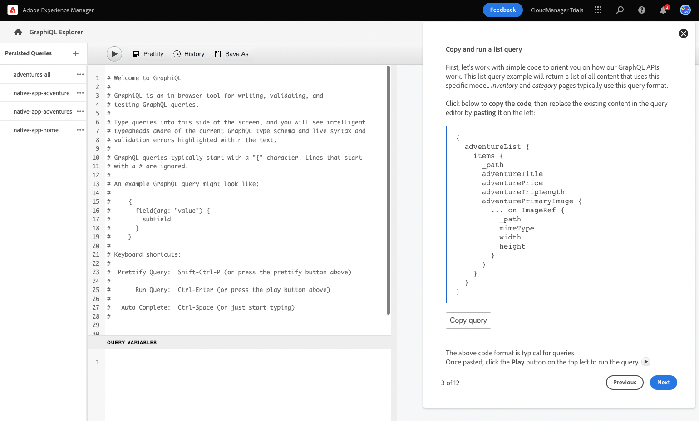
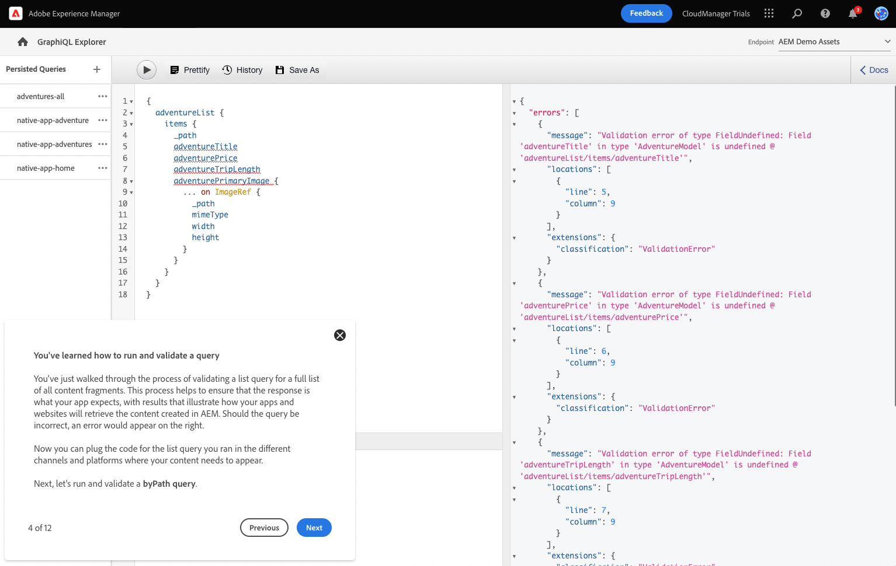
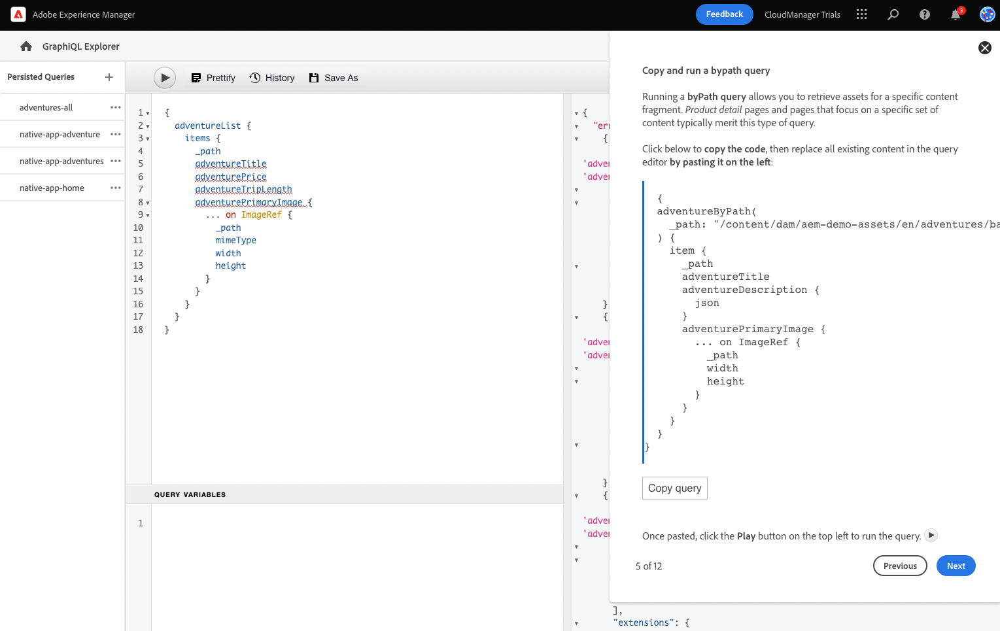
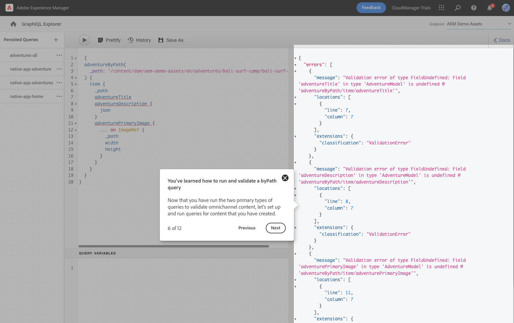
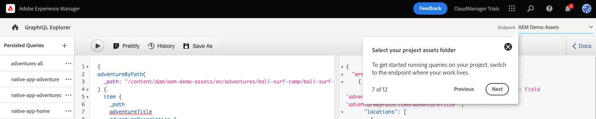

# Extract Content via the GraphQL API {#extract-content}

Learn how to use Content Fragments and the GraphQL API as a headless content management system.

## Step 1 - Introduction to Extracting a Sample React App {#introduction}

Now that you have [created your own Content Fragment models](content-structure.md) as well created your own headless content as [Content Fragments,](create-content.md) you can learn how to extract that content for use in headless apps.

First you will learn how to run two different types of queries: **list** and **byPath** queries. Then you will learn how to retrieve content from the Content Fragment you created previously.

GraphQL provides a query-based API allowing external client applications to query AEM for only the content it needs using a single API call. [The GraphQL API guide](https://experienceleague.adobe.com/docs/experience-manager-learn/getting-started-with-aem-headless/graphql/multi-step/explore-graphql-api.html) is available to follow along during this learning module.

You can return to the AEM Trial home screen at any time by clicking on the application selection icon (the gride of dots) in the navigation bar and selecting **Experience Manager**.

Click **Begin Tour** to get started!

## Step 2 - Select a Query Endpoint {#query-endpoint}

You begin in AEM as a Cloud Service's GraphQL Explorer. Here you can build and run queries against your headless content. AEM Trials come with an endpoint preloaded with content from which you can extract content for testing purposes.

Select the **AEM demo assets** endpoint from the drop down menu if it is not already.

## Step 3 - Copy and Run a List Query {#list-query}

Start with a simple list query in order to orient yourself with how AEM as a Cloud Service's GraphQL APIs work. This list query example will return a list of all content that uses a specific Content Fragment model. Inventory and category pages typically use this query format.

Click the **Copy query** button to copy the code snippet. Then replace the existing content in the query editor to the left by pasting the copied code. Once pasted, click the **Play** button at the top left of the query editor to execute the query.

## Step 4 - You've Learned How to Run and Validate a Query {#run-list-query}

Once the query successfully executes, the results are displayed in the right panel, next to the query editor. Should the query be incorrect, an error would appear in the right panel.

You've just validated a list query for a full list of all content fragments. This process helps to ensure that the response is what your app expects, with results that illustrate how your apps and websites will retrieve the content created in AEM. 

The different channels and platforms where your content needs to appear can now use this query or similar to retrieve your headless content.

## Step 5 - Copy and Run a byPath Query {#bypath-query}

Running a byPath query allows you to retrieve assets for a specific Content Fragment. Product detail pages and pages that focus on a specific set of content typically require this type of query.

Click the **Copy query** button to copy the code snippet. Then replace the existing content in the query editor to the left by pasting the copied code. Once pasted, click the **Play** button at the top left of the query editor to execute the query.

## Step 6 - You've Learned How to Run and Validate a byPath Query {#run-bypath-query}

Once the query successfully executes, the results are displayed in the right panel, next to the query editor. Should the query be incorrect, an error would appear in the right panel.

You've just validated a list query for a full list of all content fragments. This process helps to ensure that the response is what your app expects, with results that illustrate how your apps and websites will retrieve the content created in AEM. 

The different channels and platforms where your content needs to appear can now use this query or similar to retrieve your headless content.

Now that you have run the two primary types of queries, you are ready to set up and run queries for content that you created yourself.

## Step 7 - Select Your Project Assets Folder {#select-endpoint}

To run queries against your own Content Fragments, change the endpoint from the **AEM Demo Assets** folder to your own project's assets folder.

