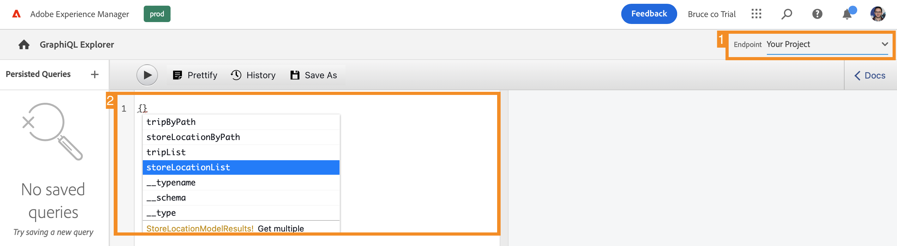
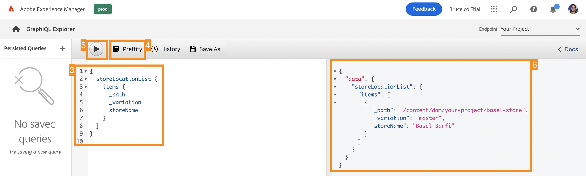

# Extract Content via the GraphQL API {#extract-content}

>[!CONTEXTUALHELP]
>id="aemcloud_sites_trial_admin_content_fragments_graphql"
>title="Extract content using the GraphQL API"
>abstract="In this module you learn how you can use Content Fragments and the GraphQL API as a headless content management system."

>[!CONTEXTUALHELP]
>id="aemcloud_sites_trial_admin_content_fragments_graphql_guide"
>title="Launch the GraphQL Explorer"
>abstract="GraphQL provides a query-based API allowing external client applications to query AEM for only the content it needs, using a single API call. Follow this module to learn how to run two different types of queries. Then learn how to retrieve the content from the Content Fragment you created in the previous module.<br><br>Launch this module in a new tab by clicking below."
>additional-url="https://video.tv.adobe.com/v/328618" text="Extract content intro video"

>[!CONTEXTUALHELP]
>id="aemcloud_sites_trial_admin_content_fragments_graphql_guide_footer"
>title="Nice work! You've learned about the two basic types of queries and how to query your own content. You now understand how to use the AEM GraphQL API to create efficient queries that deliver content in a format that you app expects."
>abstract=""

## Query for a List of Sample Content {#list-query}

You start on the GraphQL Explorer in a new tab. Here you can build and validate queries against your headless content before using them to power the content in your app or website.

1. Your AEM headless trial comes with an endpoint preloaded with Content Fragments from which you can extract content for testing purposes. Make sure that the **AEM Demo Assets** endpoint is selected in the **Endpoint** drop-down menu at the top-right corner of the editor.

2. Copy the following code snippet for a list query of the preloaded **AEM Demo Assets** endpoint. A list query returns a list of all content that uses a specific Content Fragment model. Inventory and category pages typically use this query format.

   ```text
   {
       adventureList {
         items {
            _path
            adventureTitle
            adventurePrice
            adventureTripLength
            adventurePrimaryImage {
              ... on ImageRef {
               _path
               mimeType
               width
               height
             }
           }
         }
      }
    }
   ```

3. Replace the existing content in the query editor by pasting the copied code.

4. Once pasted, click the **Play** button at the top left of the query editor to execute the query.

5. The results are displayed in the right panel, next to the query editor. Should the query be incorrect, an error would appear in the right panel.

   

You've just validated a list query for a full list of all Content Fragments. This process helps to ensure that the response is what your app expects, with results that illustrate how your apps and websites will retrieve the content created in AEM. 

## Query for a Specific Piece of Sample Content {#bypath-query}

Running a byPath query allows you to retrieve content for a specific Content Fragment. Product detail pages and pages that focus on a specific set of content typically require this type of query.

1. Copy the following code snippet for a byPath query of the preloaded **AEM Demo Assets** endpoint.

   ```text
    {
     adventureByPath(
       _path: "/content/dam/aem-demo-assets/en/adventures/bali-surf-camp/bali-surf-camp"
     ) {
       item {
         _path
         title
         description {
           json
         }
         primaryImage {
           ... on ImageRef {
             _path
             width
             height
           }
         }
       }
     }
   }
   ```

2. Replace the existing content in the query editor by pasting the copied code.

3. Once pasted, click the **Play** button at the top left of the query editor to execute the query.

4. The results are displayed in the right panel, next to the query editor. Should the query be incorrect, an error would appear in the right panel.

   

You've just validated a byPath query to retrieve a specific Content Fragment identified by the path of that fragment.

## Query Your Own Content {#own-queries}

Now that you have run the two primary types of queries, you are ready to query your own content.

1. To run queries against your own Content Fragments, change the endpoint from the **AEM Demo Assets** folder to the **Your Project** folder.

2. Delete all existing content in the query editor. Then type open bracket `{` and press Ctrl+Space or Option+Space for an auto-complete list of the models that were defined in your endpoint. Select the model that you created that ends in `List` from the options.

   

3. Define the items that the query should contain for the Content Fragment model you selected. Again, type open bracket `{`, then press Ctrl+Space or Option+Space for an auto-complete list. Select `items` from the options.

4. Tap or click the **Prettify** button to automatically format your code so that it is easier to read.

5. Once complete, tap or click the **Play** button at the top left of the editor to run the query. The editor auto-complete the `items` and the query runs.

6. The results are displayed in the right panel, next to the query editor.

   

This is how your content can be delivered to omnichannel digital experiences.
