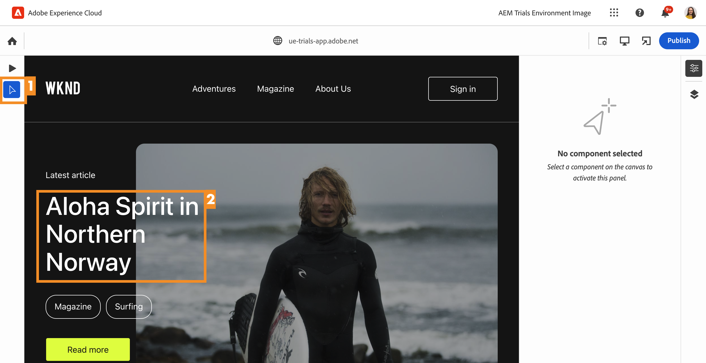
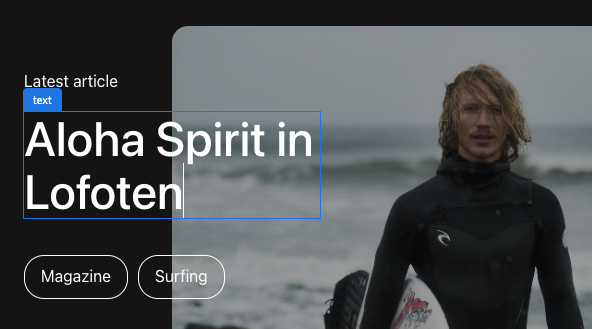
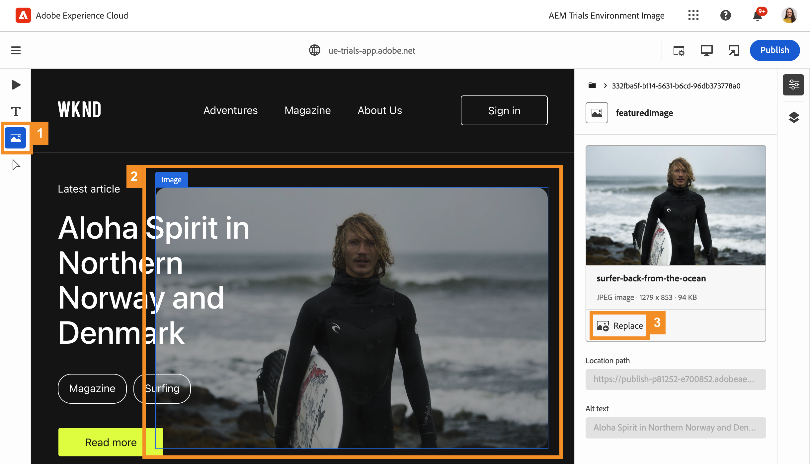
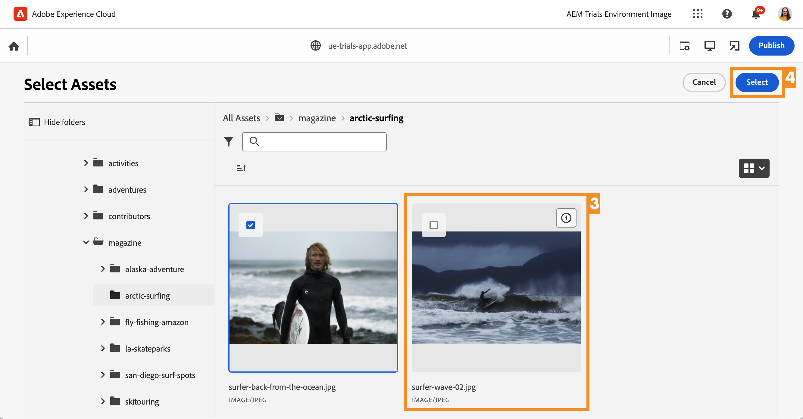
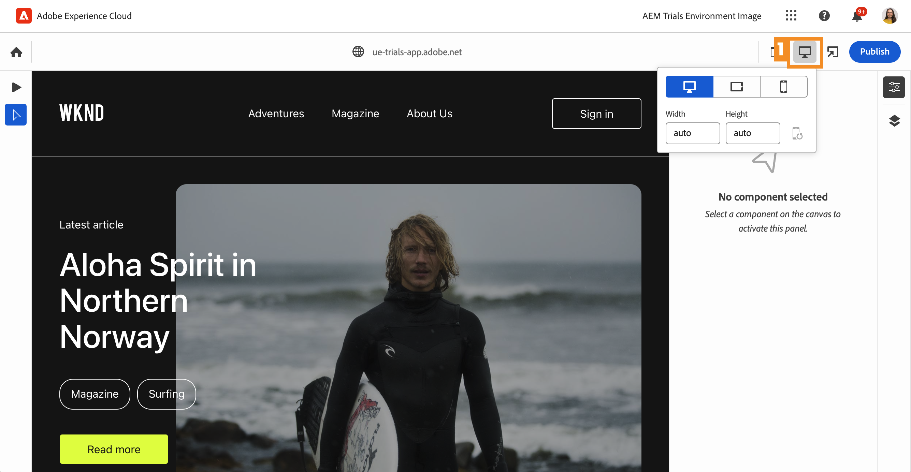
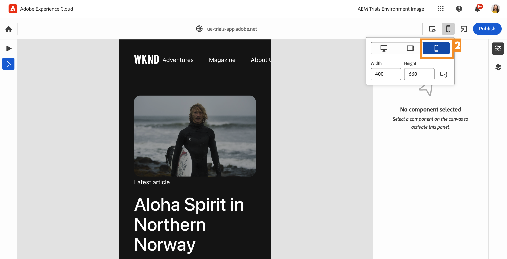
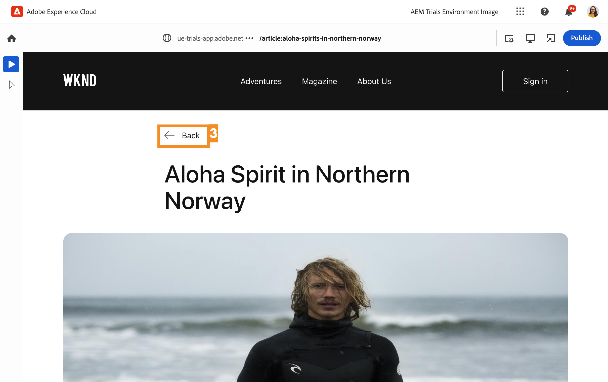
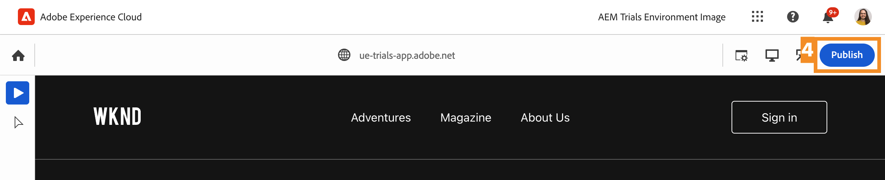
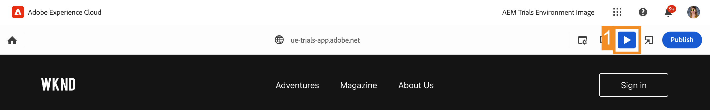
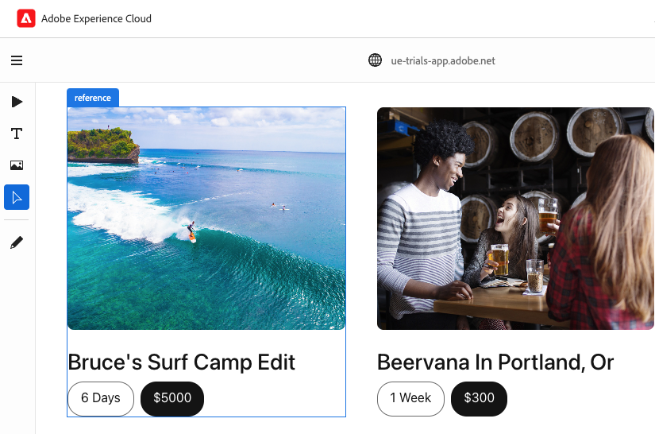

# Edit in Context with the Universal Editor {#editing-in-context}

>[!CONTEXTUALHELP]
>id="aemcloud_sites_trial_edit_inline_universal_editor"
>title="Edit in Context with the Universal Editor"
>abstract="See how your headless apps can use the Universal Editor to bring low-friction, in context editing to the fingertips of your authors."

>[!CONTEXTUALHELP]
>id="aemcloud_sites_trial_edit_inline_universal_editor_guide"
>title="Launch the Universal Editor"
>abstract="In this guide, you explore the Universal Editor and how it enables anyone to edit every aspect of your content in any implementation, leading to enhanced content velocity.  Launch this module in a new tab by clicking below, then follow this guide."

>[!CONTEXTUALHELP]
>id="aemcloud_sites_trial_edit_inline_universal_editor_guide_footer"
>title="In this module, you learned how to customize content in context and in place using the Universal Editor."
>abstract=""

## Edit Text in Context {#edit-text}

Editing in place and in context can often be advantageous over structured headless content editing as in the Content Fragment editor, which you saw in previous modules.

>[!NOTE]
>
>To use the Universal Editor in this trial, you must use Chrome as your browser and not in incognito mode. This is a limitation of the trial experience, not of the Universal Editor.

Using the Universal Editor, you have an agile way to edit your text in context and in place, allowing simple and intuitive content authoring.

1. Double-click to select the title of the latest article to edit it.

   

1. The component is selected as indicated by a blue border with a tab indicating that it is a text component. A cursor is in the border awaiting text input. Change the text to `Aloha Spirit in Lofoten`.

   

1. Select outside of the text component and your changes are saved automatically.

The Universal Editor saves your changes automatically within the authoring environment. You still need to publish them for your readers to see, which we will do in a later step.

## Edit Media in Context {#edit-media}

You can also swap out images while still remaining in the context of your content by using the Universal Editor.

1. Select the image of the surfer to select it.

1. In the component rail, you can see the detail of the asset. Select the **Featured Image** thumbnail.

   

1. In the **Select Assets** window, scroll down and select the `surfer-wave-02.JPG` image to select it.

1. Select **Select** in the **Select Assets** window.

   

The image is replaced with the one you selected.

## Experience Your Content As Your Readers Do {#emulators}

The Universal Editor lets you interact with your content within its context, seeing the content as it is delivered to the devices of your users.

1. By default the editor renders the desktop version of your content. Select the emulator button at the top-right of the Universal Editor toolbar to change the target device.

   

1. Readers may be on different devices with different aspect ratios, so the editor offers emulation modes to see how the page will be presented to users. For example, select the mobile device option in portrait mode.

   

1. See the content change in the editor. The icon for the emulator also changes to reflect the mode it is in. Select anywhere outside of the emulator menu to close it and interact with your content.

1. Return the emulator to desktop mode.

You can also specify exact dimensions for the emulator and rotate the emulated device to view your content on any potential target device.

## Previewing and Publishing {#preview}

Because you need to select your content to modify it in the editor, the editor does not allow you to follow links or interact with your content by tapping or clicking. Using preview mode, you can follow the links within your content and experience it as your users would before publishing.

1. In the Universal Editor toolbar, select **Preview**.

1. Now select the **Read More** link for the main article.

   

1. Browse the article, then use the **Back** link to return to the main page.

   

1. Now select the **Publish** button at the top-right of the editor to publish your content.

   

Your content is published.

## Editing Content Fragments {#editing-fragments}

To accelerate your content authoring experience when structured editing of headless content is more advantageous than in-place editing, the Universal Editor gives you quick access to the Content Fragment editor as well.

1. Turn off preview mode by tapping the **Preview** button on the Universal Editor toolbar.

   

1. Scroll further down on the page to the **Adventures** section.

1. Select one of the adventures such as **Bali Surf Camp** to select it.

   * Note the blue outline of the selected component. The tab should display the name of the Content Fragment when a Content Fragment is selected. In this case **Bali Surf Camp**.
   * Because the Universal Editor allows selecting any object on the page, components that are parts of a Content Fragment can also be selected individually. Select where indicated in the illustration to select the entire Content Fragment component.

1.  The **Edit** icon appears on the component rail. Select the **Edit** icon to open the Content Fragment editor on a new tab.

   

On the new tab, you can now edit your Content Fragment that you selected in the Universal Editor.
