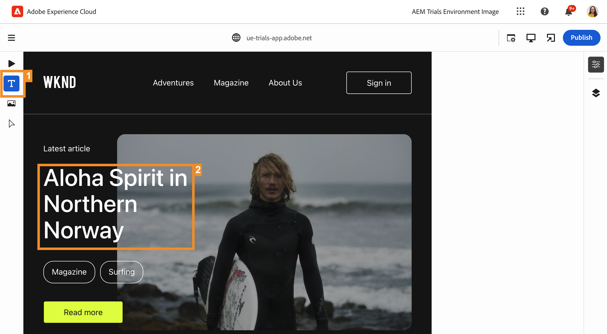

# Editing In-Context {#editing-in-context}

>[!CONTEXTUALHELP]
>id="aemcloud_sites_trial_edit_inline_universal_editor"
>title="Editing in-context"
>abstract="See how your headless apps can leverage the Universal Editor to bring low-friction, in-context editing to the fingertips of your authors."

>[!CONTEXTUALHELP]
>id="aemcloud_sites_trial_edit_inline_universal_editor_guide"
>title="Launch the Universal Editor"
>abstract="In this guide we'll explore the Universal Editor and how it enables anyone to edit every aspect of your content in any implementation, leading to enhanced content velocity.  Launch this module in a new tab by clicking below, then follow this guide."

>[!CONTEXTUALHELP]
>id="aemcloud_sites_trial_edit_inline_universal_editor_guide_footer"
>title="In this module, you learned how to customize content in-context and in-place using the Universal Editor."
>abstract=""

## Edit Text In-Context {#edit-text}

Editing in-place and in-context can often be advantageous over structured headless content editing as in the Content Fragment editor, which you saw in previous modules.

Using the Universal Editor, you have an agile way to edit your text in-context and in-place, allowing simple and intuitive content authoring.

1. The editor should load by default in **Text** mode. If not, please tap or click the **Text** icon in the mode rail at the left side of the editor.

1. Tap or click the title of the latest article to edit it.

   

1. The component is selected as indicated by a blue border with a tab indicating that it is a text component. A cursor is in the border awaiting text input. Change the text to `Aloha Spirit in Lofoten`.

   

1. Press the enter/return key or tap or click outside of the text component and your changes are saved automatically.

The Universal Editor saves your changes automatically within the authoring environment. You still need to publish them for your readers to see, which we will do in a later step.

## Experience Your Content As Your Readers Do {#emulators}

The Universal Editor allows you to interact with your content within its context, seeing the content as it is delivered to the devices of your users.

1. By default the editor renders the desktop version of your content. Tap or click the emulator button at the top-right of the editor to change the target device.

   

1. Readers may be on different devices with different aspect ratios, so the editor offers emulation modes in order to see how the page will be presented to users. For example, select the mobile device option in portrait mode.

   

1. See the content change in the editor. The icon for the emulator also changes to reflect the mode it is in. Tap or click anywhere outside of the emulator menu to close it and interact with your content.

1. Return the emulator to desktop mode.

You can also specify exact dimensions for the emulator and rotate the emulated device in order to view your content on any potential target device.

## Previewing and Publishing {#preview}

Because you need to tap or click your content to select it in the editor, the editor does not allow you to follow links or interact with your content by tapping or clicking when it is in an edit mode. Using preview mode, you can follow the links within your content and experience it as your users would before publishing.

1. In the mode rail on the left side of the editor, tap or click **Preview**.

1. Now tap or click on the **Read More** link for the main article.

   

1. Browse the article, then use the **Back** link to return to the main page.

   

1. Now tap or click on the **Publish** button at the top-right of the editor to publish your content.

   

Your content is published.

## Editing Content Fragments {#editing-fragments}

To accelerate your content authoring experience when structured editing of headless content is more advantageous than in-place editing, the Universal Editor gives you quick access to the Content Fragment editor as well.

1. Scroll further down on the page to the **Adventures** section.

1. In the mode rail on the left side of the editor, select **Components**. This allows you to select page components in the editor.

1. Tap or click one of the adventures to select it.

   * Note the blue outline of the selected component. The tab should read **reference** when a Content Fragment is selected.
   * Because the Universal Editor allows selecting any object on the page, components that are parts of a Content Fragment can also be selected individually. Tap or click where indicated in the illustration to select the entire Content Fragment component.

1.  A new **Edit** icon appears on the mode rail. Tap or click the **Edit** icon to open the Content Fragment editor on a new tab.

   

On the new tab, you can now edit your Content Fragment that you selected in the Universal Editor.
